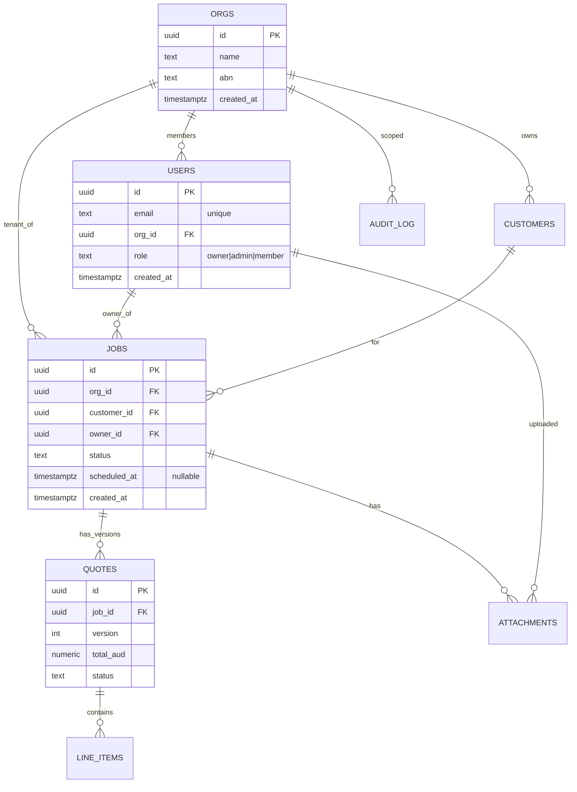

# ERD — Multi-tenant SaaS (jobs-and-quotes for trades)

**Source:** Narrative + planned schema
**Generated:** 20/05/2026

---

## Entity List

| Entity | PK | Key columns | Notes |
|--------|-----|------------|-------|
| orgs | id (uuid) | name, abn, created_at | Tenant root |
| users | id (uuid) | email, org_id, role | role enum: owner / admin / member |
| customers | id (uuid) | org_id, name, email, phone | Org's external customers |
| jobs | id (uuid) | org_id, customer_id, owner_id, status, scheduled_at | Status: draft / quoted / scheduled / in_progress / done / cancelled |
| quotes | id (uuid) | job_id, version, total_aud, status | One-to-many on job_id (revision history) |
| line_items | id (uuid) | quote_id, description, qty, unit_price_aud, total_aud | |
| attachments | id (uuid) | job_id, owner_id, file_path, size_bytes | Files stored in Supabase storage |
| audit_log | id (uuid) | org_id, user_id, entity, entity_id, action, payload (jsonb), at | Soft-immutable audit trail |

---

## Mermaid ERD



---

## DBML

```dbml
Table orgs {
  id uuid [pk, default: `gen_random_uuid()`]
  name text [not null]
  abn text [unique, note: 'Australian Business Number']
  created_at timestamptz [default: `now()`]
}

Table users {
  id uuid [pk, default: `gen_random_uuid()`]
  email text [unique, not null]
  org_id uuid [ref: > orgs.id, not null]
  role text [not null, note: 'enum: owner | admin | member']
  created_at timestamptz [default: `now()`]
}

Table customers {
  id uuid [pk, default: `gen_random_uuid()`]
  org_id uuid [ref: > orgs.id, not null]
  name text [not null]
  email text
  phone text
  created_at timestamptz [default: `now()`]
}

Table jobs {
  id uuid [pk, default: `gen_random_uuid()`]
  org_id uuid [ref: > orgs.id, not null]
  customer_id uuid [ref: > customers.id, not null]
  owner_id uuid [ref: > users.id, not null]
  status text [not null]
  scheduled_at timestamptz
  created_at timestamptz [default: `now()`]
}

Table quotes {
  id uuid [pk, default: `gen_random_uuid()`]
  job_id uuid [ref: > jobs.id, not null]
  version int [not null]
  total_aud numeric(12, 2) [not null]
  status text [not null]
}

Table line_items {
  id uuid [pk, default: `gen_random_uuid()`]
  quote_id uuid [ref: > quotes.id, not null]
  description text [not null]
  qty numeric(10, 2) [not null]
  unit_price_aud numeric(12, 2) [not null]
  total_aud numeric(12, 2) [not null]
}

Ref: users.org_id > orgs.id [delete: cascade]
Ref: customers.org_id > orgs.id [delete: cascade]
Ref: jobs.org_id > orgs.id [delete: restrict, note: 'protect against accidental org delete']
Ref: quotes.job_id > jobs.id [delete: cascade]
Ref: line_items.quote_id > quotes.id [delete: cascade]
```

---

## Notation Legend

- `||--o{` : one-to-many (left side mandatory, right side optional / zero-or-more)
- `||--||` : one-to-one (both mandatory)
- `}o--o{` : many-to-many (both optional; usually represented via junction table)
- `PK` : Primary key
- `FK` : Foreign key
- `"unique"` and `"nullable"` annotations explicit
- ON DELETE: `cascade` for child of tenant; `restrict` for protective; `set null` for orphan-safe

---

## Open Questions

1. Should `quotes` have a soft-delete column (`deleted_at`) so we keep history without delete cascade?
2. Should `attachments` be polymorphic (attach to any entity) or strictly `job_id`-scoped? Recommend: stay job-scoped to avoid polymorphic complications.
3. Should `audit_log` be partitioned by month? At 100k+ rows/month, yes — flag for migration design later.
