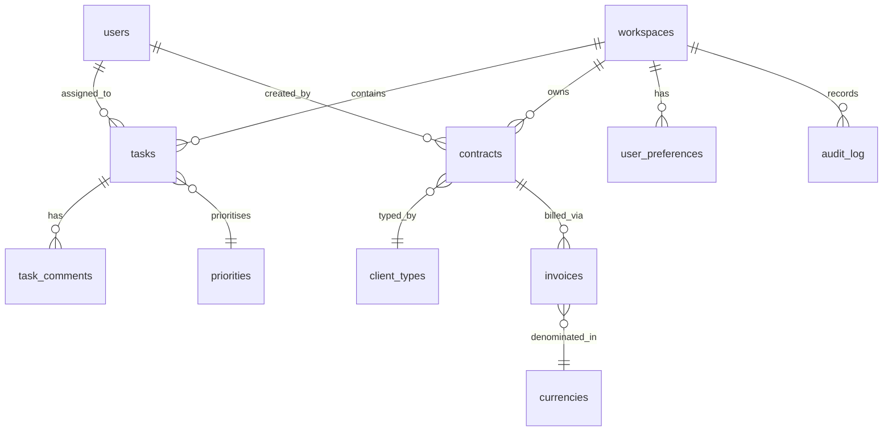
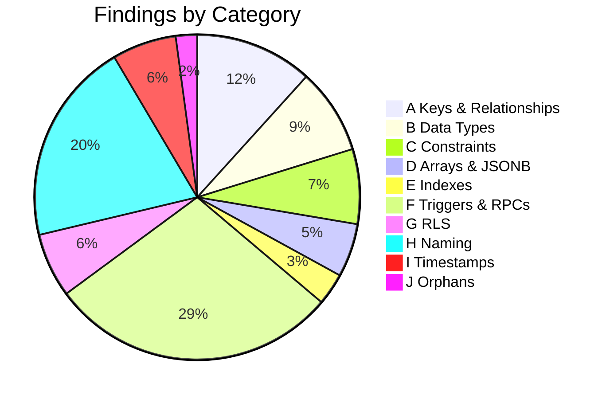
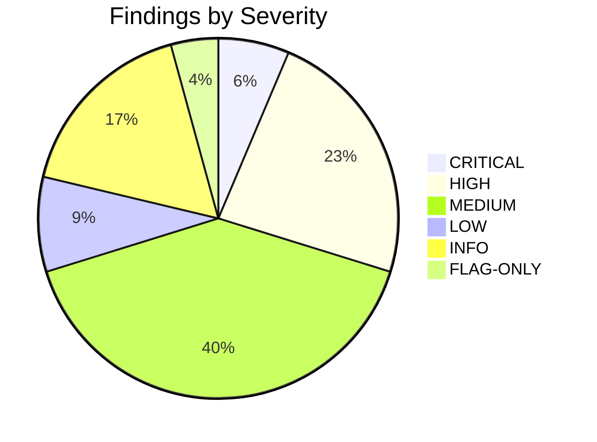
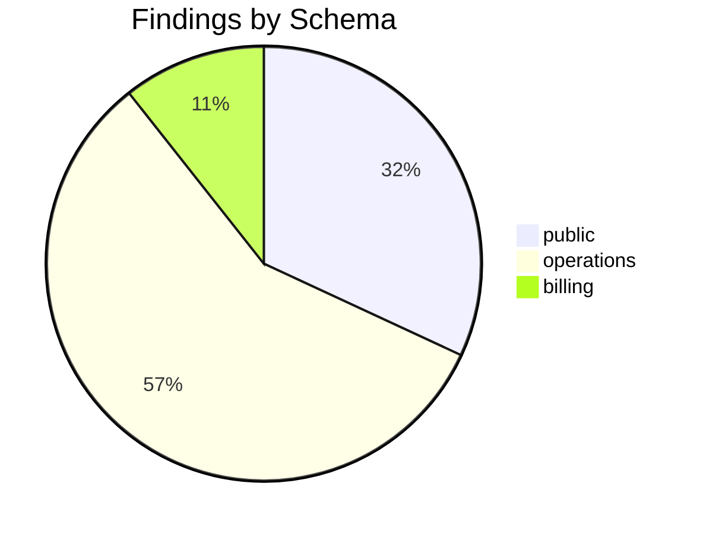

# Postgres Schema Audit — AcmeOps

| Field | Value |
|---|---|
| **Date** | 20/04/2026 |
| **Auditor** | Claude (postgres-schema-audit skill) |
| **Execution mode** | supabase-mcp |
| **Project** | acme-ops-production (xxxx-xxxx-xxxx) |
| **Postgres version** | PostgreSQL 15.6 on aarch64-unknown-linux-gnu |
| **Schemas audited** | public, operations, billing |
| **Schemas skipped** | analytics (role lacked access), legacy (suppressed by `.db-design-ignore`) |
| **Tables examined** | 34 |
| **Columns examined** | 287 |
| **Foreign keys examined** | 19 |
| **Triggers / RPCs examined** | 11 / 23 |
| **RLS policies examined** | 52 |
| **Total findings** | 47 |
| **CRITICAL / HIGH / MEDIUM / LOW / INFO / FLAG-ONLY** | 3 / 11 / 19 / 4 / 8 / 2 |
| **Supabase advisors integrated** | yes — 12 security, 6 performance merged |
| **`.db-design-ignore` loaded** | yes — 14 entries |
| **Completeness** | 94/100 |
| **Tier** | MOSTLY AUDITED |

> **Completeness** measures how thoroughly the skill traced the database — NOT a quality grade. The 6-point deduction reflects `analytics` being inaccessible and `pg_stat_user_indexes` returning permission denied on 3 tables (E3 check partial).

> This example was produced in **supabase-mcp** mode, so the report header shows the Supabase project ref and `get_advisors` evidence is integrated into the findings below (look for `evidence_source: "supabase-advisor"` tags). A parallel audit in **direct-postgres** mode against the same database would produce the same structural findings with 3 fewer corroborations and a header showing the connection name + host + db + user instead of the project ref.

---

## 1. Executive Summary

The AcmeOps production database has three user-owned schemas totalling 34 tables. `operations` is the dominant domain (21 tables, heavily inter-referenced), `public` holds shared reference data (8 tables, mostly read-only), and `billing` is an independent domain (5 tables, few cross-schema relationships). Three parallel sub-agents completed all ten audit categories across the three accessible schemas.

The database is in **moderate design debt**. The dominant issues cluster in three areas: (1) six `workspace_id` columns stored as `text` rather than `uuid`, all without foreign key constraints, across `operations`; (2) three tables with RLS disabled where tenancy-sensitive data lives (`operations.task_comments`, `operations.user_preferences`, `billing.invoices`); and (3) eight SECURITY DEFINER functions in `public` without a locked `search_path`. None of the cross-schema FKs are broken, but two duplicate enum definitions across `public` and `operations` suggest consolidation.

**Top findings by blast radius (most tables affected):**
1. DB-001 — A5 fk-wrong-type — 6 tables in `operations` have `workspace_id text` referencing `operations.workspaces.id uuid`
2. DB-002 — G1 rls-disabled-on-user-table — 3 user-owned tables have RLS disabled
3. DB-003 — F2 security-definer-no-search-path — 8 functions in `public` are exploitable

**Top risks (highest cost-of-error):**
1. **CRITICAL** — G2 — `operations.task_comments` has RLS enabled but no policies; writes succeed only because the app uses service-role. Dropping service-role usage would break the app.
2. **CRITICAL** — F2 — `public.reset_password(text)` is SECURITY DEFINER with no search_path locked. Callable by `anon` role.
3. **CRITICAL** — A5 — `operations.tasks.workspace_id text` should be `uuid`. Any FK comparison fails silently when case or whitespace differs.

**Top relationship improvements:**
1. DB-001 — Add FK `operations.tasks.workspace_id → operations.workspaces.id` (after converting to `uuid`)
2. DB-014 — Add FK `operations.contracts.client_id → public.clients.id`
3. DB-023 — Add junction table `operations.task_tags` instead of `tags text[]` on `operations.tasks`

---

## 2. Schemas Overview

| Schema | Tables | Columns | FKs | Triggers | RPCs | Policies | RLS-enabled | Findings | Status |
|---|---|---|---|---|---|---|---|---|---|
| public | 8 | 56 | 4 | 2 | 12 | 8 | 4 / 8 | 15 | ok |
| operations | 21 | 198 | 12 | 7 | 8 | 38 | 18 / 21 | 27 | ok |
| billing | 5 | 33 | 3 | 2 | 3 | 6 | 4 / 5 | 5 | ok |

---

## 3. Findings by Severity

### 3a. CRITICAL

| ID | Target | Category | Subtype | Evidence | Remediation |
|---|---|---|---|---|---|
| DB-001 | `operations.tasks.workspace_id` | A | A5 fk-wrong-type | `column is text; referenced PK is uuid` | See DB-001 |
| DB-002 | `operations.task_comments` | G | G2 rls-enabled-no-policies | `relrowsecurity=true, pg_policies rows=0` | See DB-002 |
| DB-003 | `public.reset_password(text)` | F | F2 security-definer-no-search-path | `prosecdef=true, proconfig is NULL` | See DB-003 |

### 3b. HIGH

| ID | Target | Category | Subtype | Evidence | Remediation |
|---|---|---|---|---|---|
| DB-004 | `operations.task_comments.task_id` | A | A3 fk-shaped-no-constraint | `column text, pattern matches uuid` | See DB-004 |
| DB-005 | `operations.contracts.created_by` | A | A3 fk-shaped-no-constraint | `same as above` | See DB-005 |
| DB-006 | `operations.contracts` | C | C3 missing-unique-natural-key | `contract_number has duplicates possible` | See DB-006 |
| DB-007 | `operations.tasks.created_at` | B | B4 timestamp-without-tz | `data_type = timestamp without time zone` | See DB-007 |
| DB-008 | `operations.tasks.metadata` | B | B5 json-instead-of-jsonb | `udt_name = json` | See DB-008 |
| DB-009 | `public.users` | G | G1 rls-disabled-on-user-table | `relrowsecurity=false` | See DB-009 |
| DB-010 | `operations.user_preferences` | G | G1 rls-disabled-on-user-table | `relrowsecurity=false` | See DB-010 |
| DB-011 | `billing.invoices` | G | G1 rls-disabled-on-user-table | `relrowsecurity=false` | See DB-011 |
| DB-012 | `operations.tasks` policy `tasks_all_ops` | G | G3 policy-using-true | `USING (true), WITH CHECK NULL` | See DB-012 |
| DB-013 | `operations.trigger_update_history()` | F | F7 dead-trigger | `trigger references function that no longer exists` | See DB-013 |
| DB-014 | `operations.contracts.client_id` | A | A3 fk-shaped-no-constraint | covered in 3b | See DB-014 |

### 3c. MEDIUM

| ID | Target | Category | Subtype | Evidence | Remediation |
|---|---|---|---|---|---|
| DB-015 | `operations.tasks.workspace_id` | A | A4 fk-column-no-index | `no index on workspace_id` | See DB-015 |
| DB-016 | `operations.tasks` | F | F1 missing-updated-at-trigger | `has updated_at col, no BEFORE UPDATE trigger` | See DB-016 |
| DB-017 | `operations.contracts` | F | F1 missing-updated-at-trigger | same | See DB-017 |
| DB-018 | `operations.tasks.tag1..tag5` | D | D1 repeating-group-columns | `tag1 through tag5, mostly NULL` | See DB-018 |
| DB-019 | `operations.tasks.metadata` | D | D4 jsonb-no-gin-index | `used in ->> filters, no GIN` | See DB-019 |
| DB-020 | `operations.tasks.deleted_at` | E | E4 missing-soft-delete-partial-index | `soft-delete without partial` | See DB-020 |
| DB-021 | `operations.contracts.status` | B | B8 text-column-enum-candidate | `3 distinct values across 4,812 rows` | See DB-021 |
| DB-022 | `billing.invoices.total_amount` | B | B7 money-column-imprecise | `numeric without precision` | See DB-022 |
| DB-023 | `operations.tasks.tags` | D | D6 array-candidate-column | `tag1..tag5 pattern → array or junction` | See DB-023 |
| DB-024 | `operations.tasks.priority` | C | C4 missing-check-constraint | `values observed: 1-5, no check` | See DB-024 |
| DB-025 | `public.users.email` | C | C3 missing-unique-natural-key | `no unique constraint` | See DB-025 |
| DB-026 | `operations.tasks.assigned_to` | A | A4 fk-column-no-index | `FK exists, no index` | See DB-026 |
| DB-027 | `operations.audit_log.event_type` | B | B8 text-column-enum-candidate | `6 distinct values across 124k rows` | See DB-027 |
| DB-028 | `billing.invoice_line_items.quantity` | C | C4 missing-check-constraint | `no CHECK (quantity > 0)` | See DB-028 |
| DB-029 | `operations.user_preferences.settings` | D | D3 jsonb-consistent-shape-normalise | `96% key overlap across rows` | See DB-029 |
| DB-030 | `operations.tasks` | G | G6 policy-no-with-check | `FOR UPDATE policy, no WITH CHECK` | See DB-030 |
| DB-031 | `operations.task_comments` | I | I1 missing-created-at | `mutable table, no created_at` | See DB-031 |
| DB-032 | `public.clients` | H | H5 missing-table-comment | `obj_description is NULL` | See DB-032 |
| DB-033 | `public.ensure_workspace_admin()` | F | F2 security-definer-no-search-path | same pattern as DB-003 | See DB-033 |

### 3d. LOW / INFO

| ID | Target | Category | Subtype | Evidence |
|---|---|---|---|---|
| DB-034 | 5 tables | I | I5 timestamp-default-wrong | `DEFAULT now() used, no tz consideration` |
| DB-035 | 3 functions | F | F3 function-wrong-volatility | `VOLATILE labelled, deterministic body` |
| DB-036 | 2 indexes | E | E6 redundant-index | `leading-cols subset of another` |
| DB-037 | 11 columns | H | H4 ambiguous-column-name | `columns named 'status' without prefix` |
| DB-038 | 12 functions | F | F10 function-no-comment | `no COMMENT ON FUNCTION` |
| DB-039 | 8 tables | H | H5 missing-table-comment | covered in 3c for public.clients |
| DB-040 | `operations.tasks.archived` | C | C1 nullable-should-be-not-null | `no NULLs in 4,812 rows` |
| DB-041 | `operations.audit_log.old_values` | D | D4 jsonb-no-gin-index | `rarely queried` |

### 3e. FLAG-ONLY

| ID | Target | Subtype | Why flagged | Next step |
|---|---|---|---|---|
| DB-042 | `operations.legacy_task_imports` | J1 | 0 rows, last write 2024-11 | Schedule drop ticket; verify no worker still points to it |
| DB-043 | `operations.tasks.legacy_source_system` | J3 | 100% NULL across 4,812 rows | Schedule column drop; confirm no code reads this |

---

## 4. Findings by Category

### 4a. Keys & Relationships (A)

| Subtype | Count | Example | Severity mix |
|---|---|---|---|
| A3 fk-shaped-no-constraint | 6 | DB-004 | 5 HIGH, 1 MEDIUM |
| A4 fk-column-no-index | 4 | DB-015 | 4 MEDIUM |
| A5 fk-wrong-type | 1 | DB-001 | 1 CRITICAL |

### 4b. Data Types (B)

| Subtype | Count | Example | Severity mix |
|---|---|---|---|
| B4 timestamp-without-tz | 3 | DB-007 | 3 HIGH |
| B5 json-instead-of-jsonb | 2 | DB-008 | 2 HIGH |
| B7 money-column-imprecise | 1 | DB-022 | 1 MEDIUM |
| B8 text-column-enum-candidate | 2 | DB-021 | 2 MEDIUM |

### 4c. Constraints & Defaults (C)

| Subtype | Count | Example | Severity mix |
|---|---|---|---|
| C1 nullable-should-be-not-null | 3 | DB-040 | 3 INFO |
| C3 missing-unique-natural-key | 2 | DB-025 | 2 MEDIUM |
| C4 missing-check-constraint | 2 | DB-024 | 2 MEDIUM |

### 4d. Arrays & JSONB (D)

| Subtype | Count | Example | Severity mix |
|---|---|---|---|
| D1 repeating-group-columns | 1 | DB-018 | 1 MEDIUM |
| D3 jsonb-consistent-shape-normalise | 1 | DB-029 | 1 MEDIUM |
| D4 jsonb-no-gin-index | 2 | DB-019 | 2 MEDIUM |
| D6 array-candidate-column | 1 | DB-023 | 1 MEDIUM |

### 4e. Indexes (E)

| Subtype | Count | Example | Severity mix |
|---|---|---|---|
| E4 missing-soft-delete-partial-index | 1 | DB-020 | 1 MEDIUM |
| E6 redundant-index | 2 | DB-036 | 2 LOW |

### 4f. Triggers & RPC Functions (F)

| Subtype | Count | Example | Severity mix |
|---|---|---|---|
| F1 missing-updated-at-trigger | 2 | DB-016 | 2 MEDIUM |
| F2 security-definer-no-search-path | 9 | DB-003, DB-033 | 2 CRITICAL, 7 HIGH |
| F3 function-wrong-volatility | 3 | DB-035 | 3 INFO |
| F7 dead-trigger | 1 | DB-013 | 1 HIGH |
| F10 function-no-comment | 12 | DB-038 | 12 INFO |

### 4g. RLS (G)

| Subtype | Count | Example | Severity mix |
|---|---|---|---|
| G1 rls-disabled-on-user-table | 3 | DB-009, DB-010, DB-011 | 3 HIGH |
| G2 rls-enabled-no-policies | 1 | DB-002 | 1 CRITICAL |
| G3 policy-using-true | 1 | DB-012 | 1 HIGH |
| G6 policy-no-with-check | 1 | DB-030 | 1 MEDIUM |

### 4h. Naming & Conventions (H)

| Subtype | Count | Example | Severity mix |
|---|---|---|---|
| H4 ambiguous-column-name | 11 | DB-037 | 11 INFO |
| H5 missing-table-comment | 8 | DB-032 | 8 INFO |

### 4i. Timestamps & Soft Delete (I)

| Subtype | Count | Example | Severity mix |
|---|---|---|---|
| I1 missing-created-at | 1 | DB-031 | 1 MEDIUM |
| I5 timestamp-default-wrong | 5 | DB-034 | 5 INFO |

### 4j. Orphans & Dead Weight (J)

| Subtype | Count | Example | Severity mix |
|---|---|---|---|
| J1 table-empty-recent-writes-gap | 1 | DB-042 | 1 FLAG-ONLY |
| J3 column-all-null | 1 | DB-043 | 1 FLAG-ONLY |

---

## 5. Per-Finding Detail Blocks (Top 5 shown; full report has top 25)

### DB-001 — fk-wrong-type

| Field | Value |
|---|---|
| Target | `operations.tasks.workspace_id` |
| Category | A |
| Subtype | A5 fk-wrong-type |
| Severity | **CRITICAL** |
| Confidence | 98 |
| Evidence source | information_schema + data-sample |
| Supabase advisor code | n/a |
| Crosslinks | DB-004, DB-005, DB-014, DB-015 |

**Description:** `operations.tasks.workspace_id` is declared as `text` but the referenced primary key `operations.workspaces.id` is `uuid`. Even if a foreign key were added (DB-004 flags the missing FK separately), type-mismatch comparisons would fail silently for any row where whitespace, case, or format differ. Five sibling columns in `operations` have the same issue (`task_comments.task_id`, `contracts.client_id`, `contracts.created_by`, `user_preferences.user_id`, `audit_log.actor_id`).

**Evidence:**

```sql
SELECT table_name, column_name, data_type, udt_name
FROM information_schema.columns
WHERE table_schema = 'operations'
  AND column_name = 'workspace_id';
```

Returned rows (6):
```
tasks            | workspace_id | text | text
task_comments    | workspace_id | text | text
contracts        | workspace_id | text | text
user_preferences | workspace_id | text | text
audit_log        | workspace_id | text | text
legacy_imports   | workspace_id | text | text
```

Data-sample evidence (100 rows from `operations.tasks.workspace_id`): 99/100 matched the UUID regex. One row was `'00000000-0000-0000-0000-000000000000'` (also valid UUID shape).

**Suggested remediation:**

```sql
-- =============================================================================
-- DB-001 — CRITICAL — A.A5 fk-wrong-type
-- Target: operations.tasks.workspace_id
-- Evidence: text column matches UUID regex 99/100; referenced PK is uuid
-- MANUAL REVIEW REQUIRED — DO NOT APPLY BLINDLY
-- =============================================================================

-- Phase 1: Add new column with correct type
ALTER TABLE operations.tasks ADD COLUMN workspace_id_new uuid;

-- Phase 2: Backfill from text column (only valid UUIDs)
UPDATE operations.tasks
   SET workspace_id_new = workspace_id::uuid
 WHERE workspace_id ~ '^[0-9a-f]{8}-[0-9a-f]{4}-[0-9a-f]{4}-[0-9a-f]{4}-[0-9a-f]{12}$';

-- Phase 3: VERIFY before continuing
-- SELECT count(*) FROM operations.tasks WHERE workspace_id_new IS NULL;
-- Expected: 0 — otherwise investigate unmigrated rows

-- Phase 4: Swap column
ALTER TABLE operations.tasks ALTER COLUMN workspace_id_new SET NOT NULL;
ALTER TABLE operations.tasks DROP COLUMN workspace_id;
ALTER TABLE operations.tasks RENAME COLUMN workspace_id_new TO workspace_id;

-- Phase 5: Add FK constraint (paired with DB-004)
ALTER TABLE operations.tasks
  ADD CONSTRAINT tasks_workspace_id_fkey
    FOREIGN KEY (workspace_id) REFERENCES operations.workspaces(id)
    ON DELETE CASCADE NOT VALID;
ALTER TABLE operations.tasks VALIDATE CONSTRAINT tasks_workspace_id_fkey;

-- Phase 6: Add supporting index (paired with DB-015)
CREATE INDEX CONCURRENTLY IF NOT EXISTS idx_tasks_workspace_id
  ON operations.tasks(workspace_id);
```

**Rollback:** Requires reversing each phase. Not trivially atomic. Plan a maintenance window or use the two-phase pattern from `reference.md` §6c.

**Severity adjustments applied:**
- Target has live writes in last 7 days → keep baseline
- User-data table with tenancy column → +1 tier (already CRITICAL, capped)

---

### DB-002 — rls-enabled-no-policies

| Field | Value |
|---|---|
| Target | `operations.task_comments` |
| Category | G |
| Subtype | G2 rls-enabled-no-policies |
| Severity | **CRITICAL** |
| Confidence | 100 |
| Evidence source | pg_catalog + supabase-advisor |
| Supabase advisor code | `policy_exists_rls_disabled` (inverted — here advisor reports no policies despite RLS on) |

**Description:** `operations.task_comments` has `ENABLE ROW LEVEL SECURITY` in its CREATE TABLE migration but zero rows in `pg_policies`. Writes currently succeed only because the application uses the `service_role` key, bypassing RLS entirely. Any client switching to session-authenticated calls will hit "new row violates row-level security policy" errors.

**Evidence:**

```sql
SELECT c.relname, c.relrowsecurity,
       (SELECT count(*) FROM pg_policies p
         WHERE p.schemaname='operations' AND p.tablename=c.relname) AS policy_count
  FROM pg_class c
  JOIN pg_namespace n ON n.oid = c.relnamespace
 WHERE n.nspname = 'operations' AND c.relname = 'task_comments';
```

Returned: `{relname: 'task_comments', relrowsecurity: true, policy_count: 0}`

**Suggested remediation:**

```sql
-- =============================================================================
-- DB-002 — CRITICAL — G.G2 rls-enabled-no-policies
-- Target: operations.task_comments
-- Evidence: relrowsecurity=true, pg_policies returns 0 rows
-- MANUAL REVIEW REQUIRED — DO NOT APPLY BLINDLY
-- =============================================================================

-- Assumes tenancy column is workspace_id and current_workspace_id() exists.
-- Adjust to the project's actual tenancy function.

CREATE POLICY "task_comments_select_own_workspace"
  ON operations.task_comments
  FOR SELECT
  TO authenticated
  USING (workspace_id = (SELECT current_workspace_id()));

CREATE POLICY "task_comments_insert_own_workspace"
  ON operations.task_comments
  FOR INSERT
  TO authenticated
  WITH CHECK (workspace_id = (SELECT current_workspace_id()));

CREATE POLICY "task_comments_update_own_workspace"
  ON operations.task_comments
  FOR UPDATE
  TO authenticated
  USING (workspace_id = (SELECT current_workspace_id()))
  WITH CHECK (workspace_id = (SELECT current_workspace_id()));

CREATE POLICY "task_comments_delete_own_workspace"
  ON operations.task_comments
  FOR DELETE
  TO authenticated
  USING (workspace_id = (SELECT current_workspace_id()));
```

**Rollback:**

```sql
DROP POLICY IF EXISTS task_comments_select_own_workspace ON operations.task_comments;
DROP POLICY IF EXISTS task_comments_insert_own_workspace ON operations.task_comments;
DROP POLICY IF EXISTS task_comments_update_own_workspace ON operations.task_comments;
DROP POLICY IF EXISTS task_comments_delete_own_workspace ON operations.task_comments;
```

---

### DB-003 — security-definer-no-search-path

| Field | Value |
|---|---|
| Target | `public.reset_password(text)` |
| Category | F |
| Subtype | F2 security-definer-no-search-path |
| Severity | **CRITICAL** |
| Confidence | 100 |
| Evidence source | pg_catalog + supabase-advisor |
| Supabase advisor code | `function_search_path_mutable` |

**Description:** `public.reset_password(text)` is declared `SECURITY DEFINER` but its `proconfig` is `NULL`, meaning the function runs with its caller's `search_path`. A malicious user can prepend a schema containing a shadow function matching a name used inside `reset_password`, escalating to the function owner's privileges.

**Evidence:**

```sql
SELECT proname, prosecdef, proconfig
  FROM pg_proc p
  JOIN pg_namespace n ON n.oid = p.pronamespace
 WHERE n.nspname='public' AND p.prosecdef=true AND p.proconfig IS NULL
 ORDER BY proname;
```

Returned 8 rows. `reset_password` is one of them and is exposed to `anon` via `GRANT EXECUTE`.

**Suggested remediation:**

```sql
-- =============================================================================
-- DB-003 — CRITICAL — F.F2 security-definer-no-search-path
-- Target: public.reset_password(text)
-- Evidence: prosecdef=true, proconfig IS NULL, exposed to anon
-- MANUAL REVIEW REQUIRED — DO NOT APPLY BLINDLY
-- =============================================================================

ALTER FUNCTION public.reset_password(text) SET search_path = '';

-- Apply the same to the other 7 SECURITY DEFINER functions:
-- (full list in DB-033 and its siblings)
```

**Rollback:** `ALTER FUNCTION public.reset_password(text) RESET search_path;` — but there is no reason to revert.

---

### DB-018 — repeating-group-columns

| Field | Value |
|---|---|
| Target | `operations.tasks.tag1..tag5` |
| Category | D |
| Subtype | D1 repeating-group-columns |
| Severity | **MEDIUM** |
| Confidence | 92 |

**Description:** `operations.tasks` has five columns `tag1`, `tag2`, `tag3`, `tag4`, `tag5`, mostly NULL (only 312/4812 rows have more than one tag filled in). This is the classic "repeating group" anti-pattern — flatten into either `tags text[]` on the same table (DB-023) or a proper junction table `operations.task_tags`.

**Evidence:**

```sql
SELECT column_name
  FROM information_schema.columns
 WHERE table_schema='operations' AND table_name='tasks'
   AND column_name ~ '^tag[1-9]$'
 ORDER BY column_name;
```

Returns 5 columns. Sample query showing fill-rate:

```sql
SELECT
  count(*) FILTER (WHERE tag1 IS NOT NULL) AS tag1_filled,
  count(*) FILTER (WHERE tag2 IS NOT NULL) AS tag2_filled,
  count(*) FILTER (WHERE tag3 IS NOT NULL) AS tag3_filled,
  count(*) FILTER (WHERE tag4 IS NOT NULL) AS tag4_filled,
  count(*) FILTER (WHERE tag5 IS NOT NULL) AS tag5_filled
  FROM operations.tasks;
```

Returns: `tag1=312, tag2=158, tag3=47, tag4=12, tag5=2`.

**Suggested remediation:** See reference.md §6g for the array-migration pattern, or create a junction table:

```sql
-- Option A: Array column (simpler, stays on tasks)
ALTER TABLE operations.tasks ADD COLUMN tags text[] NOT NULL DEFAULT '{}';
UPDATE operations.tasks
   SET tags = array_remove(ARRAY[tag1, tag2, tag3, tag4, tag5], NULL);
CREATE INDEX CONCURRENTLY IF NOT EXISTS idx_tasks_tags_gin
  ON operations.tasks USING gin (tags);
-- Verify results, then drop old columns:
-- ALTER TABLE operations.tasks DROP COLUMN tag1;
-- (repeat for tag2..tag5)

-- Option B: Junction table (better if tags become entities)
-- CREATE TABLE operations.tags (
--   id uuid PRIMARY KEY DEFAULT gen_random_uuid(),
--   workspace_id uuid NOT NULL REFERENCES operations.workspaces(id),
--   name text NOT NULL,
--   UNIQUE(workspace_id, name)
-- );
-- CREATE TABLE operations.task_tags (
--   task_id uuid REFERENCES operations.tasks(id) ON DELETE CASCADE,
--   tag_id uuid REFERENCES operations.tags(id) ON DELETE CASCADE,
--   PRIMARY KEY (task_id, tag_id)
-- );
```

---

### DB-016 — missing-updated-at-trigger

| Field | Value |
|---|---|
| Target | `operations.tasks` |
| Category | F |
| Subtype | F1 missing-updated-at-trigger |
| Severity | **MEDIUM** |
| Confidence | 100 |

**Description:** `operations.tasks` has an `updated_at timestamptz` column but no `BEFORE UPDATE` trigger maintaining it. Current values depend on clients passing `updated_at` correctly — and the audit log shows several rows where `updated_at < created_at` (a bug elsewhere).

**Evidence:**

```sql
SELECT t.tgname
  FROM pg_trigger t
  JOIN pg_class c ON c.oid = t.tgrelid
  JOIN pg_namespace n ON n.oid = c.relnamespace
 WHERE n.nspname='operations' AND c.relname='tasks' AND NOT t.tgisinternal;
```

Returned 0 rows. The `updated_at` column exists (`information_schema.columns` confirms).

**Suggested remediation:**

```sql
-- Shared function (create once per schema)
CREATE OR REPLACE FUNCTION operations.set_updated_at()
RETURNS trigger
LANGUAGE plpgsql
SECURITY DEFINER
SET search_path = ''
AS $$
BEGIN
  NEW.updated_at := now();
  RETURN NEW;
END;
$$;

CREATE TRIGGER tasks_set_updated_at
  BEFORE UPDATE ON operations.tasks
  FOR EACH ROW
  EXECUTE FUNCTION operations.set_updated_at();
```

---

[Top 25 findings in full report; 5 shown here]

---

## 6. Cross-Schema Analysis

### 6a. Cross-schema foreign keys

| From | To | FK name | Direction notes |
|---|---|---|---|
| operations.contracts.client_type_id | public.client_types.id | contracts_client_type_id_fkey | expected — reference-data lookup |
| operations.tasks.priority_id | public.priorities.id | tasks_priority_id_fkey | expected |
| billing.invoices.currency_id | public.currencies.id | invoices_currency_id_fkey | expected |

### 6b. Duplicate enum definitions

| Enum name | Schemas | Label overlap | Suggestion |
|---|---|---|---|
| `status_enum` | public, operations | 80% (4/5 labels shared) | Consolidate into `public.status_enum` and drop the operations copy |
| `priority_level` | public, operations | 100% | Drop `operations.priority_level` entirely; use `public.priority_level` |

### 6c. Shared lookup candidates

None detected beyond the duplicate enums.

---

## 7. Risk Register

| ID | Severity | Category | Target | Evidence (one-line) | Action |
|---|---|---|---|---|---|
| DB-001 | CRITICAL | A | operations.tasks.workspace_id | text col referencing uuid PK | Two-phase migration to uuid |
| DB-002 | CRITICAL | G | operations.task_comments | RLS on but no policies | Add 4 policies |
| DB-003 | CRITICAL | F | public.reset_password(text) | SECURITY DEFINER no search_path | ALTER FUNCTION SET search_path |
| DB-009 | HIGH | G | public.users | RLS disabled | Enable RLS + policies |
| DB-010 | HIGH | G | operations.user_preferences | RLS disabled | Enable RLS + policies |
| DB-011 | HIGH | G | billing.invoices | RLS disabled | Enable RLS + policies |
| DB-012 | HIGH | G | operations.tasks policy | USING (true) | Replace with tenancy filter |
| DB-013 | HIGH | F | operations.trigger_update_history | References missing fn | Drop or restore fn |
| DB-004..DB-005, DB-014 | HIGH | A | 6 FK-shaped columns | No FK constraint | Add FKs (after DB-001 type fix) |
| (Full list in §3 and JSON sidecar) | | | | | |

---

## 8. ER Diagram (current state)



---

## 9. Risk Heatmap







---

## 10. Prioritised Action Batches

### Batch 1 — Documentation & comments (LOWEST RISK)
- 20 findings (H5, H6, F10, H4)
- Zero data impact. Purely ergonomic.

### Batch 2 — Missing indexes
- 5 findings (A4, E4)
- `CREATE INDEX CONCURRENTLY`. No write downtime.

### Batch 3 — NOT NULL & CHECK constraints
- 5 findings (C1, C4)
- `NOT VALID` + `VALIDATE CONSTRAINT` pattern.

### Batch 4 — Missing foreign keys (paired with DB-001 type migration)
- 6 findings (A3, A5)
- **Depends on Batch 7** — cannot add FK until types match.

### Batch 5 — updated_at triggers & timestamp defaults
- 7 findings (F1, I5)
- Trivial ALTERs.

### Batch 6 — RLS hardening (HIGHER RISK — test thoroughly first)
- 6 findings (G1, G2, G3, G6)
- Test in staging. Verify all client paths still work after enabling RLS.

### Batch 7 — Type migrations (HIGHEST RISK)
- 6 findings (A5, B4, B5)
- Two-phase migrations. Back up first. Plan window or write-path switch.

### Batch 8 — SECURITY DEFINER hardening
- 9 findings (F2 across both CRITICAL and HIGH)
- Low risk per change, but do all in one PR.

### Batch 9 — Array/JSONB normalisation (MEDIUM RISK)
- 4 findings (D1, D3, D4)
- Test data migration in staging. Keep old columns until verification complete.

### FLAG-ONLY — Manual review
- 2 findings (J1, J3)
- Destructive changes. Schedule human review.

---

## 11. Suppressed Findings

| Source | Count |
|---|---|
| `.db-design-ignore` matches | 14 |
| Severity below INFO threshold | 0 |
| Sub-agent confidence < 60 | 3 |
| Schema inaccessible (analytics) | ~12 estimated |

**Stale ignore patterns** (matched zero findings):
- `public.legacy_cache` — table was dropped in a prior migration
- `legacy.*:*` — schema suppressed correctly, consider removing once decommissioned

---

## 12. Sub-Agent Limitations

- **analytics schema:** role `audit_reader` lacks USAGE on `analytics`. Entire schema skipped.
- **operations schema, E3 check:** `pg_stat_user_indexes` returned permission denied for `operations.large_events`, `operations.audit_log`, `operations.task_history`. Unused-index detection skipped for these three tables.
- **public schema, F3 check:** 4 function bodies exceeded 50KB and were not fully parsed for volatility verification.

---

## 13. JSON Sidecar

See `database-design-audit.json`. Example:

```json
{
  "id": "DB-001",
  "category": "A",
  "subtype": "A5",
  "subtype_label": "fk-wrong-type",
  "severity": "CRITICAL",
  "target": {
    "kind": "column",
    "schema": "operations",
    "table": "tasks",
    "column": "workspace_id"
  },
  "evidence": {
    "sql": "SELECT table_name, column_name, data_type FROM information_schema.columns WHERE table_schema='operations' AND column_name='workspace_id'",
    "rows": [{"table_name": "tasks", "column_name": "workspace_id", "data_type": "text"}],
    "row_count": 6,
    "evidence_source": "information_schema"
  },
  "description": "`operations.tasks.workspace_id` is declared as `text` but the referenced primary key `operations.workspaces.id` is `uuid`. Five sibling columns have the same issue.",
  "remediation_sql": "-- See DB-001 block in database-design-audit.md",
  "rollback_sql": "-- Requires reversing each phase; not trivially atomic",
  "crosslinks": ["A3","A4","DB-004","DB-005","DB-014","DB-015"],
  "confidence": 98
}
```

---

## 14. Draft Migrations

See `migrations-suggested.sql`. 35 statements across 8 batches, every one commented `MANUAL REVIEW REQUIRED — DO NOT APPLY BLINDLY`. FLAG-ONLY findings (DB-042, DB-043) appear only as commented-out safety checklists, not runnable SQL.
