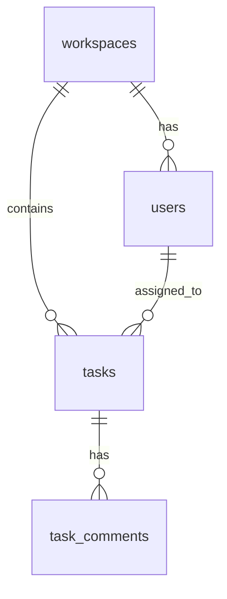
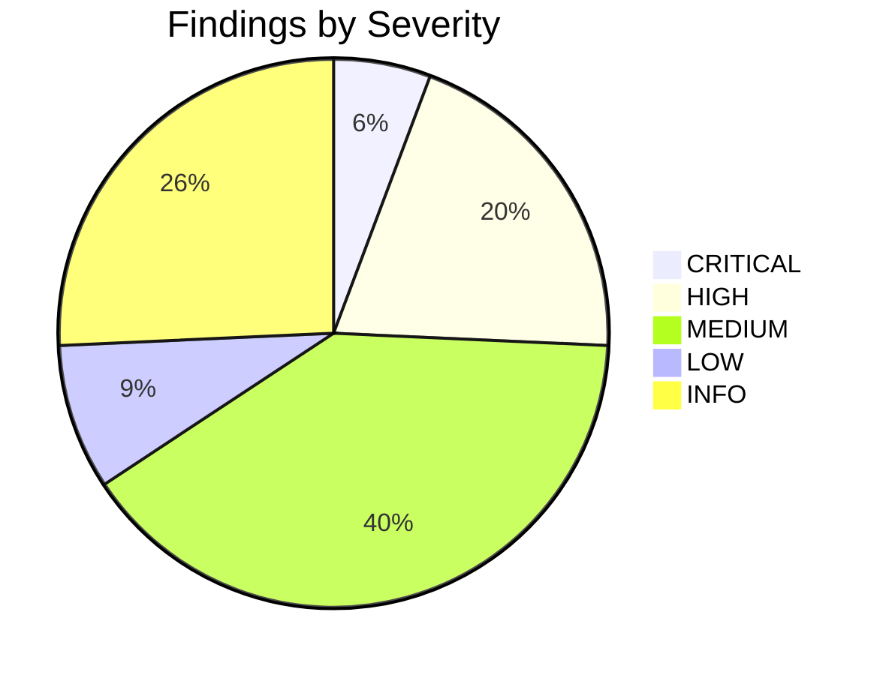

# Postgres Schema Audit Reference

Dense lookup tables, SQL query library, check taxonomy, and scoring rules for the `postgres-schema-audit` skill. Loaded on demand from `SKILL.md`.

All SQL snippets in this file are SELECT-only against `pg_catalog` and `information_schema`. They are designed to run through either the Supabase MCP's `execute_sql` tool (in `supabase-mcp` mode) or the local `scripts/run-query.sh` wrapper (in `direct-postgres` mode). The snippets themselves are identical between modes — only the execution path differs.

## Table of Contents

- [0. Connection Modes](#0-connection-modes)
- [1. System Schemas to Exclude](#1-system-schemas-to-exclude)
- [2. Per-Schema Snapshot Queries](#2-per-schema-snapshot-queries)
- [3. Audit Category Taxonomy](#3-audit-category-taxonomy)
- [4. FK Action Code Reference](#4-fk-action-code-reference)
- [5. Severity Rubric](#5-severity-rubric)
- [6. Safe Remediation Patterns](#6-safe-remediation-patterns)
- [7. Sub-Agent Prompt Rubric](#7-sub-agent-prompt-rubric)
- [8. Completeness Scoring](#8-completeness-scoring)
- [9. `.db-design-ignore` Format](#9-db-design-ignore-format)
- [10. Mermaid Diagram Conventions](#10-mermaid-diagram-conventions)
- [11. Supabase Advisor Integration](#11-supabase-advisor-integration)
- [12. Quick References](#12-quick-references)

---

## 0. Connection Modes

The skill supports two execution modes for reaching the database. Phase 1 of `SKILL.md` detects which is available and locks one in for the rest of the audit. Sub-agents inherit the choice and never switch mid-run.

### 0a. Supabase MCP (`execution_mode: "supabase-mcp"`)

Used when Claude Code has the Supabase MCP connector enabled (detected by `check-connection.sh` finding "supabase" in a `.mcp.json`).

| Capability | Tool |
|---|---|
| Enumerate projects | `mcp__*Supabase__list_projects` |
| Enumerate tables (cheap seed) | `mcp__*Supabase__list_tables` |
| Run catalog SELECTs | `mcp__*Supabase__execute_sql` |
| Security & performance hints | `mcp__*Supabase__get_advisors` |
| Migration history (optional) | `mcp__*Supabase__list_migrations` |

Advantages: `get_advisors` is a rich, Supabase-maintained evidence stream for RLS gaps, missing indexes, exposed functions, and other issues. It's the single strongest reason to prefer this mode for Supabase projects.

Limitation: only applicable to Supabase-hosted Postgres.

### 0b. Direct Postgres (`execution_mode: "direct-postgres"`)

Used for any Postgres 13+ where the Supabase MCP isn't applicable — AWS RDS, Google Cloud SQL, Neon, Railway, self-hosted, local dev, Azure Database for Postgres, Crunchy Bridge, and of course Supabase if the user prefers direct access.

| Capability | Tool |
|---|---|
| List configured profiles | `bash scripts/list-connections.sh` |
| Run catalog SELECTs | `bash scripts/run-query.sh --connection <name> --format json` |
| One-time setup | `bash scripts/setup-postgres.sh` (terminal-interactive) |
| Detect mode | `bash scripts/check-connection.sh` |

`run-query.sh` enforces two layers of read-only:

1. **Query lint** — refuses any query whose first keyword (after comment-stripping) isn't `SELECT`, `WITH`, `EXPLAIN`, `SHOW`, `TABLE`, or `VALUES`. Exit code 4.
2. **Transaction wrapping** — every query runs inside `BEGIN TRANSACTION READ ONLY; ... ROLLBACK;`. Postgres itself refuses any write even if the lint were bypassed.

`get_advisors` has no equivalent in this mode. Findings rely solely on catalog inspection. The report header must note the absence.

### 0c. Connection profile file format

Each profile is a bash env file at `~/.config/database-design/connections/<name>.env` (or `$XDG_CONFIG_HOME/database-design/connections/`). Created at mode `0600` by `setup-postgres.sh`.

```
# database-design connection profile: <name>
PGHOST=<host>
PGPORT=<port>
PGDATABASE=<db>
PGUSER=<user>
PGPASSWORD=<password>
PGSSLMODE=<disable|allow|prefer|require|verify-ca|verify-full>
PGAPPNAME=database-design-audit
PG_STATEMENT_TIMEOUT_MS=30000
```

**The skill never reads these files.** They are sourced by `run-query.sh` in a subshell. The profile name is the only identifier the skill passes around.

### 0d. Active-connection resolution order

When `run-query.sh` or `list-connections.sh` needs to know which profile is active (no `--connection` flag given), it checks in this order:

1. `.database-design/active-connection` in the current working directory (project-local pointer — contains only a profile NAME, not credentials; safe to gitignore)
2. `$XDG_CONFIG_HOME/database-design/active-connection` (user-global pointer)
3. If neither exists and only one profile is configured, that one
4. Otherwise, the skill asks the user to pick

### 0e. Recommended role for direct-postgres mode

Always audit with a dedicated read-only role, not a superuser. Apply this SQL once per database (replace `<password>` and list the schemas you want audited):

```sql
-- Create the role
CREATE ROLE audit_reader WITH LOGIN PASSWORD '<password>';

-- Catalog access (required — every audit query reads pg_catalog / information_schema)
GRANT USAGE ON SCHEMA pg_catalog         TO audit_reader;
GRANT USAGE ON SCHEMA information_schema TO audit_reader;

-- Per-schema grants — repeat for each schema you want audited
GRANT USAGE ON SCHEMA public TO audit_reader;
GRANT SELECT ON ALL TABLES IN SCHEMA public TO audit_reader;
ALTER DEFAULT PRIVILEGES IN SCHEMA public
  GRANT SELECT ON TABLES TO audit_reader;
```

For Supabase projects accessed in direct-postgres mode (unusual — prefer the MCP), do NOT grant role memberships `anon`, `authenticated`, or `service_role`. The audit does not need RLS bypass and adding those memberships weakens the safety model.

### 0f. Choosing a mode when both are configured (`mode: both`)

| Situation | Recommend |
|---|---|
| Supabase project, security advisors matter | supabase-mcp |
| Non-Supabase Postgres | direct-postgres (only option) |
| Supabase project + you want a dedicated audit role | direct-postgres |
| Multiple audits across different projects frequently | whichever is set as active globally |

The skill never picks silently when both are configured — it always asks.

---

## 1. System Schemas to Exclude

Always omit these from schema enumeration. They either belong to Postgres itself or to Supabase's managed infrastructure, and the audit cannot meaningfully recommend changes there.

```
pg_catalog, information_schema, pg_toast,
pg_temp_*, pg_toast_temp_*,
auth, storage, realtime, vault,
extensions, graphql, graphql_public, net,
pgsodium, pgsodium_masks,
supabase_functions, supabase_migrations
```

---

## 2. Per-Schema Snapshot Queries

Phase 3 of the skill runs each of these once per selected schema to produce a structural snapshot. Bind `$1` to the schema name.

### 2a. Tables and columns

```sql
SELECT
  c.table_schema,
  c.table_name,
  c.column_name,
  c.ordinal_position,
  c.data_type,
  c.udt_name,
  c.is_nullable,
  c.column_default,
  c.character_maximum_length,
  c.numeric_precision,
  c.numeric_scale,
  pg_get_expr(a.attfdwoptions, a.attrelid) AS fdw_options,
  pg_catalog.col_description(a.attrelid, a.attnum) AS column_comment,
  a.attndims AS array_ndims
FROM information_schema.columns c
JOIN pg_catalog.pg_namespace n ON n.nspname = c.table_schema
JOIN pg_catalog.pg_class cl ON cl.relname = c.table_name AND cl.relnamespace = n.oid
JOIN pg_catalog.pg_attribute a ON a.attrelid = cl.oid AND a.attname = c.column_name
WHERE c.table_schema = $1
  AND cl.relkind IN ('r','p')          -- ordinary + partitioned tables
ORDER BY c.table_name, c.ordinal_position;
```

### 2b. Primary keys and unique constraints

```sql
SELECT
  n.nspname AS schema_name,
  cl.relname AS table_name,
  con.conname AS constraint_name,
  con.contype AS constraint_type,  -- 'p' primary, 'u' unique
  array_agg(att.attname ORDER BY u.ord) AS columns
FROM pg_catalog.pg_constraint con
JOIN pg_catalog.pg_class cl ON cl.oid = con.conrelid
JOIN pg_catalog.pg_namespace n ON n.oid = cl.relnamespace
JOIN LATERAL unnest(con.conkey) WITH ORDINALITY u(attnum, ord) ON TRUE
JOIN pg_catalog.pg_attribute att ON att.attrelid = con.conrelid AND att.attnum = u.attnum
WHERE n.nspname = $1
  AND con.contype IN ('p','u')
GROUP BY n.nspname, cl.relname, con.conname, con.contype
ORDER BY cl.relname, con.contype;
```

### 2c. Foreign keys (with actions)

```sql
SELECT
  n.nspname                                AS schema_name,
  cl.relname                               AS table_name,
  con.conname                              AS fk_name,
  array_agg(a.attname ORDER BY u.ord)      AS fk_columns,
  fn.nspname                               AS ref_schema,
  fcl.relname                              AS ref_table,
  array_agg(fa.attname ORDER BY fu.ord)    AS ref_columns,
  con.confdeltype                          AS on_delete,  -- a=no action, r=restrict, c=cascade, n=set null, d=set default
  con.confupdtype                          AS on_update,
  con.convalidated                         AS validated
FROM pg_catalog.pg_constraint con
JOIN pg_catalog.pg_class cl   ON cl.oid = con.conrelid
JOIN pg_catalog.pg_namespace n ON n.oid = cl.relnamespace
JOIN pg_catalog.pg_class fcl  ON fcl.oid = con.confrelid
JOIN pg_catalog.pg_namespace fn ON fn.oid = fcl.relnamespace
JOIN LATERAL unnest(con.conkey)  WITH ORDINALITY u(attnum, ord)   ON TRUE
JOIN pg_catalog.pg_attribute a   ON a.attrelid = con.conrelid AND a.attnum = u.attnum
JOIN LATERAL unnest(con.confkey) WITH ORDINALITY fu(attnum, ord)  ON TRUE
JOIN pg_catalog.pg_attribute fa  ON fa.attrelid = con.confrelid AND fa.attnum = fu.attnum
WHERE n.nspname = $1
  AND con.contype = 'f'
GROUP BY n.nspname, cl.relname, con.conname, fn.nspname, fcl.relname,
         con.confdeltype, con.confupdtype, con.convalidated
ORDER BY cl.relname, con.conname;
```

### 2d. Check constraints

```sql
SELECT
  n.nspname AS schema_name,
  cl.relname AS table_name,
  con.conname AS check_name,
  pg_catalog.pg_get_constraintdef(con.oid) AS definition
FROM pg_catalog.pg_constraint con
JOIN pg_catalog.pg_class cl ON cl.oid = con.conrelid
JOIN pg_catalog.pg_namespace n ON n.oid = cl.relnamespace
WHERE n.nspname = $1
  AND con.contype = 'c'
ORDER BY cl.relname, con.conname;
```

### 2e. Indexes (with predicate and uniqueness)

```sql
SELECT
  n.nspname  AS schema_name,
  cl.relname AS table_name,
  i.relname  AS index_name,
  ix.indisunique        AS is_unique,
  ix.indisprimary       AS is_primary,
  pg_catalog.pg_get_indexdef(ix.indexrelid) AS definition,
  pg_catalog.pg_get_expr(ix.indpred, ix.indrelid) AS partial_predicate,
  array_agg(att.attname ORDER BY k.ord) AS indexed_columns
FROM pg_catalog.pg_index ix
JOIN pg_catalog.pg_class i  ON i.oid  = ix.indexrelid
JOIN pg_catalog.pg_class cl ON cl.oid = ix.indrelid
JOIN pg_catalog.pg_namespace n ON n.oid = cl.relnamespace
LEFT JOIN LATERAL unnest(ix.indkey) WITH ORDINALITY k(attnum, ord) ON TRUE
LEFT JOIN pg_catalog.pg_attribute att ON att.attrelid = ix.indrelid AND att.attnum = k.attnum
WHERE n.nspname = $1
GROUP BY n.nspname, cl.relname, i.relname, ix.indisunique, ix.indisprimary, ix.indexrelid, ix.indpred, ix.indrelid
ORDER BY cl.relname, i.relname;
```

### 2f. Triggers (non-internal)

```sql
SELECT
  n.nspname AS schema_name,
  cl.relname AS table_name,
  t.tgname AS trigger_name,
  pg_catalog.pg_get_triggerdef(t.oid) AS definition,
  p.proname AS function_name,
  pn.nspname AS function_schema,
  t.tgenabled AS enabled,
  (t.tgtype & 2) != 0 AS is_before,  -- bitmask for BEFORE
  (t.tgtype & 64) != 0 AS is_instead  -- INSTEAD OF
FROM pg_catalog.pg_trigger t
JOIN pg_catalog.pg_class cl ON cl.oid = t.tgrelid
JOIN pg_catalog.pg_namespace n ON n.oid = cl.relnamespace
JOIN pg_catalog.pg_proc p ON p.oid = t.tgfoid
JOIN pg_catalog.pg_namespace pn ON pn.oid = p.pronamespace
WHERE n.nspname = $1
  AND NOT t.tgisinternal
ORDER BY cl.relname, t.tgname;
```

### 2g. Functions (RPCs)

```sql
SELECT
  n.nspname AS schema_name,
  p.proname AS function_name,
  pg_catalog.pg_get_function_arguments(p.oid) AS args,
  pg_catalog.pg_get_function_result(p.oid) AS return_type,
  l.lanname AS language,
  p.provolatile AS volatility,        -- i=immutable, s=stable, v=volatile
  p.prosecdef AS security_definer,
  p.proleakproof AS leakproof,
  p.proconfig AS config,              -- includes search_path if locked
  pg_catalog.obj_description(p.oid, 'pg_proc') AS function_comment
FROM pg_catalog.pg_proc p
JOIN pg_catalog.pg_namespace n ON n.oid = p.pronamespace
JOIN pg_catalog.pg_language l ON l.oid = p.prolang
WHERE n.nspname = $1
  AND p.prokind = 'f'
ORDER BY p.proname;
```

### 2h. RLS state and policies

```sql
-- RLS enabled/forced per table
SELECT
  n.nspname AS schema_name,
  cl.relname AS table_name,
  cl.relrowsecurity AS rls_enabled,
  cl.relforcerowsecurity AS rls_forced
FROM pg_catalog.pg_class cl
JOIN pg_catalog.pg_namespace n ON n.oid = cl.relnamespace
WHERE n.nspname = $1
  AND cl.relkind = 'r'
ORDER BY cl.relname;

-- Policies
SELECT schemaname, tablename, policyname, cmd, roles, qual, with_check, permissive
FROM pg_policies
WHERE schemaname = $1
ORDER BY tablename, policyname;
```

### 2i. Enums and custom types

```sql
SELECT
  n.nspname AS schema_name,
  t.typname AS type_name,
  t.typtype AS type_kind,  -- 'e' enum, 'd' domain, 'c' composite
  CASE t.typtype
    WHEN 'e' THEN (SELECT array_agg(enumlabel ORDER BY enumsortorder)
                   FROM pg_catalog.pg_enum WHERE enumtypid = t.oid)
    ELSE NULL
  END AS enum_labels,
  CASE t.typtype
    WHEN 'd' THEN pg_catalog.format_type(t.typbasetype, t.typtypmod)
    ELSE NULL
  END AS domain_base_type
FROM pg_catalog.pg_type t
JOIN pg_catalog.pg_namespace n ON n.oid = t.typnamespace
WHERE n.nspname = $1
  AND t.typtype IN ('e','d','c')
  AND NOT EXISTS (SELECT 1 FROM pg_catalog.pg_class cl WHERE cl.reltype = t.oid)
ORDER BY t.typname;
```

### 2j. Row counts and sizes

```sql
SELECT
  schemaname AS schema_name,
  relname    AS table_name,
  n_live_tup AS approx_row_count,
  n_dead_tup AS dead_rows,
  pg_total_relation_size(relid) AS total_bytes,
  last_autovacuum,
  last_autoanalyze
FROM pg_stat_user_tables
WHERE schemaname = $1
ORDER BY total_bytes DESC;
```

### 2k. Index usage (if available)

```sql
SELECT schemaname, relname, indexrelname, idx_scan, idx_tup_read, idx_tup_fetch
FROM pg_stat_user_indexes
WHERE schemaname = $1
ORDER BY relname, indexrelname;
```

---

## 3. Audit Category Taxonomy

Sub-agents walk every category. Each finding carries a category letter + subtype code.

### Category A — Keys & Relationships

| Code | Subtype | Trigger | Default severity |
|---|---|---|---|
| A1 | `missing-primary-key` | Table has no PK constraint | HIGH |
| A2 | `composite-pk-candidate-surrogate` | PK is composite of `text` columns; surrogate `uuid` preferred | MEDIUM |
| A3 | `fk-shaped-no-constraint` | Column named `*_id` or `*_uuid` with no FK defined | HIGH |
| A4 | `fk-column-no-index` | FK column has no supporting index | HIGH |
| A5 | `fk-wrong-type` | FK column type differs from referenced PK type | CRITICAL |
| A6 | `fk-no-on-delete` | FK has `ON DELETE NO ACTION` where a cascade or `SET NULL` would be correct | MEDIUM |
| A7 | `many-to-many-no-junction` | Repeated row patterns suggesting a junction table is missing | MEDIUM |
| A8 | `orphan-table` | Table not referenced by any FK and has no FKs pointing elsewhere | INFO |
| A9 | `self-ref-no-cycle-check` | Self-referential FK with no CHECK preventing cycles | INFO |
| A10 | `text-column-holds-uuid` | `text` column pattern-matches UUIDs in sample rows | HIGH |

### Category B — Data Types

| Code | Subtype | Trigger | Default severity |
|---|---|---|---|
| B1 | `text-holding-uuid` | `text`/`varchar` column holds UUIDs (covered in A10 when FK-shaped) | HIGH |
| B2 | `integer-id-should-be-bigint` | `int4` PK on a table expected to grow past 2B rows | MEDIUM |
| B3 | `text-holding-timestamp` | `text` column holds ISO 8601 timestamps | HIGH |
| B4 | `timestamp-without-tz` | `timestamp` column (not `timestamptz`) | HIGH |
| B5 | `json-instead-of-jsonb` | `json` column (not `jsonb`) | HIGH |
| B6 | `varchar-arbitrary-limit` | `varchar(n)` with n ∈ {50, 100, 255, 500} | MEDIUM |
| B7 | `money-column-imprecise` | `numeric` without precision on a money-shaped column | MEDIUM |
| B8 | `text-column-enum-candidate` | `text` column with ≤10 distinct values across many rows | MEDIUM |
| B9 | `delimited-list-column` | `text` column with commas/semicolons/pipes in sampled rows | MEDIUM |
| B10 | `char1-boolean` | `char(1)` or `varchar(1)` storing Y/N or T/F | MEDIUM |

### Category C — Constraints & Defaults

| Code | Subtype | Trigger | Default severity |
|---|---|---|---|
| C1 | `nullable-should-be-not-null` | Column with zero NULLs in live data and no domain reason for nullability | MEDIUM |
| C2 | `missing-default` | `created_at`, `id`, `updated_at`, etc. with no default | MEDIUM |
| C3 | `missing-unique-natural-key` | Column (slug, email, username) with no unique constraint | HIGH |
| C4 | `missing-check-constraint` | Numeric range, email shape, status whitelist without CHECK | MEDIUM |
| C5 | `repeated-check-domain-candidate` | Same CHECK repeated in 3+ tables → domain type | INFO |
| C6 | `generated-column-candidate` | Trigger or application-maintained derived column could be `GENERATED ALWAYS AS (...) STORED` | INFO |

### Category D — Arrays & JSONB

| Code | Subtype | Trigger | Default severity |
|---|---|---|---|
| D1 | `repeating-group-columns` | `tag1`, `tag2`, `tag3` → single array column | MEDIUM |
| D2 | `delimited-list-should-be-array` | Covered in B9 where applicable | MEDIUM |
| D3 | `jsonb-consistent-shape-normalise` | JSONB column whose sampled rows share 90%+ of keys → normalise | MEDIUM |
| D4 | `jsonb-no-gin-index` | JSONB column queried in `->>` filters without GIN index | MEDIUM |
| D5 | `array-no-gin-index` | Array column used in `= ANY(...)` filters without GIN | MEDIUM |
| D6 | `array-candidate-column` | Column that semantically represents a set but is stored scalar (e.g., `preferred_language` string → `preferred_languages` array if business logic allows multiple) | INFO |

### Category E — Indexes

| Code | Subtype | Trigger | Default severity |
|---|---|---|---|
| E1 | `fk-unsupported` | Covered in A4 | HIGH |
| E2 | `duplicate-index` | Two indexes with same column set and key order | MEDIUM |
| E3 | `unused-index` | `idx_scan = 0` in `pg_stat_user_indexes` (only flag if stats have been collected for ≥14 days) | INFO |
| E4 | `missing-soft-delete-partial-index` | `deleted_at` column exists but no partial index excluding soft-deleted rows | MEDIUM |
| E5 | `missing-composite-index` | Frequently co-queried columns (inferred from RLS policies and FK pairs) with no composite | MEDIUM |
| E6 | `redundant-index` | Leading-columns-subset of another index | LOW |

### Category F — Triggers & RPC Functions

| Code | Subtype | Trigger | Default severity |
|---|---|---|---|
| F1 | `missing-updated-at-trigger` | Table has `updated_at` column but no BEFORE UPDATE trigger maintaining it | MEDIUM |
| F2 | `security-definer-no-search-path` | SECURITY DEFINER function with no `SET search_path` locked in `proconfig` | CRITICAL |
| F3 | `function-wrong-volatility` | Function labelled `VOLATILE` but body is deterministic | INFO |
| F4 | `duplicate-trigger-logic` | Two triggers on same table run the same function | LOW |
| F5 | `trigger-before-after-wrong` | Trigger fires AFTER for a mutation it should make on NEW | MEDIUM |
| F6 | `missing-audit-trigger` | Table flagged sensitive (matches `users`, `billing*`, `audit*`, etc.) with no audit trigger | MEDIUM |
| F7 | `dead-trigger` | Trigger references a function that no longer exists | HIGH |
| F8 | `security-definer-exposed-anon` | SECURITY DEFINER function with `EXECUTE` granted to `anon` | CRITICAL |
| F9 | `cascade-chain-risk` | Cascade chain of length ≥3 from one root table | HIGH |
| F10 | `function-no-comment` | Function with no `COMMENT ON FUNCTION` (ergonomic hit only) | INFO |

### Category G — RLS (Supabase)

| Code | Subtype | Trigger | Default severity |
|---|---|---|---|
| G1 | `rls-disabled-on-user-table` | `relrowsecurity = false` on a non-reference-data table | CRITICAL |
| G2 | `rls-enabled-no-policies` | `relrowsecurity = true` but no rows in `pg_policies` | CRITICAL |
| G3 | `policy-using-true` | Policy with `USING (true)` and no `WITH CHECK` | HIGH |
| G4 | `policy-missing-tenancy-filter` | Policy uses `auth.uid()` but not the table's detected tenancy column | HIGH |
| G5 | `partial-cmd-coverage` | Table has SELECT policy but no matching INSERT/UPDATE/DELETE policy | MEDIUM |
| G6 | `policy-no-with-check` | `FOR INSERT` or `FOR UPDATE` policy with no `WITH CHECK` | HIGH |

### Category H — Naming & Conventions

| Code | Subtype | Trigger | Default severity |
|---|---|---|---|
| H1 | `inconsistent-casing` | Schema mixes `snake_case` and `camelCase` identifiers | INFO |
| H2 | `reserved-word-identifier` | Column or table named with a SQL reserved word | INFO |
| H3 | `plural-singular-mixed` | Schema mixes plural and singular table names | INFO |
| H4 | `ambiguous-column-name` | Columns named `name`, `status`, `date` without domain prefix | INFO |
| H5 | `missing-table-comment` | Table has no `COMMENT ON TABLE` | INFO |
| H6 | `missing-column-comment-key` | Key column (PK, FK, enum-column) with no comment | INFO |

### Category I — Timestamps & Soft Delete

| Code | Subtype | Trigger | Default severity |
|---|---|---|---|
| I1 | `missing-created-at` | Mutable user-data table with no `created_at` | MEDIUM |
| I2 | `missing-updated-at` | Table that accepts UPDATEs with no `updated_at` | MEDIUM |
| I3 | `soft-delete-no-partial-index` | Covered in E4 | MEDIUM |
| I4 | `timestamp-without-tz` | Covered in B4 | HIGH |
| I5 | `timestamp-default-wrong` | `created_at DEFAULT now()` where `now() AT TIME ZONE 'utc'` or `clock_timestamp()` is more appropriate | INFO |

### Category J — Orphans & Dead Weight

| Code | Subtype | Trigger | Default severity |
|---|---|---|---|
| J1 | `table-empty-recent-writes-gap` | Zero rows and no writes in last 90 days | FLAG-ONLY |
| J2 | `table-never-referenced` | Covered in A8 | INFO |
| J3 | `column-all-null` | Column with 100% NULL values in a table with ≥1000 rows | INFO |
| J4 | `column-single-distinct-value` | Column with one distinct value across ≥1000 rows | INFO |
| J5 | `view-depends-on-missing-column` | View definition references a column that no longer exists | HIGH |

---

## 4. FK Action Code Reference

`pg_constraint.confdeltype` and `confupdtype` use single-character codes:

| Code | Meaning |
|---|---|
| `a` | NO ACTION (default) |
| `r` | RESTRICT |
| `c` | CASCADE |
| `n` | SET NULL |
| `d` | SET DEFAULT |

When the audit recommends changes, always emit the long form in SQL for readability.

---

## 5. Severity Rubric

Start with the category default. Apply adjustments based on evidence:

| Signal | Adjustment |
|---|---|
| Target table has zero rows | −1 tier |
| Target table's advisor-level = `ERROR` from `get_advisors` | keep baseline |
| Target is a reference/lookup table (static, <1000 rows, no UPDATEs) | −1 tier |
| Target has live writes in last 7 days | keep baseline |
| Target is user-data table with tenancy column | +1 tier on RLS findings |
| `.db-design-ignore` matches the finding | suppress |
| Finding is corroborated by a Supabase advisor | +1 tier on security findings |

Tier ordering (high → low): CRITICAL → HIGH → MEDIUM → LOW → INFO → FLAG-ONLY

### Severity meanings

| Severity | Meaning | Report section |
|---|---|---|
| CRITICAL | Data-loss, security, or correctness risk. Act before next release. | §3a |
| HIGH | Serious design flaw. Act within current sprint. | §3b |
| MEDIUM | Hardening opportunity. Add to hardening backlog. | §3c |
| LOW | Low-impact improvement. Nice to have. | §3d |
| INFO | Observational. No action required. | §3d |
| FLAG-ONLY | Destructive change (DROP). Human review mandatory; never emitted as runnable SQL. | §3e |

---

## 6. Safe Remediation Patterns

Every SQL suggestion in `migrations-suggested.sql` uses one of these patterns.

### 6a. Adding a NOT VALID FK (low-lock)

```sql
ALTER TABLE schema.child
  ADD CONSTRAINT child_parent_id_fkey
    FOREIGN KEY (parent_id) REFERENCES schema.parent(id)
    ON DELETE CASCADE
    NOT VALID;

ALTER TABLE schema.child VALIDATE CONSTRAINT child_parent_id_fkey;
```

### 6b. Creating an index without locking writes

```sql
CREATE INDEX CONCURRENTLY IF NOT EXISTS idx_child_parent_id
  ON schema.child (parent_id);
```

### 6c. Converting `text` UUID column to `uuid`

```sql
-- Two-phase migration: add new column, backfill, swap, drop old
ALTER TABLE schema.target ADD COLUMN id_new uuid;
UPDATE schema.target SET id_new = id::uuid WHERE id ~ '^[0-9a-f-]{36}$';
-- Verify all rows migrated before proceeding:
-- SELECT count(*) FROM schema.target WHERE id_new IS NULL;
ALTER TABLE schema.target ALTER COLUMN id_new SET NOT NULL;
ALTER TABLE schema.target DROP COLUMN id;
ALTER TABLE schema.target RENAME COLUMN id_new TO id;
ALTER TABLE schema.target ADD PRIMARY KEY (id);
```

### 6d. Enabling RLS with a baseline policy

```sql
ALTER TABLE schema.target ENABLE ROW LEVEL SECURITY;

CREATE POLICY "target_select_own"
  ON schema.target
  FOR SELECT
  TO authenticated
  USING (workspace_id = (SELECT current_workspace_id()));

CREATE POLICY "target_insert_own"
  ON schema.target
  FOR INSERT
  TO authenticated
  WITH CHECK (workspace_id = (SELECT current_workspace_id()));
```

### 6e. Adding `updated_at` auto-update trigger

```sql
-- Function (schema-local so it can be reused):
CREATE OR REPLACE FUNCTION schema.set_updated_at()
RETURNS trigger
LANGUAGE plpgsql
SECURITY DEFINER
SET search_path = ''
AS $$
BEGIN
  NEW.updated_at := now();
  RETURN NEW;
END;
$$;

CREATE TRIGGER target_set_updated_at
  BEFORE UPDATE ON schema.target
  FOR EACH ROW
  EXECUTE FUNCTION schema.set_updated_at();
```

### 6f. Locking SECURITY DEFINER function `search_path`

```sql
ALTER FUNCTION schema.the_function SET search_path = '';
```

### 6g. Converting repeating-group columns to an array

```sql
-- Migration is destructive — preserve old columns until verification
ALTER TABLE schema.target ADD COLUMN tags text[] NOT NULL DEFAULT '{}';
UPDATE schema.target
SET tags = array_remove(ARRAY[tag1, tag2, tag3, tag4], NULL);
-- Verify, then drop individually:
-- ALTER TABLE schema.target DROP COLUMN tag1;
-- ALTER TABLE schema.target DROP COLUMN tag2;
```

### 6h. Adding a GIN index for JSONB / array

```sql
CREATE INDEX CONCURRENTLY IF NOT EXISTS idx_target_metadata_gin
  ON schema.target USING gin (metadata jsonb_path_ops);
```

### 6i. Partial index for soft-delete

```sql
CREATE INDEX CONCURRENTLY IF NOT EXISTS idx_target_active
  ON schema.target (created_at)
  WHERE deleted_at IS NULL;
```

---

## 7. Sub-Agent Prompt Rubric

See `templates/subagent-prompt-template.md` for the full prompt. Every sub-agent call must include:

1. The schema snapshot JSON from Phase 3 (inline, not by reference — sub-agents can't see the main skill's memory)
2. The full audit category list (A1–J5)
3. The severity rubric from §5
4. The remediation patterns from §6
5. Explicit instruction to return JSON only, matching the `finding` shape from `templates/findings-schema.json`
6. Explicit instruction NOT to run mutating SQL
7. A maximum finding count (50 per schema is reasonable; more than that indicates low signal-to-noise)

---

## 8. Completeness Scoring

Completeness measures trace thoroughness. A clean schema and a messy schema can both score 100%.

### Adjustments

| Signal | Adjustment |
|---|---|
| MCP not connected (Phase 1 gate) | Overall = 0 |
| User did not confirm project | Overall = 0 |
| Zero schemas selected | Overall = 0 |
| Sub-agent returned malformed JSON | −15 per failed agent (from Phase 4) |
| Category skipped in a schema | −5 per (schema × category) skipped |
| `get_advisors` not called | −5 (from Phase 3) |
| Cross-schema analysis skipped | −10 (from Phase 5) |
| Finding missing evidence SQL | −2 per finding (from Phase 4) |
| Report section omitted | −5 per section (from Phase 8) |
| `migrations-suggested.sql` not emitted for actionable findings | −10 (from Phase 7) |

### Tiers

| Score | Tier |
|---|---|
| 95–100 | FULLY AUDITED |
| 80–94 | MOSTLY AUDITED |
| 60–79 | PARTIALLY AUDITED |
| <60 | INSUFFICIENT |

---

## 9. `.db-design-ignore` Format

Same parser as `.deadcode-ignore` and `.write-path-ignore`. Every entry MUST have a justification comment.

Pattern shapes:

| Pattern | Matches |
|---|---|
| `schema.table` | All findings on a table |
| `schema.table.column` | All findings on a specific column |
| `schema.function_name` | All findings on a function |
| `schema.*:G1` | All rows for a specific category code in a schema |
| `DB-042` | A specific finding ID from a prior run |
| `public.*:H5` | Suppress "missing-table-comment" in the public schema |

Stale entries (matching zero findings in the current run) are reported as warnings.

See `templates/db-design-ignore.example` for annotated examples.

---

## 10. Mermaid Diagram Conventions

### ER diagram (required)



### Risk heatmap (pie)


### Severity distribution (pie)



---

## 11. Supabase Advisor Integration

The `mcp__*Supabase__get_advisors` tool returns two categories: `security` and `performance`. Merge both into the findings with these mappings:

| Advisor code (examples) | Maps to audit subtype |
|---|---|
| `rls_disabled_in_public` | G1 `rls-disabled-on-user-table` |
| `policy_exists_rls_disabled` | G2 `rls-enabled-no-policies` |
| `function_search_path_mutable` | F2 `security-definer-no-search-path` |
| `security_definer_view` | (new) `security-definer-view-risk` |
| `rls_initplan` | E5 `missing-composite-index` (performance) |
| `unused_index` | E3 `unused-index` |
| `duplicate_index` | E2 `duplicate-index` |
| `no_primary_key` | A1 `missing-primary-key` |
| `auth_rls_initplan` | (perf note attached to G findings) |

Findings corroborated by an advisor get an `evidence_source: "supabase-advisor"` tag and one tier of severity bump on security items.

---

## 12. Quick References

- `pg_class.relkind`: `r` table, `p` partitioned, `v` view, `m` matview, `i` index, `S` sequence, `f` foreign table
- `pg_constraint.contype`: `c` check, `f` foreign, `p` primary, `u` unique, `t` trigger, `x` exclusion
- `pg_proc.provolatile`: `i` immutable, `s` stable, `v` volatile
- Trigger timing bitmask (`pg_trigger.tgtype`):
  - bit 0 (1): row-level (not statement)
  - bit 1 (2): BEFORE
  - bit 2 (4): INSERT
  - bit 3 (8): DELETE
  - bit 4 (16): UPDATE
  - bit 5 (32): TRUNCATE
  - bit 6 (64): INSTEAD OF
