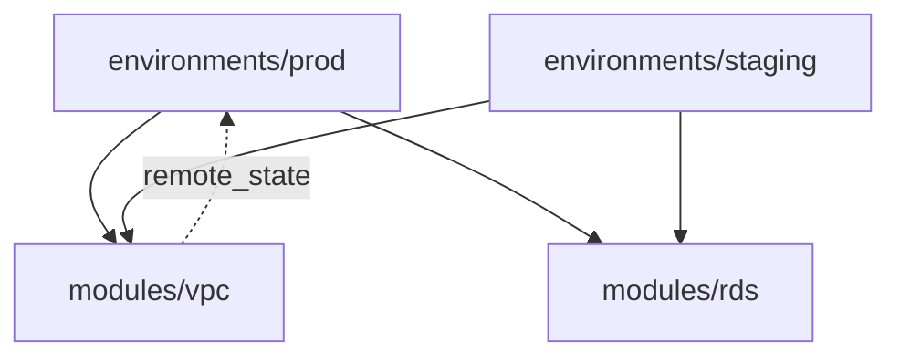

# IaC Terraform Audit — acme-infra

**Audited:** 21/04/2026
**Mode:** live
**Modules audited:** 4
**Verdict:** CONDITIONAL — score 61/100

---

## Executive Summary

Four modules (`environments/prod`, `environments/staging`, `modules/vpc`, `modules/rds`) audited. Prod environment uses a local state backend (CRITICAL — state sits on a single developer's laptop). VPC module has SSH open to the world on a production-tagged SG. RDS module is in decent shape but missing KMS pinning. Staging module reuses the prod state bucket key prefix — a write collision risk.

**Top risks:**
1. `environments/prod/backend.tf` — local state backend *(IAC-002)*
2. `modules/vpc/main.tf:42` — SSH 0.0.0.0/0 on prod SG *(IAC-001)*
3. `environments/staging/backend.tf` — shares state key with prod *(IAC-005)*

---

## Module Dependency Graph

---

## Category Scores

| Category | Weight | Score |
|---|---|---|
| A. State & Backend | 20 | 40 |
| B. Provider pinning | 10 | 70 |
| C. Security | 30 | 55 |
| D. Module hygiene | 10 | 75 |
| E. Environment separation | 10 | 50 |
| F. Drift risk | 10 | 80 |
| G. Cost hotspots | 5 | 60 |
| H. Testing & CI | 5 | 40 |

---

## Per-Module Findings

### `environments/prod` — HIGH RISK
- IAC-002 CRITICAL A.1 local backend
- IAC-006 HIGH H.2 no `terraform validate` in CI

### `modules/vpc` — HIGH RISK
- IAC-001 CRITICAL C.1 SSH 0.0.0.0/0
- IAC-004 MEDIUM D.2 variables missing descriptions

### `modules/rds` — MEDIUM RISK
- IAC-007 HIGH C.3 RDS instance not encrypted
- IAC-009 MEDIUM G.5 log_retention_in_days unset

### `environments/staging` — HIGH RISK
- IAC-005 CRITICAL E.1 shares state key with prod
- IAC-008 MEDIUM B.2 provider version range unpinned

---

## Live Plan Output

| Module | Add | Change | Destroy |
|---|---|---|---|
| environments/prod | 0 | 3 | 0 |
| environments/staging | 1 | 0 | 0 |
| modules/vpc | 0 | 2 | 0 |
| modules/rds | 0 | 1 | 0 |

No destructive changes pending. Drift is minor and safe to apply outside this audit.

---

## Risk Register

| ID | Sev | Target | Evidence | Remediation |
|---|---|---|---|---|
| IAC-001 | CRITICAL | modules/vpc/main.tf:42 | SG port 22 open to world | Restrict to bastion CIDR |
| IAC-002 | CRITICAL | environments/prod/backend.tf:1 | `backend "local"` on prod | Migrate to S3+DynamoDB |
| IAC-005 | CRITICAL | environments/staging/backend.tf:3 | shared state key prefix | Use distinct key per env |
| IAC-007 | HIGH | modules/rds/main.tf:18 | `storage_encrypted = false` | `storage_encrypted = true` + KMS |

---

## Action Batches

### Critical
- Migrate prod backend to S3 + DynamoDB.
- Restrict SSH ingress.
- Separate staging state key from prod.

### High
- Enable RDS storage encryption.
- Add CI `terraform validate` + `tflint`.

### Medium
- Add variable descriptions in `modules/vpc`.
- Set log retention on CloudWatch groups.
- Pin provider in `environments/staging`.

---

## Suppressed

None.

---

*Generated by `devops:iac-terraform-audit` — Anthril DevOps plugin*
