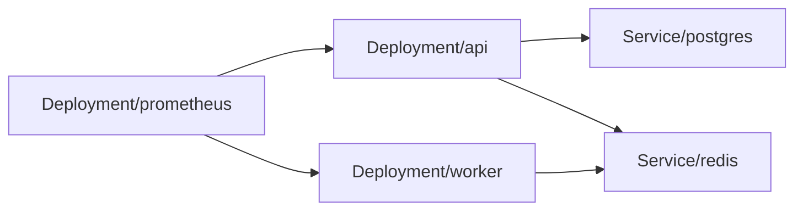

# Kubernetes Manifest Audit — acme-platform

**Audited:** 21/04/2026
**Mode:** live
**Groups audited:** 3
**Manifests audited:** 42
**Verdict:** FAIL — score 48/100

---

## Executive Summary

Three groups audited: `charts/api`, `charts/worker`, and `manifests/monitoring`. The `api` chart runs as root with no resource limits on a production-tagged namespace and includes a plaintext `kind: Secret` with database credentials in Git. The monitoring group has NetworkPolicy gaps allowing Prometheus to scrape across tenancy boundaries. Worker chart is in reasonable shape.

**Top risks:**
1. `charts/api/templates/deployment.yaml:42` — `privileged: true` *(K8S-001)*
2. `charts/api/templates/secret-db.yaml` — plaintext DB password *(K8S-003)*
3. `charts/api/templates/deployment.yaml:55` — no memory limit *(K8S-002)*

---

## Workload Graph

---

## Category Scores

| Category | Weight | Score |
|---|---|---|
| A. Pod security | 20 | 25 |
| B. Resources | 15 | 50 |
| C. Probes | 10 | 80 |
| D. Image hygiene | 10 | 70 |
| E. Secrets & config | 15 | 20 |
| F. Networking | 10 | 55 |
| G. RBAC | 10 | 70 |
| H. Availability | 5 | 60 |
| I. Helm hygiene | 5 | 60 |

---

## Per-Group Findings

### `charts/api` — FAILING
- K8S-001 CRITICAL A.7 `privileged: true` on api container
- K8S-003 CRITICAL E.1 plaintext Secret in Git
- K8S-002 HIGH B.3 no memory limit
- K8S-005 HIGH A.1 runAsNonRoot not set
- K8S-008 MEDIUM D.1 image pinned by tag not digest

### `charts/worker` — PASS WITH WARNINGS
- K8S-010 MEDIUM C.3 no startupProbe on slow-start worker

### `manifests/monitoring` — HIGH RISK
- K8S-004 MEDIUM H.1 no PDB
- K8S-007 HIGH F.1 no NetworkPolicy restricting prometheus scrape source
- K8S-011 MEDIUM G.2 ServiceAccount has `verbs: [get, list]` on `*` — too wide

---

## kube-bench results

| CIS ID | Control | Result |
|---|---|---|
| 5.2.5 | Minimize privilege escalation | FAIL (3 workloads) |
| 5.2.6 | Minimize root containers | FAIL (api) |
| 5.3.2 | NetworkPolicies in each namespace | WARN (monitoring) |
| 5.4.1 | Secrets as env vars | WARN (api, worker) |

---

## Runtime Resilience Test

Target: `charts/api` (staging namespace, confirmed non-prod)
Experiment: single pod deletion via `kubectl delete pod -l app=api --field-selector="status.phase=Running" --max-replicas=1`
Result: PASS — pod rescheduled in 8s; 0 failed readiness checks from LB during recovery.
Recovery time: 8.2s

---

## Risk Register

| ID | Sev | Cat | Target | Evidence | Remediation |
|---|---|---|---|---|---|
| K8S-001 | CRITICAL | A.7 | charts/api/templates/deployment.yaml:42 | `privileged: true` | Remove; use explicit capabilities |
| K8S-003 | CRITICAL | E.1 | charts/api/templates/secret-db.yaml | Plaintext DB password | Replace with SealedSecret |
| K8S-002 | HIGH | B.3 | deployment.yaml:55 | No `limits.memory` | Add 512Mi limit |
| K8S-005 | HIGH | A.1 | deployment.yaml:36 | `runAsNonRoot` unset | Set to true |
| K8S-007 | HIGH | F.1 | manifests/monitoring | No NetworkPolicy | Default-deny + allow-from monitoring NS |

---

## Action Batches

### Critical
- Remove privileged mode on api container (K8S-001).
- Move DB credentials to SealedSecrets (K8S-003).

### High
- Add memory limits and securityContext to all api containers (K8S-002, K8S-005).
- Add NetworkPolicies in monitoring namespace (K8S-007).

### Medium
- Pin images by digest (K8S-008).
- Add PDB for monitoring (K8S-004).
- Tighten monitoring RBAC (K8S-011).
- Add startup probe on worker (K8S-010).

---

## Suppressed

None (no `.k8s-ignore` present).

---

*Generated by `devops:kubernetes-manifest-audit` — Anthril DevOps plugin*
