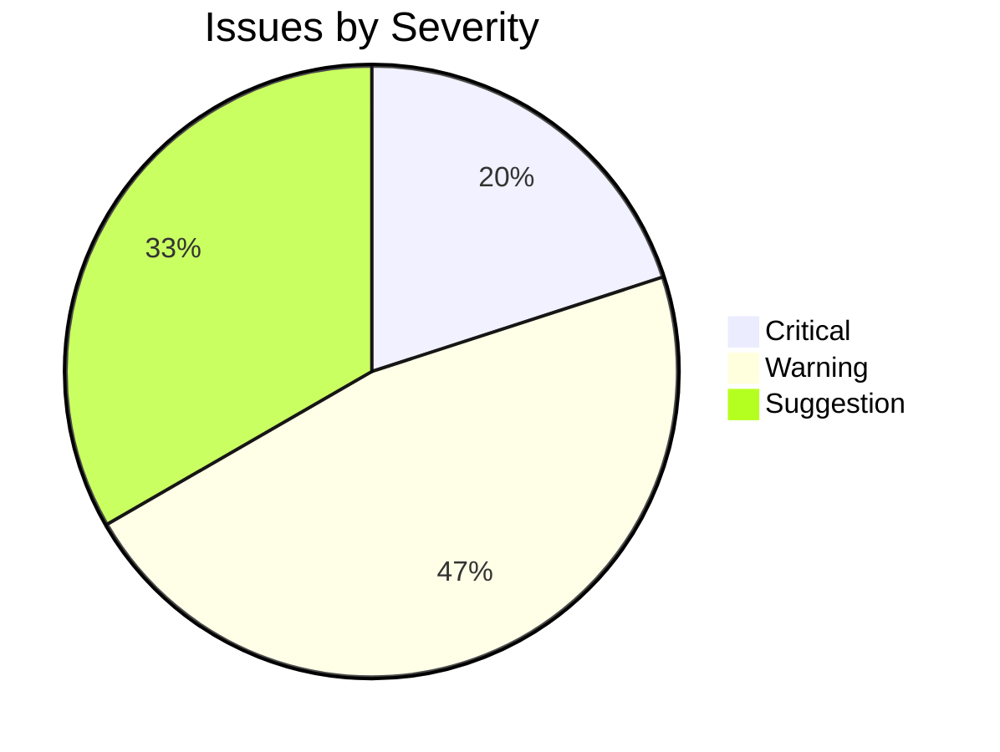
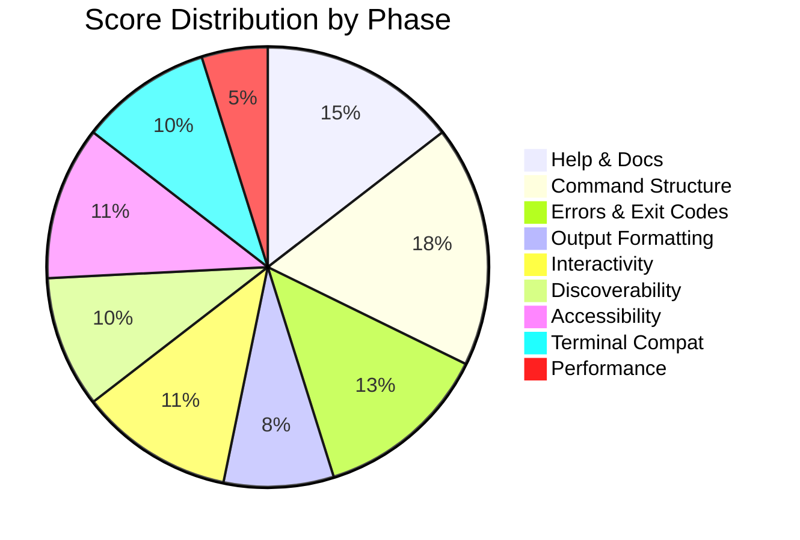

# CLI UX Audit Report

## Summary

| Field | Value |
|-------|-------|
| **CLI** | widgetctl |
| **Version** | 0.4.2 |
| **Date** | 2026-04-21 |
| **Overall Score** | 62/100 |
| **Overall Verdict** | CONDITIONAL |
| **Critical Issues** | 3 |
| **Warnings** | 7 |
| **Suggestions** | 5 |

## CLI Identity

| Field | Value |
|-------|-------|
| Binary path | `/usr/local/bin/widgetctl` |
| Language / Runtime | Node 20 |
| Framework | commander v12 |
| Subcommand tree depth | 2 |
| Top-level subcommands | 6 (`login`, `list`, `create`, `delete`, `sync`, `config`) |
| Source repo | `github.com/example/widgetctl` |

---

## Phase Results

### Phase 1: Discovery & Invocation -- CONTEXT

- Binary resolves to `./node_modules/.bin/widgetctl` (Node wrapper).
- Framework: commander — typo suggestions disabled by default.
- Baseline probes captured in `.cli-ux-audit/probes/`.

### Phase 2: Help & Documentation -- 9/15 -- FAIL

| Check | Status | Details |
|-------|--------|---------|
| `--help` and `-h` both work | PASS | Identical output, exit 0 |
| Per-subcommand help works | PASS | `widgetctl create --help` works |
| Help to stdout | PASS | `--help 2>/dev/null` prints full content |
| Synopsis line | PASS | `Usage: widgetctl [options] [command]` |
| Options block with descriptions | PASS | Every flag has a description |
| **Examples block** | **FAIL** | No examples in top-level or subcommand help |
| Defaults shown inline | PARTIAL | Shown for some flags, missing for `--timeout` |
| Wraps at narrow width | FAIL | `COLUMNS=40 widgetctl --help` produces long lines |
| `--version` exits 0 | PASS | `0.4.2` |
| Man page shipped | FAIL | No man page in package |

### Phase 3: Command Structure & Argument Parsing -- 11/15 -- PASS WITH WARNINGS

| Check | Status | Details |
|-------|--------|---------|
| Consistent subcommand grammar | PASS | Verb-first throughout |
| Short aliases for common flags | PASS | `-v`, `-o`, `-q` present |
| Negatable booleans | FAIL | `--color` yes, `--no-color` no |
| Required-arg validation | PASS | `widgetctl create` without name fails with clear usage |
| Unknown-flag rejection | PASS | `widgetctl --bogus` exits 1 |
| Typo suggestions | FAIL | `widgetctl creaete` rejected without suggestion |
| Flag order independence | PASS | — |
| `--` separator | PASS | — |
| **Destructive actions gated** | **FAIL** | `widgetctl delete <id>` runs without confirmation or `--yes` |
| Tree depth ≤ 3 | PASS | Max depth 2 |
| Mutually exclusive flags enforced | PASS | `--json` / `--yaml` mutually exclusive |

### Phase 4: Error Messages & Exit Codes -- 8/15 -- FAIL

| Check | Status | Details |
|-------|--------|---------|
| Distinct exit codes | FAIL | Always exits 1 on any failure class |
| `sysexits.h` convention | FAIL | — |
| Errors to stderr | PASS | Errors routed to stderr |
| Three-part error format | FAIL | Errors state what, not why or how to fix |
| No raw stack traces | FAIL | Node `TypeError` stack printed on network failure |
| Missing-input names the arg | PASS | — |
| Graceful network/FS errors | PARTIAL | 401 shows generic "unauthorized"; no hint to run `widgetctl login` |
| Clean signal handling | PASS | Ctrl+C during sync removes temp files |
| Secrets redacted | PASS | Token redacted as `***` in error URLs |

### Phase 5: Output Formatting -- 5/10 -- FAIL

| Check | Status | Details |
|-------|--------|---------|
| Aligned tables/lists | PASS | `widgetctl list` uses fixed-width columns |
| Semantic colour usage | PASS | Red/green/yellow used semantically |
| **`NO_COLOR` honoured** | **FAIL** | `NO_COLOR=1 widgetctl list` still emits ANSI |
| Pipe-safe (strips ANSI) | FAIL | `widgetctl list | cat -v` shows `^[[32m` |
| `--json` or structured mode | PASS | `--json` flag on `list` and `create` |
| Progress to stderr | PASS | Spinner on `sync` writes to stderr |

### Phase 6: Interactivity & Progress Feedback -- 7/10 -- PASS WITH WARNINGS

| Check | Status | Details |
|-------|--------|---------|
| Feedback for ops > 2s | PASS | ora spinner during `sync` |
| Spinners disabled on non-TTY | PARTIAL | Spinner suppressed but progress text still emitted |
| Tested prompt library | PASS | Uses `@inquirer/prompts` |
| Defaults shown in prompt | PASS | `[Y/n]` shown |
| Non-interactive escape hatch | FAIL | No `--yes` / `--no-input` on `login` flow |
| `CI=true` auto-detected | FAIL | Prompts still appear in GitHub Actions |
| Ctrl+C on prompt exits 130 | PASS | — |

### Phase 7: Discoverability & Onboarding -- 6/10 -- PASS WITH WARNINGS

| Check | Status | Details |
|-------|--------|---------|
| No-args shows help | PASS | Commander default |
| Top-level subcommand list | PASS | — |
| Typo suggestions | FAIL | See Phase 3 |
| Shell completions | FAIL | No `completion` subcommand |
| First-run guidance | PARTIAL | No docs URL in `--help`; README points to old URL |
| `--version` includes commit/date | FAIL | Version only, no commit hash |

### Phase 8: Accessibility & I18n -- 7/10 -- PASS WITH WARNINGS

| Check | Status | Details |
|-------|--------|---------|
| Status has text/symbol cue | PASS | Uses ✓ / ✗ alongside colour |
| CVD-safe palette | PASS | Red + ✗ and green + ✓ pairs |
| Critical info as text | PASS | — |
| Locale awareness | PARTIAL | Timestamps use local format; consider ISO 8601 |
| Unicode degrades on `LANG=C` | FAIL | ✓ renders as `?` under `LANG=C` with no fallback |
| High-contrast friendly | PASS | — |

### Phase 9: Terminal Compatibility & Piping Safety -- 6/10 -- PASS WITH WARNINGS

| Check | Status | Details |
|-------|--------|---------|
| No ANSI leakage on pipes | FAIL | See Phase 5 |
| `isatty` detection | PARTIAL | Spinner checks, colour does not |
| Cross-terminal support | PASS | Tested on Windows Terminal, iTerm, cmd |
| `COLUMNS` handling | PASS | Uses `process.stdout.columns`, falls back to 80 |
| SIGWINCH (TUIs only) | N/A | Not a TUI |
| Clean exit restores terminal | PASS | — |
| `TERM=dumb` respected | FAIL | Still emits ANSI under `TERM=dumb` |

### Phase 10: Performance Perception -- 3/5 -- PASS WITH WARNINGS

| Check | Status | Details |
|-------|--------|---------|
| `--help` / `--version` < 200 ms | PASS | `time widgetctl --version` = 87 ms |
| No network in help/version paths | PASS | — |
| Prompt latency < 100 ms | PASS | — |
| Lazy-load heavy subsystems | FAIL | Top-level `require('./api-client')` imports the entire HTTP client even for `--help` |

---

## Prioritised Action List

### Critical (must fix — blocks usability)

1. **Phase 3.9 — `widgetctl delete` runs without confirmation.**
   Probe: `widgetctl delete abc123` — deletes immediately, exit 0.
   Fix: add `--yes` flag and prompt by default; refuse on non-TTY without `--yes`.
2. **Phase 5.3 — `NO_COLOR` ignored.**
   Probe: `NO_COLOR=1 widgetctl list | cat -v` shows `^[[32m`.
   Fix: gate chalk/colourize calls behind an `if (!process.env.NO_COLOR && process.stdout.isTTY)` check, or swap to `picocolors` which respects `NO_COLOR` by default.
3. **Phase 2.6 — no examples block in help output.**
   Probe: `widgetctl --help` — options and commands listed, no examples.
   Fix: add `.addHelpText('after', ...)` blocks to the top-level program and every subcommand.

### Warnings (should fix)

1. **Phase 4.1 — single exit code 1 for every failure class.** Adopt distinct codes (2 for usage, 65 for bad input, 69 for service unavailable).
2. **Phase 4.4 — errors lack cause and fix.** Adopt the three-part format; when 401 is returned, point to `widgetctl login`.
3. **Phase 4.5 — raw stack traces on network failure.** Wrap the HTTP client in a handler that prints a one-line summary; gate traces behind `--debug`.
4. **Phase 3.6 — no typo suggestion on bad subcommand.** Enable commander's `showSuggestionAfterError()`.
5. **Phase 6.5/6.6 — no `--yes` / `CI` handling on login flow.** Respect `CI=true` and refuse to prompt.
6. **Phase 7.4 — no shell completion script.** Ship `widgetctl completion bash|zsh|fish` via `omelette` or similar.
7. **Phase 9.7 — ignores `TERM=dumb`.** Check `process.env.TERM === 'dumb'` before emitting ANSI.

### Suggestions (polish)

1. Add man page generation via `marked-man` or `commander-man`.
2. Include commit hash in `--version` output.
3. Lazy-load `./api-client` so `--help` does not parse the HTTP module.
4. Add ASCII fallback for ✓/✗ when `LANG=C` or UTF-8 unsupported.
5. Emit timestamps in ISO 8601 by default; offer `--local-time` as an opt-in.

---

## Visual Summary

