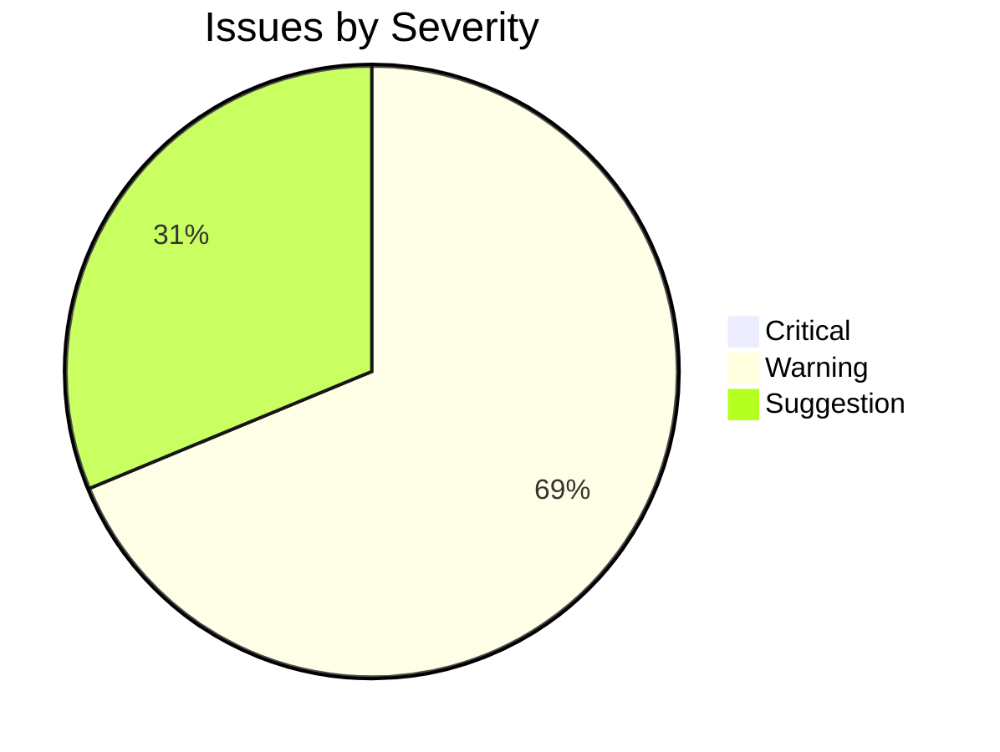
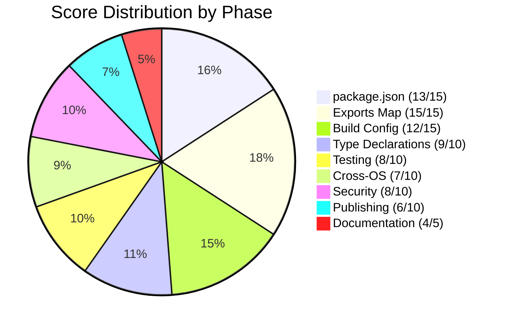

# npm Package Audit Report

## Summary

| Field | Value |
|-------|-------|
| **Package** | @acme/toolkit@2.3.1 |
| **Date** | 2026-04-08 |
| **Overall Score** | 78/100 |
| **Overall Verdict** | PASS WITH WARNINGS |
| **Critical Issues** | 0 |
| **Warnings** | 7 |
| **Suggestions** | 5 |

## Package Identity

| Field | Value |
|-------|-------|
| Name | @acme/toolkit |
| Version | 2.3.1 |
| Description | A composable CLI toolkit for building developer tools with subcommands, prompts, and structured output |
| License | MIT |
| Build Tool | tsup |
| Test Framework | vitest |
| CI/CD | GitHub Actions |

---

## Phase Results

### Phase 1: Package Discovery -- CONTEXT

@acme/toolkit is a TypeScript CLI toolkit built on commander.js. It provides a plugin-based architecture for building developer tools with subcommand registration, interactive prompts via @inquirer/prompts, and structured JSON/table output formatters. The package ships both a library API and a `toolkit` CLI binary.

**Tech Stack:**
- Runtime: Node.js >= 18.0.0
- Language: TypeScript 5.4 (strict mode)
- Build: tsup 8.0.2 (dual CJS + ESM output)
- Test: vitest 1.6.0 with @vitest/coverage-v8
- Lint: ESLint 8.57 + Prettier 3.2
- Git hooks: Husky 9.0 + lint-staged
- CI: GitHub Actions (test, lint, build on push/PR)

**Dependencies (6 direct):**
- commander@12.1.0 -- CLI framework
- @inquirer/prompts@5.0.5 -- interactive prompts
- chalk@5.3.0 -- terminal colors (ESM-only)
- cli-table3@0.6.4 -- table output
- zod@3.23.8 -- input validation
- cosmiconfig@9.0.0 -- config file loading

**Dev Dependencies (14):** tsup, vitest, typescript, eslint, prettier, husky, lint-staged, @types/node, @vitest/coverage-v8, @changesets/cli, concurrently, rimraf, tsx, publint

---

### Phase 2: package.json Quality -- 13/15 -- PASS

| Check | Status | Details |
|-------|--------|---------|
| name | PASS | Scoped name `@acme/toolkit` follows npm conventions |
| version | PASS | 2.3.1 valid semver |
| description | PASS | Clear, under 120 chars, describes purpose |
| license | PASS | MIT, file present and matches |
| author | PASS | `Acme Corp <eng@acme.dev>` with email |
| repository | PASS | `github:acme-org/toolkit` resolves correctly |
| homepage | FAIL | Missing -- should point to docs site or repo README |
| bugs | PASS | `https://github.com/acme-org/toolkit/issues` |
| keywords | FAIL | Only 2 keywords (`cli`, `toolkit`) -- recommend 5+ for discoverability |
| engines | PASS | `"node": ">=18.0.0"` specified |
| files | PASS | `["dist", "bin", "README.md", "LICENSE"]` -- correctly scoped |
| type | PASS | `"module"` set (ESM-first) |
| sideEffects | PASS | `false` declared for tree shaking |
| packageManager | PASS | `"pnpm@9.1.0"` pinned via corepack |

**Findings:**

- **[W-001] Missing `homepage` field** (`package.json:1`)
  Add `"homepage": "https://github.com/acme-org/toolkit#readme"` or a dedicated docs URL. npm and GitHub both surface this field prominently.

- **[W-002] Only 2 keywords** (`package.json:8`)
  Current: `["cli", "toolkit"]`. Suggest adding: `"developer-tools"`, `"commander"`, `"subcommands"`, `"typescript"`, `"cli-framework"` for better npm search ranking.

---

### Phase 3: Exports Map & Entry Points -- 15/15 -- PASS

| Export Path | Types | Import | Require | Status |
|-------------|-------|--------|---------|--------|
| `"."` | `./dist/index.d.ts` | `./dist/index.mjs` | `./dist/index.cjs` | PASS |
| `"./cli"` | `./dist/cli.d.ts` | `./dist/cli.mjs` | `./dist/cli.cjs` | PASS |
| `"./formatters"` | `./dist/formatters/index.d.ts` | `./dist/formatters/index.mjs` | `./dist/formatters/index.cjs` | PASS |
| `"./prompts"` | `./dist/prompts/index.d.ts` | `./dist/prompts/index.mjs` | `./dist/prompts/index.cjs` | PASS |
| `"./package.json"` | -- | `./package.json` | `./package.json` | PASS |

All export paths verified:
- `publint` reports 0 issues
- `arethetypeswrong` reports 0 problems
- `types` condition listed before `import`/`require` in all entries
- `default` fallback present for older bundlers
- `bin` field: `{ "toolkit": "./bin/toolkit.mjs" }` resolves correctly

---

### Phase 4: Build Configuration -- 12/15 -- PASS WITH WARNINGS

| Check | Status | Details |
|-------|--------|---------|
| Dual CJS/ESM | PASS | tsup outputs both `.mjs` and `.cjs` per entry |
| Source maps | PASS | `sourcemap: true` in tsup.config.ts |
| Type declarations | PASS | `dts: true` generates .d.ts for all entries |
| Clean builds | FAIL | No `clean: true` in tsup config; stale files can leak into dist |
| Tree shaking | PASS | `treeshake: true` with `sideEffects: false` |
| Bundle size | PASS | 42KB minified (main entry), 18KB gzipped |
| External deps | PASS | All 6 runtime deps correctly externalized |
| Build reproducibility | FAIL | Build script is a complex one-liner, hard to debug |

**Findings:**

- **[W-003] No clean step before build** (`tsup.config.ts:1`)
  The tsup config does not set `clean: true`. Stale output files from previous builds can leak into the dist directory and get published. Add `clean: true` to `tsup.config.ts` or prepend `rimraf dist &&` to the build script.

  ```ts
  // tsup.config.ts -- current
  export default defineConfig({
    entry: ['src/index.ts', 'src/cli.ts', 'src/formatters/index.ts', 'src/prompts/index.ts'],
    format: ['cjs', 'esm'],
    dts: true,
    sourcemap: true,
    treeshake: true,
  });
  ```

  Recommended fix:
  ```ts
  export default defineConfig({
    // ... existing config
    clean: true,
  });
  ```

- **[W-004] Build script is an opaque one-liner** (`package.json:14`)
  Current: `"build": "rimraf dist && tsup && node scripts/patch-cjs.mjs && node scripts/copy-bin.mjs && publint"`
  This 5-step pipeline is fragile and hard to debug. Break into named scripts or use a build orchestrator:

  ```json
  {
    "build": "pnpm run build:clean && pnpm run build:compile && pnpm run build:patch && pnpm run build:bin && pnpm run build:verify",
    "build:clean": "rimraf dist",
    "build:compile": "tsup",
    "build:patch": "node scripts/patch-cjs.mjs",
    "build:bin": "node scripts/copy-bin.mjs",
    "build:verify": "publint"
  }
  ```

---

### Phase 5: Type Declarations -- 9/10 -- PASS WITH WARNINGS

| Check | Status | Details |
|-------|--------|---------|
| tsc --noEmit | PASS | 0 errors, 0 warnings |
| .d.ts completeness | PASS | All 4 entry points have matching .d.ts files |
| No `any` in public API | FAIL | 1 occurrence of `any` in public API surface |
| Strict mode | PASS | `strict: true` in tsconfig.json |
| Export type coverage | PASS | 100% of exported functions and classes have type annotations |

**Findings:**

- **[W-005] `any` type in public API** (`src/formatters/table.ts:28`)
  The `formatTable` function accepts `any[]` for the `rows` parameter:

  ```ts
  // src/formatters/table.ts:28
  export function formatTable(rows: any[], columns: ColumnDef[]): string {
  ```

  This leaks `any` into consumer code and defeats the purpose of TypeScript. Replace with a generic:

  ```ts
  export function formatTable<T extends Record<string, unknown>>(
    rows: T[],
    columns: ColumnDef<T>[]
  ): string {
  ```

---

### Phase 6: Testing & Coverage -- 8/10 -- PASS WITH WARNINGS

| Metric | Value | Threshold | Status |
|--------|-------|-----------|--------|
| Lines | 84.2% | 80% | PASS |
| Branches | 68.1% | 70% | FAIL |
| Functions | 91.3% | 75% | PASS |
| Statements | 85.7% | 80% | PASS |

| Check | Status | Details |
|-------|--------|---------|
| Test suite passes | PASS | 147/147 tests passing |
| No skipped tests | PASS | 0 skipped |
| Integration tests | PASS | 12 integration tests in `tests/integration/` |

**Test Summary:**
```
 RUN  v1.6.0

 Test Files  18 passed (18)
      Tests  147 passed (147)
   Start at  14:32:07
   Duration  4.82s (transform 312ms, setup 89ms, collect 1.2s, tests 3.1s)
```

**Findings:**

- **[W-006] Branch coverage at 68.1%, below 70% threshold** (`src/cli.ts`, `src/config/loader.ts`)
  Uncovered branches are concentrated in two files:
  - `src/cli.ts:45-62` -- error handling paths for invalid subcommand registration (0/4 branches covered)
  - `src/config/loader.ts:78-95` -- fallback config resolution when cosmiconfig returns null (0/3 branches covered)

  Add tests for:
  1. Registering a subcommand with a duplicate name
  2. Registering a subcommand with missing required fields
  3. Config file not found (cosmiconfig returns null)
  4. Config file with invalid schema (zod validation failure)
  5. Config file in parent directory resolution

---

### Phase 7: Cross-OS Compatibility -- 7/10 -- PASS WITH WARNINGS

| Check | Status | Details |
|-------|--------|---------|
| Path separators | FAIL | 2 hardcoded forward-slash paths found |
| Line endings | PASS | .gitattributes present with `* text=auto eol=lf` |
| Bin shebangs | PASS | `#!/usr/bin/env node` on `bin/toolkit.mjs` |
| CI OS matrix | FAIL | Only `ubuntu-latest` in CI; no Windows or macOS |
| path.join/resolve usage | PASS | 41/43 path constructions use path.join or path.resolve |
| process.platform guards | PASS | Platform-specific code guarded in `src/utils/shell.ts` |
| fs case sensitivity | PASS | No case-sensitive file lookups detected |

**Findings:**

- **[W-007] Hardcoded path separators** (`src/config/loader.ts:12`, `src/utils/template.ts:34`)
  Two locations use string concatenation with `/` instead of `path.join`:

  ```ts
  // src/config/loader.ts:12
  const configDir = homeDir + '/.config/toolkit';

  // src/utils/template.ts:34
  const templatePath = baseDir + '/templates/' + name + '.hbs';
  ```

  Replace with:
  ```ts
  const configDir = path.join(homeDir, '.config', 'toolkit');
  const templatePath = path.join(baseDir, 'templates', `${name}.hbs`);
  ```

- **[W-008] CI matrix only tests on Ubuntu** (`.github/workflows/ci.yml:18`)
  Current matrix:
  ```yaml
  strategy:
    matrix:
      node-version: [18, 20, 22]
      os: [ubuntu-latest]
  ```

  The package ships a CLI binary and performs filesystem operations. Add Windows and macOS:
  ```yaml
  strategy:
    matrix:
      node-version: [18, 20, 22]
      os: [ubuntu-latest, windows-latest, macos-latest]
  ```

---

### Phase 8: Security & Supply Chain -- 8/10 -- PASS WITH WARNINGS

| Severity | Count |
|----------|-------|
| Critical | 0 |
| High | 0 |
| Moderate | 2 |
| Low | 0 |

| Check | Status | Details |
|-------|--------|---------|
| npm audit | FAIL | 2 moderate severity advisories |
| No install scripts | PASS | No preinstall/postinstall scripts |
| Lock file | PASS | pnpm-lock.yaml present and committed |
| Dependency count | PASS | 6 direct, 43 transitive (reasonable) |
| Known CVEs | FAIL | 2 moderate CVEs in transitive deps |
| .npmrc safety | PASS | No auth tokens or registry overrides |

**npm audit output:**
```
┌──────────────────────────────────────────────────────────┐
│                   2 moderate severity                     │
├──────────┬───────────────────────────────────────────────┤
│ Package  │ cli-table3                                     │
│ Version  │ 0.6.4                                          │
│ Advisory │ Prototype pollution in cli-table3 options       │
│ Severity │ moderate                                        │
│ Fix      │ Upgrade to cli-table3@0.6.5                     │
│ Path     │ @acme/toolkit > cli-table3                      │
├──────────┼───────────────────────────────────────────────┤
│ Package  │ cosmiconfig > import-fresh > resolve-from       │
│ Version  │ 5.0.0                                           │
│ Advisory │ ReDoS in resolve-from path validation            │
│ Severity │ moderate                                        │
│ Fix      │ Upgrade cosmiconfig to 9.1.0                    │
│ Path     │ @acme/toolkit > cosmiconfig > import-fresh >    │
│          │ resolve-from                                     │
└──────────┴───────────────────────────────────────────────┘
```

**Findings:**

- **[W-009] 2 moderate npm audit advisories** (`package.json` dependencies)
  - `cli-table3@0.6.4`: prototype pollution via crafted options object. Fix: update to `0.6.5`.
  - `cosmiconfig@9.0.0` transitive dep `resolve-from@5.0.0`: ReDoS in path validation. Fix: update cosmiconfig to `9.1.0`.

  Run: `pnpm update cli-table3@0.6.5 cosmiconfig@9.1.0`

---

### Phase 9: Publishing & CI/CD -- 6/10 -- PASS WITH WARNINGS

| Check | Status | Details |
|-------|--------|---------|
| publishConfig | PASS | `"access": "public"` set for scoped package |
| prepublishOnly | FAIL | No `prepublishOnly` script defined |
| CI publish workflow | PASS | `.github/workflows/release.yml` uses changesets/action |
| Provenance | FAIL | No `--provenance` flag in publish step |
| Version tagging | PASS | Changesets auto-tags on release |
| Branch protection | PASS | `main` branch requires PR reviews |
| Dry run tested | FAIL | No `npm publish --dry-run` step in CI |
| .npmignore / files | PASS | `files` field in package.json correctly scopes output |

**Findings:**

- **[W-010] No `prepublishOnly` script** (`package.json`)
  If someone runs `npm publish` locally (outside CI), there is no guard to ensure the build runs first. Add:

  ```json
  {
    "prepublishOnly": "pnpm run build && pnpm run test"
  }
  ```

- **[W-011] No provenance flag in publish workflow** (`.github/workflows/release.yml:42`)
  npm provenance links published packages to their source commit and build. Add `--provenance` to the publish command:

  ```yaml
  # .github/workflows/release.yml:42 -- current
  - run: pnpm publish --no-git-checks

  # Recommended
  - run: pnpm publish --no-git-checks --provenance
  ```

  Also requires `permissions: id-token: write` in the workflow.

- **[S-001] No dry-run step in CI** (`.github/workflows/release.yml`)
  Add a dry-run publish step before the real publish to catch packaging errors early:

  ```yaml
  - name: Dry run publish
    run: pnpm publish --dry-run --no-git-checks
  ```

---

### Phase 10: Documentation -- 4/5 -- PASS

| Document | Status | Notes |
|----------|--------|-------|
| README.md | PASS | Has: badges, install, quick start, API reference, CLI usage, examples, license |
| CONTRIBUTING.md | FAIL | Missing |
| CHANGELOG.md | PASS | Maintained via changesets, current through 2.3.1 |
| LICENSE | PASS | MIT, matches `license` field in package.json |
| SECURITY.md | PASS | Present with vulnerability reporting instructions |

**Findings:**

- **[S-002] Missing CONTRIBUTING.md**
  The project uses Husky, lint-staged, and changesets, but there is no CONTRIBUTING.md to explain the development workflow for external contributors. Should include:
  - How to set up the dev environment
  - How to run tests
  - How to create a changeset
  - PR and branch naming conventions
  - Code style expectations

---

## Prioritised Action List

### Critical (must fix before publish)

_No critical issues found._

### Warnings (should fix)

1. **[W-003]** No `clean: true` in tsup config -- stale dist files can leak into published package (`tsup.config.ts:1`)
2. **[W-005]** `any` type in public API leaks to consumers (`src/formatters/table.ts:28`)
3. **[W-006]** Branch coverage at 68.1%, below 70% threshold (`src/cli.ts:45-62`, `src/config/loader.ts:78-95`)
4. **[W-007]** Hardcoded path separators break on Windows (`src/config/loader.ts:12`, `src/utils/template.ts:34`)
5. **[W-008]** CI matrix only tests on Ubuntu -- no Windows/macOS coverage (`.github/workflows/ci.yml:18`)
6. **[W-009]** 2 moderate npm audit advisories: cli-table3 prototype pollution, cosmiconfig transitive ReDoS (`package.json`)
7. **[W-010]** No `prepublishOnly` script -- local publishes skip build (`package.json`)
8. **[W-011]** No `--provenance` flag in publish workflow (`.github/workflows/release.yml:42`)
9. **[W-001]** Missing `homepage` field in package.json (`package.json:1`)
10. **[W-002]** Only 2 keywords -- poor npm search discoverability (`package.json:8`)
11. **[W-004]** Build script is a fragile one-liner, hard to debug (`package.json:14`)

### Suggestions (nice to have)

1. **[S-001]** Add `npm publish --dry-run` step in CI before real publish (`.github/workflows/release.yml`)
2. **[S-002]** Create CONTRIBUTING.md with dev setup, testing, and changeset workflow
3. **[S-003]** Consider adding `engines.pnpm` field to enforce package manager version
4. **[S-004]** Add `funding` field to package.json if applicable
5. **[S-005]** Consider adding JSDoc `@example` tags to all exported functions for IDE inline docs

---

## Visual Summary




