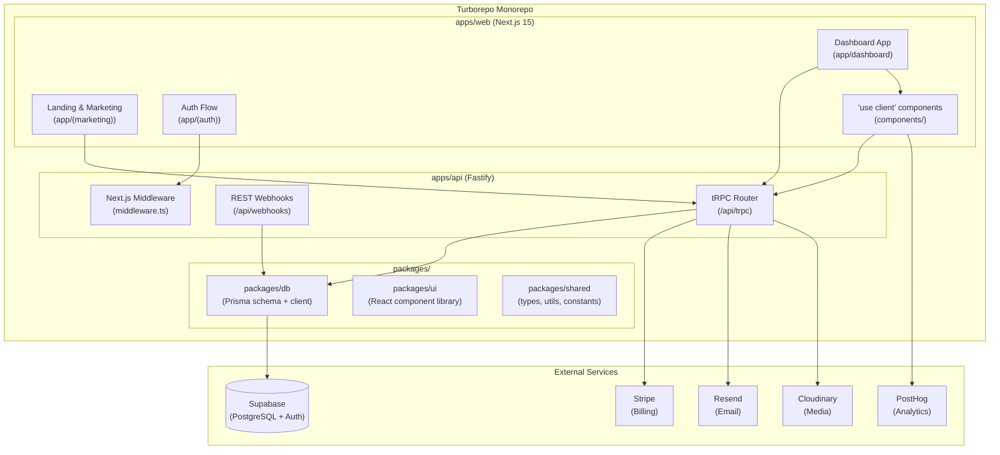

# Codebase Profile — 20260521-0942

| Field | Value |
|---|---|
| Generated | 2026-05-21 09:52 AEST |
| Profiler version | 1.0.0 |
| Target | /Users/alex/projects/listify-saas |
| Profile depth | full |
| Overall health | ⚠️ **Needs Attention** |

---

## 1. Stack Identity

| Dimension | Value |
|---|---|
| Primary language | TypeScript |
| Framework | Next.js 15.1.2 |
| Runtime | 20.x |
| Package manager | pnpm |
| TypeScript strict mode | true |
| Monorepo | true (turborepo, 3 packages) |

---

## 2. Codebase Metrics

| Metric | Value |
|---|---|
| Total files | 847 |
| Source files | 412 |
| SLOC (approx.) | 62,400 |

### Language Breakdown

| Language | SLOC | % |
|---|---|---|
| TypeScript | 58,900 | 94.4% |
| JavaScript | 2,100 | 3.4% |
| SQL | 1,100 | 1.8% |
| Shell | 300 | 0.5% |

### Largest Files

| Lines | File |
|---|---|
| 812 | apps/web/src/app/dashboard/analytics/page.tsx |
| 634 | apps/web/src/components/forms/OnboardingWizard.tsx |
| 581 | packages/db/src/schema.ts |
| 498 | apps/web/src/lib/billing/stripe.ts |
| 447 | apps/api/src/routes/webhooks.ts |
| 412 | apps/web/src/app/(auth)/register/page.tsx |
| 389 | packages/ui/src/components/DataTable.tsx |
| 356 | apps/web/src/hooks/useAnalytics.ts |
| 312 | apps/web/src/app/api/trpc/[trpc]/route.ts |
| 298 | apps/web/src/lib/email/templates.ts |

---

## 3. Dependency Graph

| Metric | Value |
|---|---|
| Direct dependencies | 47 |
| Dev dependencies | 31 |
| Transitive (estimated) | ~1,840 |
| Lockfile present | ✓ pnpm-lock.yaml |
| Outdated | 14 |
| Circular import chains | 2 |

### Vulnerability Summary

| Severity | Count | Details |
|---|---|---|
| CRITICAL | 0 | — |
| HIGH | 2 | `semver` <7.5.2 (ReDoS), `tough-cookie` <4.1.3 (Prototype Pollution) |
| MODERATE | 3 | `word-wrap`, `xml2js`, `loader-utils` |
| LOW | 8 | Various |

### Licence Breakdown

| Tier | Count |
|---|---|
| Permissive (MIT, Apache-2.0, ISC) | 44 |
| Weak copyleft (MPL-2.0) | 1 |
| Strong copyleft | 0 |
| Proprietary / unknown | 2 |

No GPL or AGPL dependencies detected. Two deps with unknown licences flagged for manual review:
`@listify/internal-icons` and `pdf-kit-pro`.

### Outdated Dependencies (top 10)

| Package | Current | Latest | Gap |
|---|---|---|---|
| `react` | 18.3.1 | 19.0.0 | 1 major |
| `next` | 15.0.3 | 15.1.2 | 3 minor |
| `@supabase/supabase-js` | 2.39.0 | 2.47.2 | 8 patch |
| `stripe` | 14.5.0 | 17.3.0 | 3 major |
| `zod` | 3.22.4 | 3.23.8 | 2 patch |
| `tailwindcss` | 3.3.7 | 4.0.0 | 1 major |
| `typescript` | 5.3.3 | 5.6.3 | 1 minor |
| `eslint` | 8.57.0 | 9.12.0 | 1 major |
| `prisma` | 5.7.1 | 5.22.0 | 15 patch |
| `@tanstack/react-query` | 5.17.0 | 5.59.0 | 42 patch |

### Circular Import Chains

- `apps/web/src/lib/auth.ts` → `apps/web/src/lib/db.ts` → `apps/web/src/lib/auth.ts`
- `packages/ui/src/components/Modal.tsx` → `packages/ui/src/hooks/useFocus.ts` → `packages/ui/src/components/Modal.tsx`

---

## 4. Architecture Topology

| Dimension | Value |
|---|---|
| Client/server model | server-first (Next.js App Router) |
| API routes | 23 (12 tRPC, 8 REST, 3 webhooks) |
| Data layer | Prisma (PostgreSQL via Supabase) |
| Entry points | 4 |

### Entry Points

- `apps/web/src/app/layout.tsx` — root layout
- `apps/web/src/app/page.tsx` — landing page
- `apps/web/src/middleware.ts` — auth middleware
- `apps/api/src/index.ts` — standalone API server (Fastify)

### External Services Detected

- Stripe (`@stripe/stripe-js`, `stripe` — billing)
- Resend (`resend` — transactional email)
- Supabase (`@supabase/supabase-js`, `@supabase/ssr` — database + auth)
- Cloudinary (`cloudinary` — image storage)
- PostHog (`posthog-js` — analytics)

### Topology Diagram

See [.anthril/codebase-topology.md](.anthril/codebase-topology.md)

---

## 5. Code Quality Signals

### Type Safety

| Signal | Value |
|---|---|
| Language | TypeScript |
| Typed | true |
| Strict mode | true |
| `any` usage | 34 occurrences |
| `@ts-ignore` | 7 occurrences |
| `@ts-nocheck` files | 0 |
| Type coverage | 96.2% (via `type-coverage`) |

### Linting

| Signal | Value |
|---|---|
| Config files found | `apps/web/eslint.config.mjs`, `packages/ui/.eslintrc.json` |
| Disable comments | 12 |
| ESLint errors | 0 |
| ESLint warnings | 23 |
| Linting enforced in CI | true (`.github/workflows/ci.yml` step: `pnpm lint`) |

### Complexity

| Signal | Value |
|---|---|
| Files over 300 LOC | 10 (2.4% of source files) |
| TODO / FIXME count | 47 |
| TODO density | 0.4 per 500 SLOC |
| Duplication tooling | not detected |

### Top TODO / FIXME Locations

- `apps/web/src/app/dashboard/analytics/page.tsx:214` — `// TODO: replace with real charting lib once budget approved`
- `apps/web/src/lib/billing/stripe.ts:89` — `// FIXME: webhook retry logic is brittle`
- `apps/web/src/components/forms/OnboardingWizard.tsx:401` — `// TODO: refactor into separate steps`
- `apps/api/src/routes/webhooks.ts:312` — `// HACK: duplicate event detection needs Idempotency-Key`
- `packages/db/src/schema.ts:178` — `// TODO: add index on user_id + created_at once load tested`

### Test Posture

| Signal | Value |
|---|---|
| Test framework | Vitest |
| E2E framework | Playwright |
| Test files | 87 |
| Source files | 281 |
| Test-to-source ratio | 0.31 |
| Coverage report found | true (`apps/web/coverage/coverage-summary.json`) |
| Coverage % | 34.7% |

---

## 6. Security Surface

### Secrets Detection

| Severity | Type | Location | Value |
|---|---|---|---|
| HIGH | Generic API key pattern | `apps/web/src/lib/email/templates.ts:14` | [REDACTED] |
| MEDIUM | Hardcoded password | `apps/web/src/lib/seed.ts:8` | [REDACTED] |
| MEDIUM | Hardcoded password | `apps/web/src/lib/seed.ts:9` | [REDACTED] |

> **Note:** The `seed.ts` patterns are likely dev seed data, not production secrets, but should be
> replaced with env vars or removed from version control.

### Environment Variable Management

| Signal | Value |
|---|---|
| `.env` files found | 4 (`.env`, `.env.local`, `.env.staging`, `.env.production.example`) |
| All in `.gitignore` | true |
| Secrets manager detected | false |
| `.env.example` present | true (`.env.production.example`) |

### Auth Pattern

| Signal | Value |
|---|---|
| Auth library | next-auth / @auth/core |
| Auth model | OAuth + email/password (session-based, JWT strategy) |

---

## 7. Infrastructure & Observability

### Hosting

| Signal | Value |
|---|---|
| Provider | Vercel |
| Config file | `vercel.json` |
| Containerised | false |
| IaC tooling | none detected |

### CI/CD

| Provider | Workflow count |
|---|---|
| GitHub Actions | 4 (ci.yml, deploy.yml, preview.yml, release.yml) |

### CI/CD Security Posture

| Check | Status |
|---|---|
| OIDC token usage | ✓ `id-token: write` present in `deploy.yml` |
| Pinned action versions | ⚠ 2 workflows use `@main` for third-party actions |
| Secret scanning step | ✗ No `gitleaks` / `trufflehog` step detected |
| `pull_request_target` misuse | ✓ Not present |

### Observability

| Dimension | Tool |
|---|---|
| Error tracking | Sentry (`@sentry/nextjs@8.3.0`) |
| Structured logging | Pino (`pino@9.1.0`) |
| APM / tracing | none detected |

---

## 8. Health Dashboard

| Dimension | Signal summary | Status |
|---|---|---|
| Dependency health | 2 HIGH CVEs, 14 outdated, 2 circular imports | ⚠ |
| Test coverage | 34.7% coverage, ratio 0.31 | ✗ |
| Type safety | Strict TS, 34 `any`, 96.2% type coverage | ✓ |
| Code complexity | 2.4% large files, 47 TODOs, density 0.4/500 | ✓ |
| Security surface | 3 patterns detected (1 HIGH, 2 MEDIUM) | ⚠ |
| Infrastructure maturity | Vercel + GitHub Actions, no IaC | ✓ |
| Observability | Sentry + Pino, no APM | ✓ |
| Developer experience | README ✓, CHANGELOG ✓, linting in CI ✓ | ✓ |

---

## 9. Recommended Focus Areas

1. ✗ **Test coverage is insufficient** — 34.7% coverage with a ratio of 0.31 is low for a production SaaS. Target ≥70% for critical paths (auth, billing, data mutations).
2. ⚠ **Dependency health needs review** — 2 HIGH-severity CVEs (`semver`, `tough-cookie`) should be patched. `stripe` is 3 major versions behind (security and API changes likely).
3. ⚠ **Security surface requires attention** — One HIGH-severity pattern detected in `templates.ts:14`. Seed file has hardcoded credentials; replace with env var references.
4. ✓ **Architecture: clean server-first boundaries** — App Router usage is consistent; tRPC well-structured. No mixed client/server boundary violations detected.
5. ✓ **Type safety: strong** — 96.2% type coverage with strict mode. Reduce the 34 remaining `any` usages progressively.

---

## 10. Profile Metadata

| Item | Path |
|---|---|
| This document | `.anthril/codebase-profile.md` |
| JSON sidecar | `.anthril/codebase-profile.json` |
| Topology diagram | `.anthril/codebase-topology.md` |
| Agent reports | `.anthril/profile-run/20260521-0942/` |
| Dependency analysis | `.anthril/profile-run/20260521-0942/dependency-analyst.md` |
| Architecture map | `.anthril/profile-run/20260521-0942/architecture-mapper.md` |
| Quality profile | `.anthril/profile-run/20260521-0942/quality-profiler.md` |
| Security scan | `.anthril/profile-run/20260521-0942/infra-security-scanner.md` |
