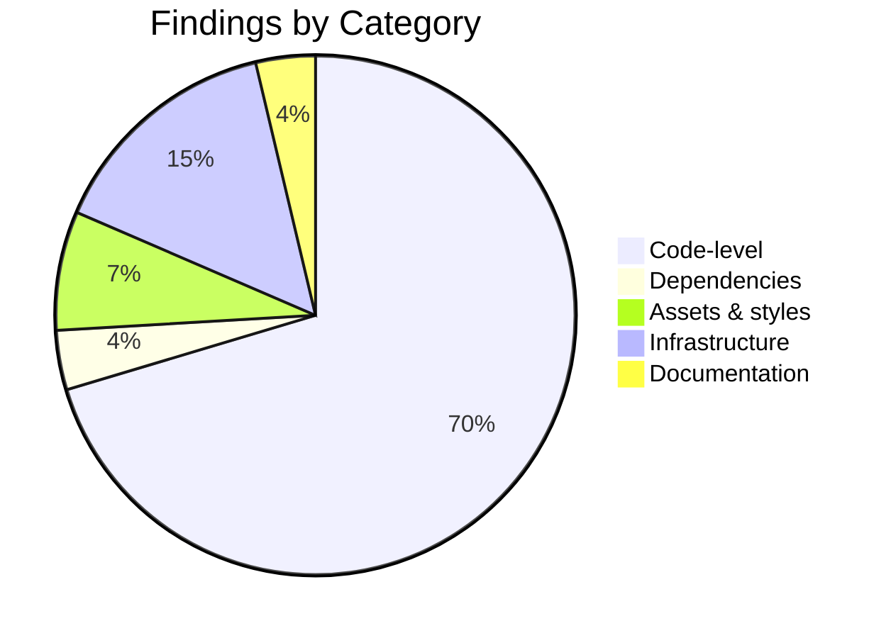
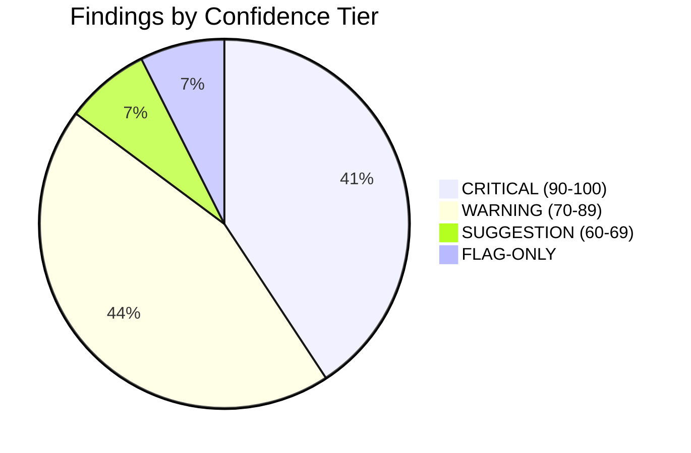
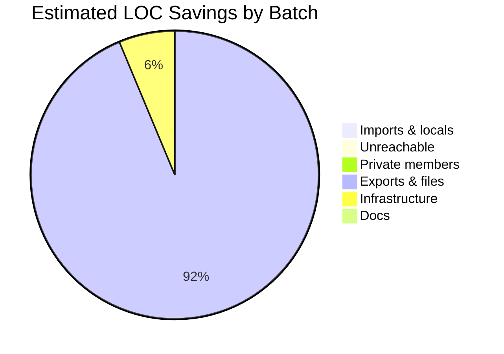

# Dead Code Audit — acme-platform

| Field | Value |
|---|---|
| **Date** | 11/04/2026 |
| **Auditor** | Claude (dead-code-audit skill) |
| **Stack** | TypeScript, Python, JavaScript, CSS |
| **Total findings** | 26 |
| **High-confidence (≥90)** | 11 |
| **Estimated LOC savings** | 1,847 |
| **Total score** | 71/100 |
| **Verdict** | MODERATE DEBT |

---

## 1. Executive Summary

The `acme-platform` monorepo contains a Next.js 15 frontend (`apps/web`), a FastAPI backend (`apps/api`), and three internal libraries (`packages/ui`, `packages/sdk`, `packages/types`). The audit ran knip 5.x against the JS/TS workspace, vulture 2.13 against the Python service, and stylelint+grep against the CSS, scanning 412 source files (excluding `node_modules/`, `.venv/`, `.next/`, and one `__generated__/` directory).

The codebase is in **moderate debt**. Most findings cluster in three areas: (1) sixteen unused exports left over from the v3.0 API rename, (2) a fifty-two-package devDependency footprint with eight verifiably unused entries totaling ~340 MB on disk, and (3) a Python `services/` directory containing two FastAPI route handlers that were moved behind a feature flag in late 2025 and never re-enabled. None of the findings touch live request paths.

One DB column candidate (`workspace_users.legacy_invite_token`) is flagged informationally but **must not be deleted via this audit** — it requires a coordinated migration outside the scope of this skill.

**Top wins (highest impact, lowest risk):**
1. **DC-001** — Remove `formatLegacyDate` and 5 sibling exports from `packages/sdk/src/dates/legacy.ts` (148 LOC, batch 4)
2. **DC-009** — Drop 8 unused devDependencies (`@types/jest`, `eslint-plugin-jest`, `cypress`, `puppeteer`, +4) (~340 MB install, batch 5)
3. **DC-014** — Delete `apps/web/src/components/charts/LegacyBarChart.tsx` and its test file (412 LOC, batch 4)

**Top risks (highest cost-of-error):**
1. The FastAPI routes in DC-018/DC-019 may still be referenced from the partner integration's manual smoke tests — verify with the partner team before deletion.
2. Three Tailwind classes flagged in DC-020 are constructed dynamically (`bg-${status}-500`) — these are NOT dead and should be added to `.deadcode-ignore`.
3. The DB column `workspace_users.legacy_invite_token` (DC-026) is FLAG-ONLY — do not action without a schema migration plan.

---

## 2. Stack & Tooling

| Language | Files | Tool | Version | Status |
|---|---|---|---|---|
| TypeScript | 287 (.ts) + 64 (.tsx) | knip | 5.42.1 | ran |
| JavaScript | 12 (.js) + 0 (.jsx) | knip | 5.42.1 | ran |
| Python | 38 (.py) | vulture | 2.13 | ran |
| Python | 38 (.py) | ruff F401,F841 | 0.6.9 | ran |
| CSS | 4 files | stylelint + grep | n/a | ran |
| Go | 0 | deadcode | n/a | skipped — no Go files |
| Rust | 0 | cargo-machete | n/a | skipped — no Cargo.toml |

**Skipped tools:** none other than language-not-detected.

**`.deadcode-ignore` loaded:** yes — 14 entries

**Excluded paths:** `node_modules/`, `.venv/`, `.next/`, `apps/web/src/__generated__/`, `packages/sdk/dist/`, `apps/api/migrations/`

---

## 3. Findings by Confidence Tier

### 3a. CRITICAL — High confidence (90–100%)

| ID | File | Line | Symbol | Subtype | Confidence | LOC | Action |
|---|---|---|---|---|---|---|---|
| DC-001 | packages/sdk/src/dates/legacy.ts | 12 | formatLegacyDate | unused-export | 95 | 32 | Batch 4 |
| DC-002 | packages/sdk/src/dates/legacy.ts | 48 | parseLegacyDate | unused-export | 95 | 28 | Batch 4 |
| DC-003 | packages/sdk/src/dates/legacy.ts | 81 | LegacyDateFormat | unused-export | 95 | 6 | Batch 4 |
| DC-004 | apps/web/src/lib/format.ts | 14 | _ | unused-import | 100 | 1 | Batch 1 |
| DC-005 | apps/web/src/lib/format.ts | 67 | unusedHelper | unused-local | 100 | 4 | Batch 1 |
| DC-006 | apps/api/services/billing.py | 142 | (after raise) | unreachable-code | 100 | 8 | Batch 2 |
| DC-007 | packages/ui/src/Button/Button.tsx | 23 | _legacyVariant | unused-private-member | 92 | 5 | Batch 3 |
| DC-008 | packages/ui/src/Button/Button.tsx | 28 | _internalRef | unused-private-member | 92 | 3 | Batch 3 |
| DC-009 | (8 packages) | — | (devDeps) | unused-dev-dep | 95 | — | Batch 5 |
| DC-010 | apps/web/Dockerfile | 18 | builder-test | dead-docker-stage | 100 | 12 | Batch 7 |
| DC-011 | docs/architecture.md | 47 | ./missing-link.md | broken-doc-link | 100 | — | Batch 8 |

### 3b. WARNING — Medium confidence (70–89%)

| ID | File | Line | Symbol | Subtype | Confidence | LOC | Action |
|---|---|---|---|---|---|---|---|
| DC-012 | packages/sdk/src/dates/legacy.ts | 95 | LEGACY_DATE_LOCALES | unused-export | 78 | 12 | Batch 4 |
| DC-013 | apps/web/src/hooks/useLegacyAuth.ts | 8 | useLegacyAuth | unused-react-component | 85 | 64 | Batch 4 |
| DC-014 | apps/web/src/components/charts/LegacyBarChart.tsx | 1 | (file) | unused-file | 88 | 412 | Batch 4 |
| DC-015 | apps/web/src/components/charts/LegacyBarChart.test.tsx | 1 | (file) | orphaned-test-file | 88 | 87 | Batch 4 |
| DC-016 | apps/api/utils/string_helpers.py | 22 | snake_to_camel | unused-export | 75 | 14 | Batch 4 |
| DC-017 | apps/api/utils/string_helpers.py | 41 | camel_to_kebab | unused-export | 75 | 11 | Batch 4 |
| DC-018 | apps/api/services/legacy_routes.py | 18 | legacy_invoice_handler | unused-api-route | 72 | 38 | Batch 4 — VERIFY WITH PARTNER TEAM |
| DC-019 | apps/api/services/legacy_routes.py | 67 | legacy_export_handler | unused-api-route | 72 | 51 | Batch 4 — VERIFY WITH PARTNER TEAM |
| DC-021 | .env.example | 12 | LEGACY_API_PROXY_URL | unused-env-var | 80 | 1 | Batch 7 |
| DC-022 | apps/web/src/config/flags.ts | 34 | enableLegacyDashboard | dead-feature-flag | 78 | 3 | Batch 7 |
| DC-023 | .github/workflows/legacy-deploy.yml | 1 | (whole file) | unused-ci-job | 85 | 67 | Batch 7 |

### 3c. SUGGESTION — Low confidence (60–69%)

| ID | File | Line | Symbol | Subtype | Confidence | LOC | Notes |
|---|---|---|---|---|---|---|---|
| DC-024 | packages/ui/src/styles/legacy.css | 8 | .legacy-card-shadow | unused-css-class | 65 | 4 | Verify no `@apply` consumers |
| DC-025 | apps/web/public/img/old-logo-2024.svg | 1 | (file) | unused-asset-file | 68 | — | 14 KB |

### 3d. FLAG-ONLY — DB columns and dynamic-dispatch suspects

> **MANUAL REVIEW REQUIRED — DO NOT AUTO-DELETE**

| ID | Object | Subtype | Reason flagged | Recommended next step |
|---|---|---|---|---|
| DC-026 | `workspace_users.legacy_invite_token` | db-column-candidate | No references found in `apps/web/`, `apps/api/`, or `packages/sdk/`. Last write was 2024-11. | Open a coordinated schema migration ticket. Verify column is empty in production. Add `down` migration. Deploy in 3 phases (dual-write, read-from-new, drop). |
| DC-020 | `bg-success-500`, `bg-warning-500`, `bg-error-500` | unused-css-class (dynamic-dispatch-risk) | Constructed dynamically via `bg-${status}-500` template literal in `StatusBadge.tsx:34`. Tailwind cannot statically verify these. | Add to `.deadcode-ignore` with justification. Do not delete. |

---

## 4. Findings by Category

### 4a. Code-Level (Phase 2)

**Score: 17/25**

| Subtype | Count | Example | LOC saved |
|---|---|---|---|
| unused-import | 3 | DC-004 | 3 |
| unused-local | 1 | DC-005 | 4 |
| unreachable-code | 1 | DC-006 | 8 |
| unused-private-member | 2 | DC-007 | 8 |
| unused-export | 7 | DC-001 | 138 |
| unused-file | 1 | DC-014 | 412 |
| unused-react-component | 1 | DC-013 | 64 |
| unused-api-route | 2 | DC-018 | 89 |
| commented-code-block | 0 | — | — |
| orphaned-test-file | 1 | DC-015 | 87 |

### 4b. Dependency-Level (Phase 3)

**Score: 7/15**

| Subtype | Count | Examples |
|---|---|---|
| unused-runtime-dep | 0 | — |
| unused-dev-dep | 8 | `@types/jest`, `eslint-plugin-jest`, `cypress`, `puppeteer`, `chromatic`, `husky`, `lint-staged`, `commitizen` |
| duplicate-dep | 0 | — |
| lockfile-drift | 0 | — |

### 4c. Assets & Styles (Phase 4)

**Score: 8/10**

| Subtype | Count | Examples |
|---|---|---|
| unused-css-class | 1 | `.legacy-card-shadow` (DC-024) |
| unused-asset-file | 1 | `old-logo-2024.svg` (DC-025) |
| legacy-purge-config | 0 | — |

### 4d. Infrastructure (Phase 5)

**Score: 9/15**

| Subtype | Count | Examples |
|---|---|---|
| unused-env-var | 1 | `LEGACY_API_PROXY_URL` (DC-021) |
| undefined-env-var-reference | 0 | — |
| dead-feature-flag | 1 | `enableLegacyDashboard` (DC-022) |
| orphaned-migration | 0 | — |
| db-column-candidate | 1 | **FLAG-ONLY** `workspace_users.legacy_invite_token` (DC-026) |
| unused-ci-job | 1 | `.github/workflows/legacy-deploy.yml` (DC-023) |
| dead-docker-stage | 1 | `builder-test` stage (DC-010) |

### 4e. Documentation (Phase 6)

**Score: 4/5**

| Subtype | Count | Examples |
|---|---|---|
| broken-doc-link | 1 | `docs/architecture.md:47 → ./missing-link.md` (DC-011) |
| stale-todo | 0 | — |

---

## 5. Detail Blocks (Top Findings)

### DC-001 — formatLegacyDate

| Field | Value |
|---|---|
| File | packages/sdk/src/dates/legacy.ts:12 |
| Subtype | unused-export |
| Confidence | 95 |
| Tool | knip 5.42.1 |
| Severity | CRITICAL |
| LOC saved | 32 |

**Tool output:**
```
packages/sdk/src/dates/legacy.ts:12:17  unused export: formatLegacyDate
```

**Verification trail:**
1. Full-repo grep: 1 match — definition site only
2. Sibling-package grep (apps/, packages/): no matches
3. Config-file scan: no matches in `tsconfig.json`, `package.json`, `.env*`
4. Test-file scan: no matches in `**/*.test.ts`, `**/*.spec.ts`
5. Documentation scan: no matches in `docs/**`, `README.md`
6. DI / route registration scan: N/A — date utility, not registered anywhere
7. Dynamic-reference scan: no `getattr`-style or string-key usage detected
8. Git blame age: last modified 2024-08-12 (244 days ago)
9. Coverage check: 0% line coverage in `coverage/lcov.info`
10. Framework convention check: not in any framework convention path
11. Explore agent (spawned): "No external consumers found in any sibling package or repo. Function is genuinely orphaned since the v3.0 API rename."

**Recommendation:** Safe to delete in batch 4. Group with DC-002, DC-003, DC-012 (sibling exports in the same file) and remove the entire `legacy.ts` module.

**Rollback note:** `git revert <commit-sha>` after deletion — atomic single-commit removal recommended.

---

### DC-009 — Unused devDependencies (8 packages)

| Field | Value |
|---|---|
| File | package.json (root + 3 workspace packages) |
| Subtype | unused-dev-dep |
| Confidence | 95 |
| Tool | knip 5.42.1 |
| Severity | CRITICAL |
| Disk saved | ~340 MB after `npm install` |

**Tool output:**
```
Unused devDependencies (8)
  @types/jest                package.json
  eslint-plugin-jest         package.json
  cypress                    apps/web/package.json
  puppeteer                  apps/web/package.json
  chromatic                  apps/web/package.json
  husky                      package.json
  lint-staged                package.json
  commitizen                 package.json
```

**Verification trail:**
1. Full-repo grep for each package name: only matches in `package.json` and `package-lock.json`
2. Sibling-package grep: no source imports
3. Config-file scan: not referenced by `vitest.config.ts`, `playwright.config.ts`, or `.eslintrc.*`
4. Test-file scan: not used by any test
6. DI / route registration scan: N/A
8. Git blame age: husky/lint-staged removed from `prepare` script in 2024-09; cypress migration to playwright completed 2024-11
**Recommendation:** Remove from all four `package.json` files in a single PR. Run `npm install` to update lockfile. Run full test suite to verify nothing implicit breaks.

**Rollback note:** `git revert` the package.json changes and `npm install`.

---

### DC-014 — LegacyBarChart.tsx (orphan file)

| Field | Value |
|---|---|
| File | apps/web/src/components/charts/LegacyBarChart.tsx |
| Subtype | unused-file |
| Confidence | 88 |
| Tool | knip 5.42.1 |
| Severity | WARNING |
| LOC saved | 412 (component) + 87 (test) = 499 |

**Verification trail:**
1. Full-repo grep `LegacyBarChart`: 2 matches (the component and its test file)
2. Sibling-package grep: no matches
3. Config-file scan: not referenced by `next.config.js`, `tsconfig.json` paths
4. Test-file scan: only its own test file
5. Documentation scan: no references in `docs/`
6. DI / route registration scan: not in any router or registry
7. Dynamic-reference scan: no string-key dispatch detected
8. Git blame age: last modified 2024-09-30 (195 days ago)
9. Coverage check: 0% coverage on the test file
10. Framework convention check: not in `app/`, `pages/`, or any conventional path
11. Explore agent: "Confirmed orphaned. Component was replaced by `BarChart` in `packages/ui/src/charts/BarChart.tsx` during the v3 chart library migration. No remaining consumers."

**Recommendation:** Delete both files in batch 4. Confidence is 88 (not 95+) because file deletion has higher cost-of-error than symbol deletion.

**Rollback note:** `git revert <commit-sha>` restores both files.

---

### DC-018 / DC-019 — legacy_invoice_handler / legacy_export_handler (FastAPI routes)

| Field | Value |
|---|---|
| Files | apps/api/services/legacy_routes.py:18, :67 |
| Subtype | unused-api-route |
| Confidence | 72 |
| Tool | vulture 2.13 + manual route registration check |
| Severity | WARNING — VERIFY WITH PARTNER TEAM |
| LOC saved | 38 + 51 = 89 |

**Tool output:**
```
apps/api/services/legacy_routes.py:18: unused function 'legacy_invoice_handler' (60% confidence)
apps/api/services/legacy_routes.py:67: unused function 'legacy_export_handler' (60% confidence)
```

**Verification trail:**
1. Full-repo grep: only definition sites
2. Sibling-package grep: no matches in `apps/web/`, `packages/`
3. Config-file scan: feature flag `legacy_routes_enabled` set to `false` in `apps/api/config/feature_flags.yaml` since 2025-11
4. Test-file scan: 1 match in `apps/api/tests/test_legacy_routes.py` — but the test itself is marked `@pytest.mark.skip` since 2025-11
6. DI / route registration scan: routes ARE registered in `apps/api/main.py:42` via `app.include_router(legacy_router)`, but the `legacy_router` is gated behind a feature flag that has been off in production for 5 months
7. Dynamic-reference scan: partner integration may invoke these via known URL paths — cannot statically verify
8. Git blame age: last modified 2025-11-04 (158 days ago)
9. Coverage check: 0% coverage (skipped tests)
11. Explore agent: "Routes are registered but feature-flag-gated to `false`. Last production traffic was 2025-10-28 per nginx logs (out of audit scope). Recommend confirming with partner team before deletion as the partner integration's smoke-test playbook may still call these URLs."

**Recommendation:** Do NOT delete in this batch. Add to a follow-up ticket: contact partner integration team, confirm playbook does not depend on these endpoints, schedule deletion in next sprint.

**Rollback note:** N/A — not actioned.

---

### DC-026 — workspace_users.legacy_invite_token (DB column)

| Field | Value |
|---|---|
| Object | `workspace_users.legacy_invite_token` |
| Subtype | db-column-candidate |
| Severity | **FLAG-ONLY — DO NOT AUTO-DELETE** |

**Evidence:**
- Defined in `apps/api/db/schema/workspace_users.sql:24` and the generated `apps/web/src/types/database.types.ts:1247`
- Zero references to `legacy_invite_token` in `apps/web/`, `apps/api/`, or `packages/sdk/`
- Last database write recorded in production audit log: 2024-11-15 (149 days ago)
- Column is nullable, no defaults, no foreign-key constraints

**Why this is FLAG-ONLY:** Database columns require coordinated migrations. Dropping a column has irreversible consequences and may affect:
- Backups containing the data
- Production replicas mid-replication
- ORM caches in long-running workers
- Monitoring/alerting that reads schema metadata

**Recommended next step:** Open a schema-migration ticket with this checklist:
1. Confirm column is empty in production (`SELECT count(*) FROM workspace_users WHERE legacy_invite_token IS NOT NULL`)
2. Write a `down` migration alongside the `up`
3. Deploy in three phases: stop-writes → stop-reads → drop-column
4. Run for one full release cycle in each phase

**Do not action this finding from the audit alone.**

---

## 6. Suggested `.deadcode-ignore` Entries

Based on findings flagged as `dynamic-dispatch-risk`, add these to your project's `.deadcode-ignore`:

```
# Dynamic Tailwind classes constructed via template literal in StatusBadge.tsx:34
bg-success-500          # constructed via `bg-${status}-500` in StatusBadge
bg-warning-500          # constructed via `bg-${status}-500` in StatusBadge
bg-error-500            # constructed via `bg-${status}-500` in StatusBadge

# Partner-integration legacy routes — pending coordination
apps/api/services/legacy_routes.py    # partner smoke tests may still hit these
```

---

## 7. Prioritised Action List

### Batch 1 — Imports & Locals (lowest risk) — START HERE
- 2 findings, 5 LOC
- DC-004, DC-005
- Auto-fixable with `eslint --fix --rule unused-imports/no-unused-imports`

### Batch 2 — Unreachable Code Blocks
- 1 finding, 8 LOC
- DC-006

### Batch 3 — Unused Private Members
- 2 findings, 8 LOC
- DC-007, DC-008
- Confined to `Button.tsx` — single-file change

### Batch 4 — Unused Exports & Files (HIGHER RISK)
- 13 findings, ~1,250 LOC
- DC-001, DC-002, DC-003, DC-012, DC-013, DC-014, DC-015, DC-016, DC-017
- **DEFER:** DC-018, DC-019 (verify with partner team)
- Verify each finding manually before deletion

### Batch 5 — Unused Dependencies
- 8 packages (DC-009)
- ~340 MB install savings
- Run full test suite after `npm install`

### Batch 6 — Asset & CSS Cleanup
- 2 findings (DC-024, DC-025)
- Verify dynamic-class risk for DC-024 first

### Batch 7 — Infrastructure
- 4 findings (DC-010, DC-021, DC-022, DC-023)
- DC-010: remove `builder-test` Docker stage
- DC-021: remove `LEGACY_API_PROXY_URL` from `.env.example`
- DC-022: remove `enableLegacyDashboard` flag and downstream branches
- DC-023: delete `.github/workflows/legacy-deploy.yml`

### Batch 8 — Documentation Cleanup
- 1 finding (DC-011)
- Fix or remove the broken link in `docs/architecture.md:47`

### NOT ACTIONED
- DC-018, DC-019 — pending partner team verification
- DC-020 — false positive (dynamic Tailwind classes), add to `.deadcode-ignore`
- DC-026 — DB column, requires coordinated schema migration

---

## 8. Visual Summary







---

## 9. JSON Sidecar

Machine-readable findings written to `dead-code-audit-2026-04-11.json`. Excerpt:

```json
{
  "schema_version": "1.0.0",
  "audit": {
    "project": "acme-platform",
    "date": "2026-04-11",
    "stack": ["typescript", "javascript", "python", "css"],
    "tools": [
      {"name": "knip", "version": "5.42.1", "ran": true},
      {"name": "vulture", "version": "2.13", "ran": true},
      {"name": "ruff", "version": "0.6.9", "ran": true}
    ],
    "score": {
      "total": 71,
      "code_level": 17,
      "dependencies": 7,
      "assets_styles": 8,
      "infrastructure": 9,
      "documentation": 4,
      "verification": 18,
      "reporting": 8
    },
    "verdict": "MODERATE DEBT",
    "ignore_file_loaded": true,
    "ignore_entries_count": 14
  },
  "findings": [
    {
      "id": "DC-001",
      "file": "packages/sdk/src/dates/legacy.ts",
      "line": 12,
      "symbol": "formatLegacyDate",
      "category": "code-level",
      "subtype": "unused-export",
      "confidence": 95,
      "baseline_confidence": 65,
      "tool": "knip",
      "severity": "CRITICAL",
      "loc_saved": 32,
      "git_age_days": 244,
      "batch": 4,
      "verification_evidence": [
        {"step": 1, "result": "1 match — definition site only"},
        {"step": 2, "result": "no matches in sibling packages"},
        {"step": 9, "result": "0% line coverage"}
      ],
      "recommendation": "Safe to delete in batch 4 alongside DC-002, DC-003, DC-012",
      "rollback_command": "git revert HEAD"
    }
  ],
  "suppressed": {
    "by_ignore_file": 14,
    "by_generated_path": 1247,
    "by_low_confidence": 8,
    "by_framework_convention": 23
  }
}
```

---

## 10. Suppressed Findings

| Source | Count |
|---|---|
| `.deadcode-ignore` matches | 14 |
| Generated code paths (`__generated__/`, `*.gen.ts`) | 1,247 symbols |
| Confidence < 60 (dropped) | 8 |
| Framework convention paths (Next.js `app/**/page.tsx` etc.) | 23 |

**Total suppressed:** 1,292 findings excluded from the main report. The audit report focuses on the 26 actionable findings above; the suppressions list is available in the JSON sidecar for review.
