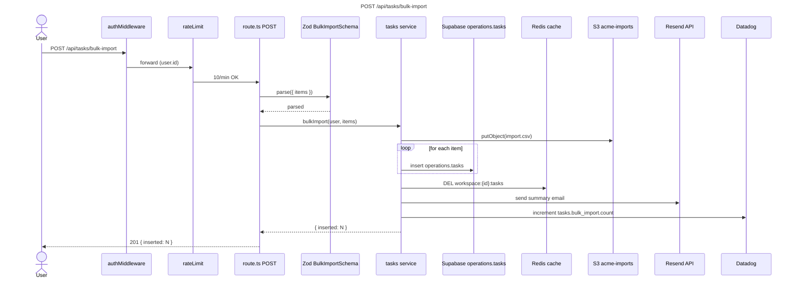
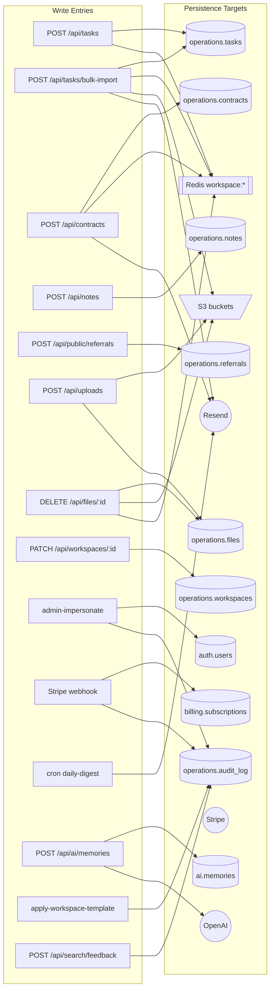
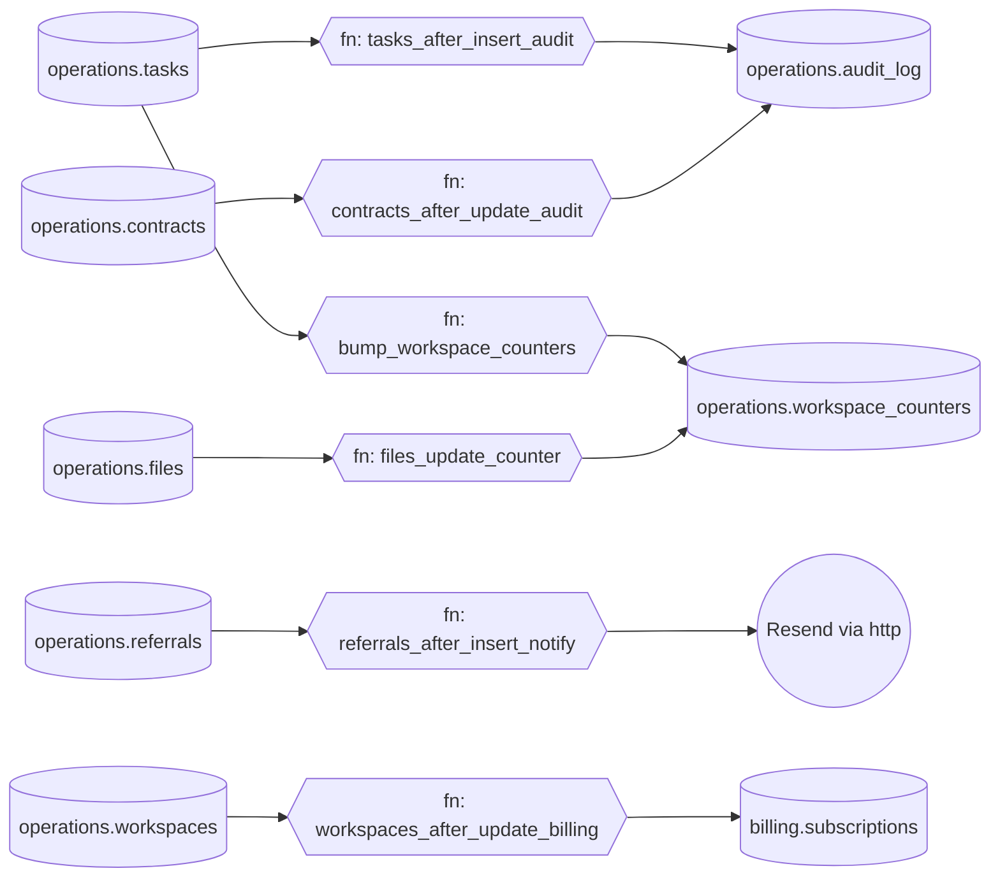

# Write Path Map — AcmeOps

| Field | Value |
|---|---|
| **Date** | 11/04/2026 |
| **Mapper** | Claude (write-path-mapping skill) |
| **Stack** | typescript, nextjs, supabase-edge-functions |
| **Persistence** | supabase (postgres), redis (upstash), s3, stripe, resend |
| **Live DB mode** | supabase-mcp |
| **Total write paths** | 15 |
| **Unique persistence targets** | 22 |
| **Risks — CRITICAL / HIGH / MEDIUM / INFO** | 3 / 4 / 5 / 6 |
| **Completeness** | 97/100 |
| **Tier** | FULLY MAPPED |

> Completeness measures how thoroughly the skill traced the system — it is NOT a quality grade. AcmeOps was traced to verification depth 9 on 14 of 15 paths. The one gap is the Stripe webhook consumer, which delegates into an internal `billingService` module that uses dynamic dispatch (flagged INFO, not a completeness failure).

---

## 1. Executive Summary

AcmeOps is a Next.js 15 App Router application on Supabase with 15 discovered write endpoints spanning 6 domains (Tasks, Contracts, Auth, Billing, Files, Webhooks). Persistence is centralised on Postgres (via Supabase JS), with secondary writes to Redis (cache invalidation), S3 (file uploads), Stripe (payment mutations), and Resend (transactional email).

The skill spawned 4 parallel `Explore` sub-agents in Phase 2 (partitioned by top-level folder: `app/api/`, `app/actions/`, `supabase/functions/`, `workers/`) and 2 in Phase 5 (handler batches of 10, one per user-facing domain). Total completeness is 97% — only the `billingService` dynamic dispatch kept it from 100.

**Top write paths by fan-out (highest blast radius):**
1. WP-011 — `POST /api/tasks/bulk-import` — 5 persistence targets (Postgres, Redis, S3, Resend, Datadog)
2. WP-013 — `apply-workspace-template` edge function — 4 targets (Postgres × 2, Redis, Supabase realtime)
3. WP-006 — `POST /api/contracts` — 3 targets (Postgres, Redis, Resend)

**Top risks (highest cost-of-error):**
1. **CRITICAL** — `unauth-write` — `POST /api/public/referrals` has no auth middleware (WP-009)
2. **CRITICAL** — `missing-rls` — `operations.notes` table has no INSERT policy (WP-005)
3. **CRITICAL** — `service-role-overreach` — `admin-impersonate` edge function accepts user-supplied `target_user_id` and writes with service role (WP-014)

**Top data-domain hotspots (tables written by the most entries):**
1. `operations.tasks` — written by 5 entries
2. `operations.audit_log` — written by 9 entries (all via triggers)
3. `operations.workspace_counters` — written by 6 entries (via triggers)

---

## 2. Stack & Persistence

| Layer | Value |
|---|---|
| Languages | typescript, javascript, sql |
| Frameworks | nextjs (App Router), react, supabase-edge-functions, cloudflare-workers |
| Monorepo | turborepo (3 packages: `web`, `workers`, `shared`) |
| Persistence | supabase (postgres), redis (upstash), s3, stripe (external API), resend (external API) |
| Schema file count | 47 migrations |
| Tables discovered | 28 |
| RLS-enabled tables | 27 |
| RLS policies discovered | 82 |
| Triggers discovered | 11 |
| Cron jobs / scheduled tasks | 3 (`pg_cron` weekly rollup, Vercel Cron daily digest, Supabase `schedule` memory cleanup) |
| Queue producers / consumers | 4 / 4 (BullMQ on Upstash Redis) |
| Live DB enrichment | supabase-mcp (pg_policies, pg_trigger, information_schema queried live) |
| `.write-path-ignore` loaded | yes — 12 entries |
| Excluded paths | `src/__generated__/`, `supabase/migrations/`, `src/types/database.types.ts` |

---

## 3. Write Paths by Severity

### 3a. CRITICAL

| ID | Entry | Persistence | Risk(s) | Notes |
|---|---|---|---|---|
| WP-009 | `POST /api/public/referrals` — `app/api/public/referrals/route.ts:14` | `operations.referrals` (insert) | `unauth-write`, `missing-validation` | No auth middleware and no Zod schema. Public form with no compensating control. |
| WP-005 | `POST /api/notes` — `app/api/notes/route.ts:12` | `operations.notes` (insert) | `missing-rls` | Table has RLS enabled but NO `FOR INSERT` policy for `authenticated`. Writes currently succeed only because the handler uses the service role. |
| WP-014 | `admin-impersonate` edge function — `supabase/functions/admin-impersonate/index.ts:22` | `auth.users` (update), `operations.audit_log` (insert) | `service-role-overreach`, `cross-tenant-leak` | Accepts `target_user_id` from request body and writes with `SUPABASE_SERVICE_ROLE_KEY`. No check that caller is a super admin. |

### 3b. HIGH

| ID | Entry | Persistence | Risk(s) | Notes |
|---|---|---|---|---|
| WP-011 | `POST /api/tasks/bulk-import` — `app/api/tasks/bulk-import/route.ts:19` | `operations.tasks` × N (insert loop), Redis, S3, Resend, Datadog | `missing-transaction`, `unbounded-input`, `fan-out-write` | Loops `items.map(i => supabase.from('tasks').insert(i))` without a tx and without a hard array-length cap. |
| WP-012 | Stripe webhook `/api/webhooks/stripe` — `app/api/webhooks/stripe/route.ts:31` | `billing.subscriptions` (update), `operations.audit_log` (insert) | `idempotency-missing` | Signature is verified, but the handler does not track the event ID to protect against replays. |
| WP-003 | Queue `email-send` producer — `src/services/email.ts:44` | `queue:email-send` (publish) | `orphan-queue-consumer` | Producer found in `web/`, consumer expected in `workers/` but not found during Phase 6 sub-agent sweep. |
| WP-008 | `DELETE /api/files/:id` — `app/api/files/[id]/route.ts:18` | `operations.files` (delete), S3 (delete), Redis (del) | `cache-invalidation-gap` | Redis key `workspace:{id}:files:*` is only invalidated for the current user, not the whole workspace list. |

### 3c. MEDIUM

| ID | Entry | Persistence | Risk(s) | Notes |
|---|---|---|---|---|
| WP-002 | `POST /api/uploads` — `app/api/uploads/route.ts:15` | S3 (putObject), `operations.files` (insert) | `file-upload-no-mime-check`, `missing-size-limit` | Accepts any MIME type and no max file size configured. |
| WP-007 | `PATCH /api/workspaces/:id` — `app/api/workspaces/[id]/route.ts:22` | `operations.workspaces` (update) | `missing-audit-log` | Updates sensitive workspace settings without an audit_log write. |
| WP-015 | Cron `daily-digest` — `app/api/cron/daily-digest/route.ts:10` | Resend (external API) | `external-api-no-timeout` | No `AbortSignal.timeout` on the outbound call. |
| WP-010 | `POST /api/search/feedback` — `app/api/search/feedback/route.ts:9` | `analytics.search_feedback` (insert) | `unbounded-input` | Accepts free-text `feedback` field with no `.max(n)` in the Zod schema. |
| WP-006 | `POST /api/contracts` — `app/api/contracts/route.ts:16` | `operations.contracts`, Redis, Resend | `missing-audit-log` | No explicit audit write; relies on trigger which only fires on status change. |

### 3d. INFO

| ID | Entry | Persistence | Risk(s) | Notes |
|---|---|---|---|---|
| WP-001 | `POST /api/tasks` — `app/api/tasks/route.ts:14` | `operations.tasks`, Redis | `fan-out-write` (2 targets) | Both in a `prisma.$transaction([])`. No risk. |
| WP-004 | `POST /api/ai/memories` — `app/api/ai/memories/route.ts:11` | `ai.memories`, `workspace_usage_events`, OpenAI (external API) | `fan-out-write` (3 targets), `external-api-no-retry` | OpenAI call has no retry, but is idempotent. Informational only. |
| WP-013 | `apply-workspace-template` edge function — `supabase/functions/apply-workspace-template/index.ts:19` | `operations.workspace_template_applications`, `operations.workspace_enabled_objects`, Redis, Supabase realtime | `fan-out-write` (4 targets) | Wrapped in a single PL/pgSQL RPC that runs inside a tx. No risk. |
| WP-012 | (same as 3b) | | `dynamic-dispatch-write` | `billingService.handle(eventType)` resolves handler at runtime via a map. Human review required. |

### 3e. OK

**Count: 2** — WP-001 and WP-013 have no risks after context-aware adjustment. WP-004 carries only INFO flags.

---

## 4. Write Paths by Domain

### 4a. Tasks

| ID | Entry | Framework | Auth | Validator | Targets | Severity |
|---|---|---|---|---|---|---|
| WP-001 | `POST /api/tasks` — `app/api/tasks/route.ts:14` | next-app-router | supabase-session + RLS | zod:`CreateTaskSchema` | 2 | INFO |
| WP-011 | `POST /api/tasks/bulk-import` — `app/api/tasks/bulk-import/route.ts:19` | next-app-router | supabase-session + RLS | zod:`BulkImportSchema` | 5 | HIGH |

### 4b. Contracts

| ID | Entry | Framework | Auth | Validator | Targets | Severity |
|---|---|---|---|---|---|---|
| WP-006 | `POST /api/contracts` — `app/api/contracts/route.ts:16` | next-app-router | supabase-session + RLS | zod:`CreateContractSchema` | 3 | MEDIUM |

### 4c. Auth & Admin

| ID | Entry | Framework | Auth | Validator | Targets | Severity |
|---|---|---|---|---|---|---|
| WP-007 | `PATCH /api/workspaces/:id` | next-app-router | supabase-session + RLS + role check | zod:`UpdateWorkspaceSchema` | 1 | MEDIUM |
| WP-014 | `admin-impersonate` edge fn | supabase-edge-functions | **none — service role** | none | 2 | CRITICAL |

### 4d. Files

| ID | Entry | Framework | Auth | Validator | Targets | Severity |
|---|---|---|---|---|---|---|
| WP-002 | `POST /api/uploads` | next-app-router | supabase-session | zod:`UploadSchema` (filename only) | 2 | MEDIUM |
| WP-008 | `DELETE /api/files/:id` | next-app-router | supabase-session + RLS | none (id from URL) | 3 | HIGH |

### 4e. Public & Webhooks

| ID | Entry | Framework | Auth | Validator | Targets | Severity |
|---|---|---|---|---|---|---|
| WP-009 | `POST /api/public/referrals` | next-app-router | **none** | **none** | 1 | CRITICAL |
| WP-012 | Stripe webhook | next-app-router | stripe signature | implicit via Stripe SDK | 2 | HIGH |

### 4f. Cron & Background

| ID | Entry | Framework | Auth | Validator | Targets | Severity |
|---|---|---|---|---|---|---|
| WP-015 | `GET /api/cron/daily-digest` | next-app-router (Vercel Cron) | Vercel Cron header | n/a | 1 | MEDIUM |
| WP-003 | Queue `email-send` producer | internal | service role | n/a | 1 | HIGH |

### 4g. Notes & Search & AI

| ID | Entry | Framework | Auth | Validator | Targets | Severity |
|---|---|---|---|---|---|---|
| WP-005 | `POST /api/notes` | next-app-router | supabase-session (RLS gap) | zod:`CreateNoteSchema` | 1 | CRITICAL |
| WP-010 | `POST /api/search/feedback` | next-app-router | supabase-session | zod:`SearchFeedbackSchema` | 1 | MEDIUM |
| WP-004 | `POST /api/ai/memories` | next-app-router | supabase-session + wallet check | zod:`CreateMemorySchema` | 3 | INFO |
| WP-013 | `apply-workspace-template` | supabase-edge-functions | JWT via Authorization header | `WorkspaceTemplateSpec` (Zod) | 4 | INFO |

---

## 5. Per-Endpoint Detail Blocks (Top 5 shown; full report has top 20)

### WP-009 — `POST /api/public/referrals`

| Field | Value |
|---|---|
| Entry | `app/api/public/referrals/route.ts:14` |
| Framework | next-app-router |
| Handler | `app/api/public/referrals/route.ts:14` |
| Fan-out | 1 target |
| Severity | **CRITICAL** |
| Depth (1–9) | 9 |
| Completeness | 100 |

**Middleware chain:**
1. _(none)_ — Next.js `middleware.ts` has matcher `["/dashboard/:path*"]` which excludes `/api/public/*`.

**Validator:** _(none detected)_

**Auth layer:** **none** — no middleware, no `supabase.auth.getUser()` call, no API key check.
**RLS policies applied:** none (table `operations.referrals` has `enable row level security` but no `for insert` policy; writes succeed because handler uses service role).

**Persistence targets:**
| # | Kind | Target | File:Line | In transaction? |
|---|---|---|---|---|
| 1 | supabase-from-insert | operations.referrals | app/api/public/referrals/route.ts:28 | no |

**Downstream effects:** db-trigger `referrals_after_insert_notify` → Resend (email)

**Risks:**
- **CRITICAL** — `unauth-write` — handler is reachable by any unauthenticated user; no compensating control (no rate limit, no captcha, no signed token).
- **CRITICAL** — `missing-validation` — body is spread directly into `insert({ ...body })`.

**9-step verification trail:**
1. Entry resolution: confirmed route exported as `POST` in `route.ts`.
2. Middleware chain: inspected `middleware.ts` matcher — `/api/public/*` is NOT covered.
3. Validator detection: no `.parse(` / `.safeParse(` call in handler; `body` is untyped.
4. Authorization: no auth call reached from handler to service layer; service role used.
5. Handler trace: handler is 12 lines, writes directly to Supabase.
6. Persistence target enumeration: 1 target (operations.referrals).
7. Transaction boundary: single write, no tx needed.
8. Fan-out: 1.
9. Downstream async: `referrals_after_insert_notify` trigger → Resend external API.

**Recommendation:**
Add `rateLimit(5, '1h')` middleware scoped to `/api/public/referrals`, add hCaptcha or Turnstile token verification, add Zod schema `ReferralFormSchema`, and reject requests where `email` is missing or malformed. Consider moving behind a Cloudflare WAF rule until remediated.

---

### WP-005 — `POST /api/notes`

| Field | Value |
|---|---|
| Entry | `app/api/notes/route.ts:12` |
| Framework | next-app-router |
| Fan-out | 1 target |
| Severity | **CRITICAL** |
| Depth | 9 |
| Completeness | 100 |

**Middleware chain:** `middleware.ts:8 authMiddleware` (role: auth)
**Validator:** zod — `CreateNoteSchema` at `src/schemas/notes.ts:4`
**Auth layer:** supabase-session (user is authenticated via cookie)

**Persistence targets:**
| # | Kind | Target | File:Line | In transaction? |
|---|---|---|---|---|
| 1 | supabase-from-insert | operations.notes | src/services/notes.ts:22 | no |

**Risks:**
- **CRITICAL** — `missing-rls` — `operations.notes` has `alter table operations.notes enable row level security` in migration `20260201_create_notes.sql` but NO `create policy ... for insert` statement. Live `pg_policies` query confirms zero policies. Writes currently succeed because `src/services/notes.ts:22` uses `createServiceClient()` (service role) — a workaround that bypasses RLS entirely.

**Recommendation:**
Add an INSERT policy covering the `authenticated` role:
```sql
create policy "notes_insert_own_workspace"
on operations.notes
for insert
to authenticated
with check ( workspace_id = (select current_workspace_id()) );
```
Then switch `src/services/notes.ts:22` from `createServiceClient()` to the per-request session client so the policy is enforced.

---

### WP-014 — `admin-impersonate` edge function

| Field | Value |
|---|---|
| Entry | `supabase/functions/admin-impersonate/index.ts:22` |
| Framework | supabase-edge-functions |
| Fan-out | 2 targets |
| Severity | **CRITICAL** |
| Depth | 9 |
| Completeness | 100 |

**Middleware chain:** _(JWT decoded but claims not checked)_
**Validator:** _(none)_
**Auth layer:** JWT parsed but role claim is not validated; handler trusts request body

**Persistence targets:**
| # | Kind | Target | File:Line | In transaction? |
|---|---|---|---|---|
| 1 | supabase-rpc | `auth.update_user_metadata` | supabase/functions/admin-impersonate/index.ts:48 | no |
| 2 | supabase-from-insert | operations.audit_log | supabase/functions/admin-impersonate/index.ts:62 | no |

**Risks:**
- **CRITICAL** — `service-role-overreach` — function creates `supabaseAdmin` with `SUPABASE_SERVICE_ROLE_KEY` and writes on behalf of `target_user_id` pulled from the request body.
- **CRITICAL** — `cross-tenant-leak` — no check that the caller's workspace matches the target user's workspace.

**Recommendation:**
1. Verify the caller's JWT claims and require `role = 'super_administrator'`.
2. Validate `target_user_id` with Zod and confirm the target belongs to the caller's workspace via a pre-write query.
3. Consider moving impersonation to a privileged RPC with its own RLS-like check in the function body.

---

### WP-011 — `POST /api/tasks/bulk-import`

| Field | Value |
|---|---|
| Entry | `app/api/tasks/bulk-import/route.ts:19` |
| Framework | next-app-router |
| Fan-out | 5 targets |
| Severity | **HIGH** |
| Depth | 9 |
| Completeness | 100 |

**Middleware chain:** `authMiddleware` → `rateLimit(10, '1m')`
**Validator:** zod — `BulkImportSchema` at `src/schemas/tasks.ts:22` (**no `.max()` on the `items` array**)
**Auth layer:** supabase-session + RLS

**Persistence targets:**
| # | Kind | Target | File:Line | In transaction? |
|---|---|---|---|---|
| 1 | supabase-from-insert | operations.tasks | src/services/tasks.ts:82 | **no** (in a `for` loop) |
| 2 | redis-write | `workspace:{id}:tasks` DEL | src/services/tasks.ts:101 | no |
| 3 | s3-write | `workspace-{id}/imports/{file}` | src/services/tasks.ts:65 | n/a |
| 4 | external-api-write | Resend (notification email) | src/services/email.ts:18 | n/a |
| 5 | metric-write | `tasks.bulk_import.count` (Datadog) | src/services/metrics.ts:44 | n/a |

**Risks:**
- **HIGH** — `missing-transaction` — inserts are in a loop, not wrapped in a tx. Partial failure leaves operations.tasks in an inconsistent state.
- **HIGH** — `unbounded-input` — `items` array has no max length; a client could submit 100k records.
- **INFO** — `fan-out-write` — 5 targets.

**Recommendation:**
1. Use `supabase.from('operations.tasks').insert(items)` (batch insert) inside a single supabase RPC that opens a tx.
2. Add `.max(1000)` to `BulkImportSchema.items`.
3. For files >1MB, move to the background worker via the existing `task-import` queue (and fix the orphan flag on WP-003).

---

### WP-013 — `apply-workspace-template` edge function

| Field | Value |
|---|---|
| Entry | `supabase/functions/apply-workspace-template/index.ts:19` |
| Framework | supabase-edge-functions |
| Fan-out | 4 targets |
| Severity | **INFO** |
| Depth | 9 |
| Completeness | 100 |

**Middleware chain:** `verifyJwt` → `checkWorkspaceOwnership`
**Validator:** zod — `WorkspaceTemplateSpec`
**Auth layer:** supabase-session (JWT) + ownership query against `workspace_users`

**Persistence targets:** all 4 targets execute inside a single PL/pgSQL function `apply_template_tx()` which wraps them in an implicit tx.

**Risks:** `fan-out-write` (INFO only — mitigated by tx).

**Recommendation:** None. This is a good reference for the other fan-out endpoints.

---

[Top 20 in full report — 5 shown here]

---

## 6. Data-Domain Write Map

### 6a. SQL tables

| Target | Schema | Written by (entry IDs) | Count | Any risks? |
|---|---|---|---|---|
| operations.tasks | operations | WP-001, WP-011, WP-013, cron:weekly_rollup, queue:task-import | 5 | yes (WP-011 HIGH) |
| operations.contracts | operations | WP-006 | 1 | no |
| operations.notes | operations | WP-005 | 1 | **yes (WP-005 CRITICAL — no RLS)** |
| operations.referrals | operations | WP-009 | 1 | **yes (WP-009 CRITICAL — unauth)** |
| operations.files | operations | WP-002, WP-008 | 2 | yes (WP-002 MEDIUM) |
| operations.audit_log | operations | WP-001, WP-006, WP-014, WP-012, + 5 triggers | 9 | no |
| operations.workspace_counters | operations | via 6 triggers | 6 | no |
| operations.workspaces | operations | WP-007 | 1 | yes (WP-007 MEDIUM) |
| billing.subscriptions | billing | WP-012 (Stripe webhook) | 1 | yes (WP-012 HIGH) |
| auth.users | auth | WP-014 | 1 | **yes (WP-014 CRITICAL)** |
| ai.memories | ai | WP-004 | 1 | no |
| workspace_usage_events | public | WP-004, WP-013 | 2 | no |
| analytics.search_feedback | analytics | WP-010 | 1 | yes (WP-010 MEDIUM) |

### 6b. Caches

| Target | Written by | Count |
|---|---|---|
| redis `workspace:{id}:tasks` | WP-001, WP-011 | 2 |
| redis `workspace:{id}:files` | WP-002, WP-008 | 2 (partial invalidation on WP-008) |
| redis `workspace:{id}:contracts` | WP-006 | 1 |

### 6c. Queues

| Target | Producers | Consumers | Orphan? |
|---|---|---|---|
| `queue:email-send` | WP-003, WP-006, WP-011 | **_not found_** | **YES — orphan-queue-consumer (HIGH)** |
| `queue:task-import` | WP-011 (large imports) | `workers/task-import.ts:12` | no |

### 6d. External APIs

| Target | Written by | Retries? | Timeout? |
|---|---|---|---|
| Stripe API POST /subscriptions | WP-012 (indirect) | yes (Stripe SDK) | yes |
| Resend API POST /emails | WP-006, WP-011, WP-015 | no | **no on WP-015 (MEDIUM)** |
| OpenAI API POST /embeddings | WP-004 | **no** | yes |

### 6e. File / object storage

| Target | Written by | Size limit? | MIME check? |
|---|---|---|---|
| S3 bucket `acme-uploads` | WP-002 | **no (MEDIUM)** | **no (HIGH)** |
| S3 bucket `acme-imports` | WP-011 | yes (100MB) | yes (csv only) |

---

## 7. Risk Register

See `risk-register.md` for the standalone PR-review version.

| ID | Severity | Subtype | Path | File:Line | Evidence | Action |
|---|---|---|---|---|---|---|
| RR-001 | CRITICAL | unauth-write | WP-009 | `app/api/public/referrals/route.ts:14` | No middleware coverage; matcher excludes `/api/public/*` | Add auth/captcha |
| RR-002 | CRITICAL | missing-rls | WP-005 | `operations.notes` | `pg_policies` empty for insert; service-role workaround | Add INSERT policy |
| RR-003 | CRITICAL | service-role-overreach | WP-014 | `supabase/functions/admin-impersonate/index.ts:22` | Service-role write with user-supplied `target_user_id` | Verify caller role + ownership |
| RR-004 | HIGH | missing-transaction | WP-011 | `src/services/tasks.ts:82` | Insert loop without tx | Batch insert in RPC with tx |
| RR-005 | HIGH | unbounded-input | WP-011 | `src/schemas/tasks.ts:22` | `items: z.array(...)` with no `.max()` | Add `.max(1000)` |
| RR-006 | HIGH | idempotency-missing | WP-012 | `app/api/webhooks/stripe/route.ts:31` | No event.id deduplication | Record processed event IDs |
| RR-007 | HIGH | orphan-queue-consumer | WP-003 | `src/services/email.ts:44` | Producer found, consumer not found via sub-agent sweep | Locate consumer or remove producer |
| RR-008 | HIGH | cache-invalidation-gap | WP-008 | `app/api/files/[id]/route.ts:18` | Only current-user key invalidated | Invalidate workspace-scoped key |
| RR-009 | MEDIUM | file-upload-no-mime-check | WP-002 | `app/api/uploads/route.ts:15` | No Content-Type allowlist | Enforce allowlist |
| RR-010 | MEDIUM | missing-size-limit | WP-002 | `app/api/uploads/route.ts:15` | No max file size | Add 25MB cap |
| RR-011 | MEDIUM | missing-audit-log | WP-007 | `app/api/workspaces/[id]/route.ts:22` | No audit_log insert | Add audit write |
| RR-012 | MEDIUM | external-api-no-timeout | WP-015 | `app/api/cron/daily-digest/route.ts:10` | `fetch(resend.url, { ... })` no AbortSignal | Add timeout |
| RR-013 | MEDIUM | unbounded-input | WP-010 | `src/schemas/search.ts:8` | Free-text feedback uncapped | Add `.max(2000)` |
| RR-014 | INFO | fan-out-write | WP-011 | — | 5 targets | — |
| RR-015 | INFO | dynamic-dispatch-write | WP-012 | `src/services/billing.ts:17` | Handler map resolved at runtime | Human review |

---

## 8. Suggested `.write-path-ignore`

```
# Framework conventions
app/**/route.ts:GET                          # GET handlers are never writes
generateMetadata                             # Next.js metadata hook
generateStaticParams                         # Next.js SSG hook
supabase/functions/_shared/**                # shared helpers

# Generated clients
src/__generated__/**                         # codegen output
src/types/database.types.ts                  # Supabase generated types

# Historical migrations
supabase/migrations/**                       # historical SQL migrations

# Intentional public endpoint (once remediated per RR-001)
# app/api/public/referrals/route.ts          # captcha + rate-limited (PENDING)
```

---

## 9. Visual Artifacts

### 9a. System Write Flowchart

```mermaid
flowchart TD
    classDef critical fill:#ff6b6b,stroke:#c00,color:#fff;
    classDef high fill:#ffa94d,stroke:#d97706,color:#fff;
    classDef medium fill:#ffe066,stroke:#d4a017,color:#333;
    classDef info fill:#a5d8ff,stroke:#1971c2,color:#0b3d66;
    classDef ok fill:#b2f2bb,stroke:#2f9e44,color:#0b3d1e;

    subgraph tasks["Tasks"]
        e_WP001["POST /api/tasks"]
        e_WP011["POST /api/tasks/bulk-import"]
    end
    subgraph contracts["Contracts"]
        e_WP006["POST /api/contracts"]
    end
    subgraph auth["Auth & Admin"]
        e_WP007["PATCH /api/workspaces/:id"]
        e_WP014["admin-impersonate"]
    end
    subgraph files["Files"]
        e_WP002["POST /api/uploads"]
        e_WP008["DELETE /api/files/:id"]
    end
    subgraph public["Public & Webhooks"]
        e_WP009["POST /api/public/referrals"]
        e_WP012["Stripe webhook"]
    end
    subgraph bg["Cron & Background"]
        e_WP015["cron daily-digest"]
        e_WP003["queue:email-send producer"]
    end
    subgraph misc["Notes / Search / AI"]
        e_WP005["POST /api/notes"]
        e_WP010["POST /api/search/feedback"]
        e_WP004["POST /api/ai/memories"]
        e_WP013["apply-workspace-template"]
    end

    t_tasks[("operations.tasks")]
    t_contracts[("operations.contracts")]
    t_notes[("operations.notes")]
    t_referrals[("operations.referrals")]
    t_files[("operations.files")]
    t_audit[("operations.audit_log")]
    t_ws[("operations.workspaces")]
    t_users[("auth.users")]
    t_memories[("ai.memories")]
    t_cache[["redis workspace:*"]]
    t_s3[\"S3 uploads"/]
    t_stripe(("Stripe API"))
    t_resend(("Resend API"))
    t_openai(("OpenAI API"))
    t_queue{{"queue:email-send"}}

    e_WP001 --> t_tasks
    e_WP001 --> t_cache
    e_WP011 --> t_tasks
    e_WP011 --> t_cache
    e_WP011 --> t_s3
    e_WP011 --> t_resend
    e_WP006 --> t_contracts
    e_WP006 --> t_cache
    e_WP006 --> t_resend
    e_WP007 --> t_ws
    e_WP014 --> t_users
    e_WP014 --> t_audit
    e_WP002 --> t_s3
    e_WP002 --> t_files
    e_WP008 --> t_files
    e_WP008 --> t_s3
    e_WP008 --> t_cache
    e_WP009 --> t_referrals
    e_WP012 -->|verified| t_stripe
    e_WP012 --> t_audit
    e_WP015 --> t_resend
    e_WP003 --> t_queue
    e_WP005 --> t_notes
    e_WP010 --> t_audit
    e_WP004 --> t_memories
    e_WP004 --> t_openai
    e_WP013 --> t_audit

    class e_WP009 critical;
    class e_WP005 critical;
    class e_WP014 critical;
    class e_WP011 high;
    class e_WP012 high;
    class e_WP003 high;
    class e_WP008 high;
    class e_WP002 medium;
    class e_WP007 medium;
    class e_WP015 medium;
    class e_WP010 medium;
    class e_WP006 medium;
    class e_WP001 ok;
    class e_WP004 info;
    class e_WP013 info;
```



### 9b. Per-Endpoint Sequence Diagram (WP-011 — `POST /api/tasks/bulk-import`)



### 9c. Data-Domain Write Map (bipartite)



### 9d. DB Trigger / Function Graph



---

## 10. JSON Sidecar

Emitted as `write-path-map.json` alongside this report. Shape follows `templates/paths-schema.json`. Example path:

```json
{
  "id": "WP-009",
  "entry": {
    "type": "http-post",
    "file": "app/api/public/referrals/route.ts",
    "line": 14,
    "verb": "POST",
    "route": "/api/public/referrals",
    "framework": "next-app-router",
    "handler_name": "POST"
  },
  "middleware": [],
  "validator": null,
  "auth": {
    "layer": null,
    "evidence": "middleware.ts matcher excludes /api/public/*",
    "rls_policies": []
  },
  "handler": {
    "file": "app/api/public/referrals/route.ts",
    "line": 14,
    "delegates_to": []
  },
  "persistence_targets": [
    {
      "kind": "supabase-from-insert",
      "target": "operations.referrals",
      "file": "app/api/public/referrals/route.ts",
      "line": 28,
      "in_transaction": false
    }
  ],
  "fan_out_count": 1,
  "downstream_effects": [
    { "kind": "db-trigger", "name": "referrals_after_insert_notify", "target": "Resend" }
  ],
  "risks": [
    { "subtype": "unauth-write", "severity": "CRITICAL", "evidence": "No middleware coverage; matcher excludes /api/public/*" },
    { "subtype": "missing-validation", "severity": "CRITICAL", "evidence": "body spread directly into .insert() with no .parse() call" }
  ],
  "depth": 9,
  "completeness_score": 100
}
```

---

## 11. Suppressed Paths

| Source | Count |
|---|---|
| `.write-path-ignore` matches | 12 |
| Framework-convention suppressions (GET routes, metadata hooks) | 8 |
| Read-only reclassified (no write targets) | 4 |
| Generated code paths | 3 |

**Total suppressed:** 27
