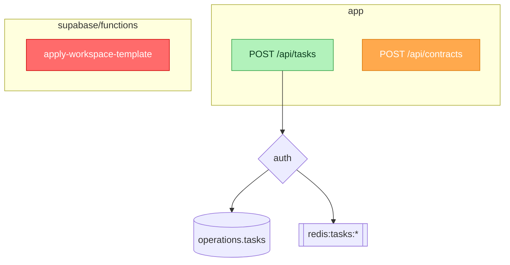
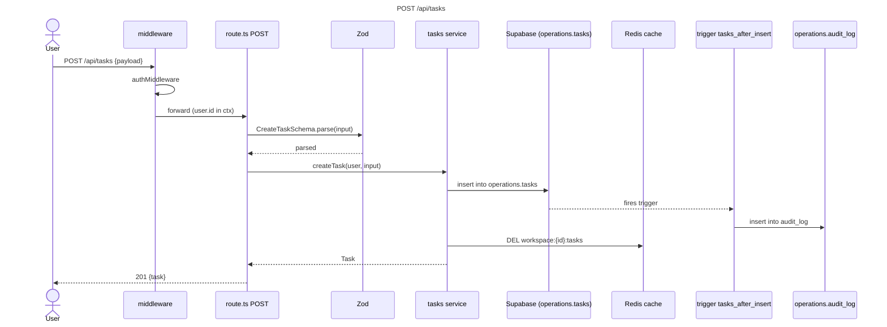
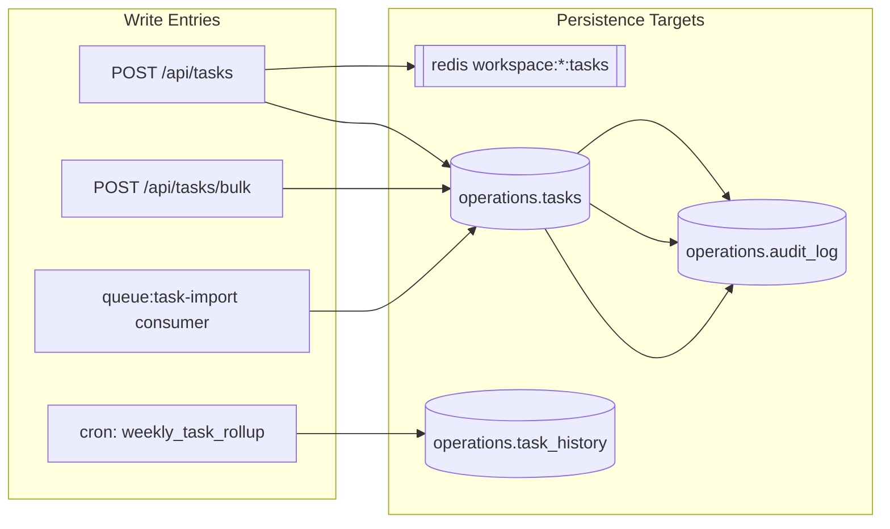
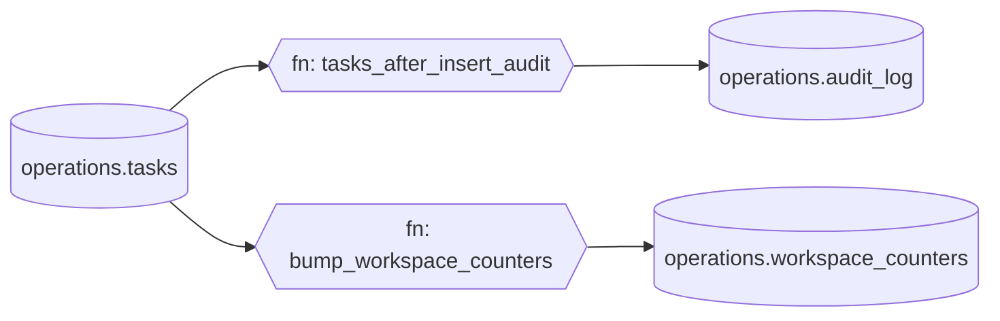

# Mermaid Diagram Templates

The `write-path-mapping` skill emits four Mermaid diagrams into the final report. This file shows the structural skeleton of each. `scripts/mermaid-render.py` fills them in from `write-path-map.json`.

---

## A. System Write Flowchart (`flowchart TD`)

Single-page overview of every write path in the project. Subgraphs per domain. Entry-point nodes colored by the highest-severity risk attached to them. Persistence-target nodes drawn with shape-based semantics.

**Node shapes:**

| Shape | Mermaid | Meaning |
|---|---|---|
| `[(table)]` | `node[(label)]` | SQL table |
| `[[cache]]` | `node[[label]]` | cache / in-memory store |
| `((api))` | `node((label))` | external API |
| `[\file/]` | `node[\label/]` | file / object storage |
| `{{queue}}` | `node{{label}}` | queue or topic |
| `((event))` | `node((label))` | domain event |
| `{auth}` | `node{label}` | decision / auth gate |

**Color classes:**

```mermaid
flowchart TD
    classDef critical fill:#ff6b6b,stroke:#c00,color:#fff;
    classDef high fill:#ffa94d,stroke:#d97706,color:#fff;
    classDef medium fill:#ffe066,stroke:#d4a017,color:#333;
    classDef info fill:#a5d8ff,stroke:#1971c2,color:#0b3d66;
    classDef ok fill:#b2f2bb,stroke:#2f9e44,color:#0b3d1e;
```

**Skeleton:**



---

## B. Per-Endpoint Sequence Diagram (`sequenceDiagram`)

One per top-20 endpoint. Shows the full stack from actor to persistence plus downstream effects.

**Skeleton:**



---

## C. Data-Domain Write Map (`flowchart LR`)

Bipartite reverse index: entry points on the left, persistence targets on the right. Answers "who writes to this table / cache / queue?".

**Skeleton:**



---

## D. DB Trigger / Function Graph (`flowchart LR`)

Postgres-side effects only. Shows cascades of triggers and functions that fire from table mutations. Reveals side-effect chains invisible in application code.

**Skeleton:**



---

## Rendering Notes

- `scripts/mermaid-render.py` consumes `write-path-map.json` and emits all four diagrams into a single markdown block suitable for embedding in the main report.
- Node IDs are sanitized (alphanumeric + underscore, no leading digit) by `sanitize_id()`.
- Labels are truncated to 80 chars and escaped for Mermaid (`"`, `|`, newlines).
- Diagrams with zero data render an `empty[No data detected]` placeholder node rather than failing.
- Preview locally with `mmdc` (mermaid-cli) or by pasting into <https://mermaid.live>.
