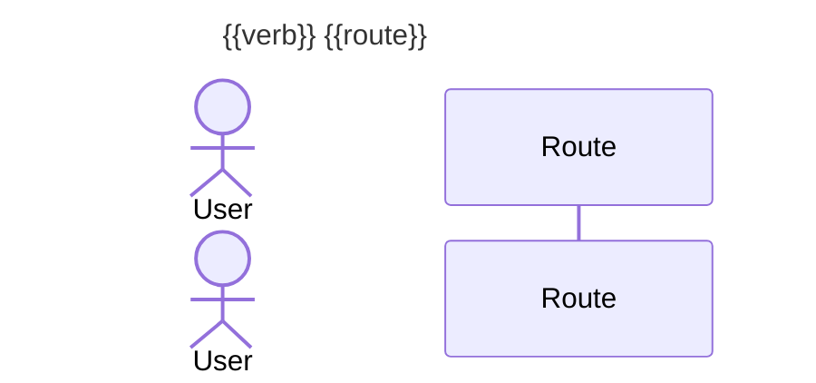
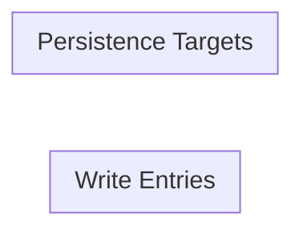

# Write Path Map — {{project_name}}

| Field | Value |
|---|---|
| **Date** | {{DD/MM/YYYY}} |
| **Mapper** | Claude (write-path-mapping skill) |
| **Stack** | {{detected_languages_and_frameworks_csv}} |
| **Persistence** | {{detected_persistence_csv}} |
| **Live DB mode** | {{none / supabase-mcp / psql / env-file}} |
| **Total write paths** | {{N}} |
| **Unique persistence targets** | {{N}} |
| **Risks — CRITICAL / HIGH / MEDIUM / INFO** | {{n}} / {{n}} / {{n}} / {{n}} |
| **Completeness** | {{X}}/100 |
| **Tier** | {{FULLY MAPPED / MOSTLY MAPPED / PARTIALLY MAPPED / INSUFFICIENT}} |

> **Completeness** measures how thoroughly the skill traced the system — it is NOT a quality grade. System quality is captured separately in §7 Risk Register. A clean system and a messy system can both score 100% on completeness.

---

## 1. Executive Summary

{{2-3 paragraphs describing the overall shape of the write surface: entry point density, dominant framework, persistence topology, most interesting fan-out chains, hotspots.}}

**Top write paths by fan-out (highest blast radius):**
1. {{WP-ID}} — {{route}} — {{n}} persistence targets
2. {{WP-ID}} — {{route}} — {{n}} persistence targets
3. {{WP-ID}} — {{route}} — {{n}} persistence targets

**Top risks (highest cost-of-error):**
1. {{severity}} — {{subtype}} — {{file:line}}
2. {{severity}} — {{subtype}} — {{file:line}}
3. {{severity}} — {{subtype}} — {{file:line}}

**Top data-domain hotspots (tables written by the most entries):**
1. {{table_name}} — written by {{n}} entries
2. {{table_name}} — written by {{n}} entries
3. {{table_name}} — written by {{n}} entries

---

## 2. Stack & Persistence

| Layer | Value |
|---|---|
| Languages | {{csv}} |
| Frameworks | {{csv}} |
| Monorepo | {{layout}} |
| Persistence | {{csv}} |
| Schema file count | {{n}} |
| Tables discovered | {{n}} |
| RLS-enabled tables | {{n}} |
| RLS policies discovered | {{n}} |
| Triggers discovered | {{n}} |
| Cron jobs / scheduled tasks | {{n}} |
| Queue producers / consumers | {{n}} / {{n}} |
| Live DB enrichment | {{mode}} |
| `.write-path-ignore` loaded | {{yes — N entries / no}} |
| Excluded paths | {{list}} |

---

## 3. Write Paths by Severity

> Severity is determined by the highest-ranked risk attached to each path. Paths with no risks land in **3e. OK**.

### 3a. CRITICAL — unauth, missing-rls, SQLi, service-role overreach, cross-tenant leak, unverified webhook

| ID | Entry | Persistence | Risk(s) | Notes |
|---|---|---|---|---|
| WP-NNN | {{verb}} {{route}} — {{file:line}} | {{target(s)}} | {{subtypes}} | {{short notes}} |

### 3b. HIGH — missing-transaction, race, cache-invalidation-gap, orphan-queue, dead-trigger

| ID | Entry | Persistence | Risk(s) | Notes |
|---|---|---|---|---|
| WP-NNN | {{verb}} {{route}} — {{file:line}} | {{target(s)}} | {{subtypes}} | {{short notes}} |

### 3c. MEDIUM — unbounded-input, idempotency-missing, missing-audit-log, missing-size-limit, api-no-timeout

| ID | Entry | Persistence | Risk(s) | Notes |
|---|---|---|---|---|
| WP-NNN | {{verb}} {{route}} — {{file:line}} | {{target(s)}} | {{subtypes}} | {{short notes}} |

### 3d. INFO — fan-out-write, dynamic-dispatch-write, api-no-retry

| ID | Entry | Persistence | Risk(s) | Notes |
|---|---|---|---|---|
| WP-NNN | {{verb}} {{route}} — {{file:line}} | {{target(s)}} | {{subtypes}} | {{short notes}} |

### 3e. OK — fully mapped, no risks

Count: **{{n}}** paths. See §4 for the full per-domain listing.

---

## 4. Write Paths by Domain

Paths grouped by top-level folder / monorepo package.

### 4a. {{domain_name}}

| ID | Entry | Framework | Auth | Validator | Persistence Targets | Severity |
|---|---|---|---|---|---|---|
| WP-NNN | {{verb}} {{route}} — {{file:line}} | {{framework}} | {{auth layer}} | {{lib:schema}} | {{n targets}} | {{severity}} |

[Repeat per domain]

---

## 5. Per-Endpoint Detail Blocks (Top 20)

### WP-001 — {{verb}} {{route}}

| Field | Value |
|---|---|
| Entry | {{file}}:{{line}} |
| Framework | {{framework}} |
| Handler | {{handler_file}}:{{line}} |
| Fan-out | {{n}} targets |
| Severity | {{CRITICAL / HIGH / MEDIUM / INFO / OK}} |
| Depth (1–9) | {{n}} |
| Completeness | {{n}}/100 |

**Middleware chain:**
1. {{name}} ({{role}}) — {{file:line}}
2. {{name}} ({{role}}) — {{file:line}}

**Validator:** {{lib}} — `{{schema}}` ({{file}}:{{line}})

**Auth layer:** {{layer}} — {{evidence}}
**RLS policies applied:** {{list}}

**Persistence targets:**
| # | Kind | Target | File:Line | In transaction? |
|---|---|---|---|---|
| 1 | {{kind}} | {{target}} | {{file:line}} | {{yes/no}} |

**Downstream effects (async / DB-side):**
- {{kind}} — {{name/channel}} — {{target}}

**Risks:**
- **{{severity}}** — `{{subtype}}` — {{evidence}}

**9-step verification trail:**
1. Entry-point resolution: {{result}}
2. Middleware chain capture: {{result}}
3. Validator detection: {{result}}
4. Authorization check: {{result}}
5. Handler trace: {{result}}
6. Persistence target enumeration: {{result}}
7. Transaction boundary check: {{result}}
8. Fan-out enumeration: {{result}}
9. Downstream async effect trace: {{result}}

**Recommendation:** {{action}}

---

[Repeat for top 20 paths, ordered by severity then fan-out]

---

## 6. Data-Domain Write Map

For each persistence target, list every entry point that writes to it. Used for blast-radius analysis.

### 6a. SQL tables

| Target | Schema | Written by (entry IDs) | Count | Any risks? |
|---|---|---|---|---|
| {{schema.table}} | {{schema}} | WP-001, WP-003, ... | {{n}} | {{yes/no}} |

### 6b. Caches

| Target | Written by | Count |
|---|---|---|
| {{redis-key-pattern}} | {{IDs}} | {{n}} |

### 6c. Queues / topics

| Target | Producers | Consumers | Orphan? |
|---|---|---|---|
| {{queue_name}} | {{IDs}} | {{IDs}} | {{yes/no}} |

### 6d. External APIs

| Target | Written by | Retries? | Timeout? |
|---|---|---|---|
| {{host + method}} | {{IDs}} | {{yes/no}} | {{yes/no}} |

### 6e. File / object storage

| Target | Written by | Size limit? | MIME check? |
|---|---|---|---|
| {{bucket + prefix}} | {{IDs}} | {{yes/no}} | {{yes/no}} |

---

## 7. Risk Register

A standalone register of every finding, sortable by severity. See `risk-register.md` for the separable PR-review version.

| ID | Severity | Subtype | Path | File:Line | Evidence | Recommended action |
|---|---|---|---|---|---|---|
| RR-001 | {{CRITICAL}} | {{subtype}} | WP-NNN | {{file:line}} | {{evidence}} | {{action}} |

---

## 8. Suggested `.write-path-ignore`

Entries that look like framework conventions or intentional design choices:

```
# Framework conventions
{{pattern}}                # {{justification}}

# Intentional unauth paths (public forms, webhooks with signature verification)
{{pattern}}                # {{justification}}

# Dynamic dispatch (covered by runtime tests)
{{pattern}}                # {{justification}}
```

---

## 9. Visual Artifacts

### 9a. System Write Flowchart

```mermaid
%% Rendered by scripts/mermaid-render.py from write-path-map.json
flowchart TD
    classDef critical fill:#ff6b6b,stroke:#c00,color:#fff;
    classDef high fill:#ffa94d,stroke:#d97706,color:#fff;
    classDef medium fill:#ffe066,stroke:#d4a017,color:#333;
    classDef info fill:#a5d8ff,stroke:#1971c2,color:#0b3d66;
    classDef ok fill:#b2f2bb,stroke:#2f9e44,color:#0b3d1e;
    %% ... nodes and edges ...
```

### 9b. Per-Endpoint Sequence Diagrams

One sequence diagram per top-20 endpoint. Collapsible in the rendered Markdown.



### 9c. Data-Domain Write Map



### 9d. DB Trigger / Function Graph

```mermaid
flowchart LR
    %% source table -> trigger_fn -> target table
```

---

## 10. JSON Sidecar

A machine-readable copy of every path is emitted alongside this report as `write-path-map.json`. Shape follows `templates/paths-schema.json`.

Example path:
```json
{
  "id": "WP-001",
  "entry": {
    "type": "http-post",
    "file": "src/app/api/tasks/route.ts",
    "line": 14,
    "verb": "POST",
    "route": "/api/tasks",
    "framework": "next-app-router"
  },
  "middleware": [
    { "name": "authMiddleware", "role": "auth", "file": "src/middleware.ts", "line": 8 }
  ],
  "validator": { "lib": "zod", "schema": "CreateTaskSchema", "file": "src/schemas/tasks.ts", "line": 4 },
  "auth": {
    "layer": "supabase-session + RLS",
    "evidence": "supabase.auth.getUser() in middleware",
    "rls_policies": ["tasks_insert_own_workspace"]
  },
  "handler": { "file": "src/app/api/tasks/route.ts", "line": 14, "delegates_to": ["src/services/tasks.ts:createTask"] },
  "persistence_targets": [
    { "kind": "supabase-from-insert", "target": "operations.tasks", "file": "src/services/tasks.ts", "line": 58, "in_transaction": false }
  ],
  "fan_out_count": 1,
  "downstream_effects": [
    { "kind": "db-trigger", "name": "tasks_after_insert_audit", "target": "operations.audit_log" }
  ],
  "risks": [],
  "depth": 9,
  "completeness_score": 100
}
```

---

## 11. Suppressed Paths

| Source | Count |
|---|---|
| `.write-path-ignore` matches | {{n}} |
| Framework-convention suppressions | {{n}} |
| Read-only reclassified (no write targets found) | {{n}} |
| Generated code paths | {{n}} |

**Total suppressed:** {{n}}
